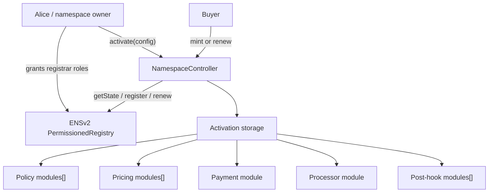

# Namespace Contracts Overview

Namespace is an activation-based controller layer for selling ENSv2 subnames through official ENSv2 registries.

The controller does not replace ENSv2. It enforces sale rules, payment, pricing, and hooks, then calls the configured `IPermissionedRegistry` to mint or renew the label.

## Core Idea

For a name like `alice.eth`, Alice owns or controls an ENSv2 registry that can mint direct child labels such as:

```text
pay.alice.eth
team.alice.eth
app.alice.eth
```

Alice creates a Namespace activation that says:

- which ENSv2 registry to mint into;
- what resolver and buyer roles should be assigned;
- which policy modules must pass;
- how price is calculated;
- how payment is collected;
- how funds are processed;
- which hooks run after registry writes.

Buyers then call one stable entry point:

```solidity
NamespaceController.mint(activationId, label, duration, runtimeData)
```

## System Map



## Two Phases

| Phase | Caller | What happens |
| --- | --- | --- |
| Activation | namespace owner | Stores the sale configuration and configures modules by `activationId`. |
| Mint/Renew | buyer or payer | Loads stored configuration, validates runtime data, executes modules, and writes to ENSv2. |

## Important Terms

| Term | Meaning |
| --- | --- |
| Activation | A stored sale configuration for one registry and parent namespace. |
| `activationId` | Unique id generated from chain id, registry, parent node, owner, and nonce. |
| Policy | A module that can allow or reject a mint/renew. |
| Pricing | A module that composes the final price. Multiple pricing modules run in order. |
| Payment | A module that collects the final price from the payer. |
| Processor | A module that handles accounting or fund distribution after payment collection. |
| Post hook | A module called after ENSv2 registry mint or renew succeeds. |
| Runtime data | Per-call data from the buyer, such as Merkle proofs or hook inputs. |

## Reading Next

1. [Activation And Configuration](./02-activation-and-configuration.md)
2. [Mint And Renewal Flow](./03-mint-and-renewal-flow.md)
3. [Module Catalog](./04-module-catalog.md)
4. [Contract Reference](./05-contract-reference.md)
5. [Security And Operations](./06-security-and-operations.md)

