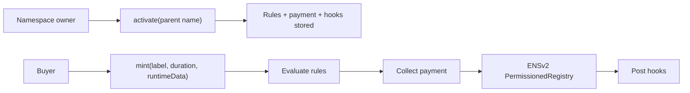

# Namespace Contracts Overview

Namespace is a sale controller for ENSv2 subnames. It does not replace ENSv2. It decides whether a subname can be minted or renewed, computes the price, collects payment, calls the official ENSv2 registry, then runs optional hooks.

The core execution model is:

```text
Rules decide.
Payment settles.
Registry mints or renews.
Hooks react.
```

## Main Actors

| Actor | Meaning |
| --- | --- |
| Namespace owner | The account that controls a parent name such as `alice.eth`. |
| Buyer | The account minting or renewing a subname such as `bob.alice.eth`. |
| NamespaceController | The orchestrator that stores activations and executes mints/renewals. |
| Rule module | A module that validates eligibility and/or returns a price effect. |
| Payment module | A module that collects ERC20 funds from the payer. |
| ENSv2 registry | The official `IPermissionedRegistry` that stores ownership, expiry, resolver, and roles. |
| Post hook | Optional module called after a successful registry mint or renewal. |

## High Level Flow



## Why Rules

Older policy/pricing splits are too rigid for real sale features. A whitelist may both allow a buyer and give a discount. A reservation may both gate a label and override the price. A future human verification integration may prove eligibility and apply a special price.

Namespace therefore uses one rule interface:

```solidity
function evaluateMint(MintContext calldata ctx, bytes calldata runtimeData)
    external
    returns (RuleOutput memory);

function evaluateRenew(RenewContext calldata ctx, bytes calldata runtimeData)
    external
    returns (RuleOutput memory);
```

Each rule can:

| Effect | Example |
| --- | --- |
| Pass | Sale window is open. |
| Block | Label is reserved and not mintable. |
| Require proof | Buyer supplies a Merkle claim. |
| Add flags | A verification rule can mark a buyer as verified. |
| Require flags | A later rule can require earlier verification. |
| Set a base price | Fixed price or USD oracle price. |
| Add/subtract price | Length premium or discount amount. |
| Apply BPS discount/markup | Token-holder discount. |
| Override price | Reserved label has a custom flat price. |

## Rule Phases

Rules are stored in activation order and must be sorted by `RulePhase`.

| Phase | Intended use |
| --- | --- |
| `GUARD` | Fast global checks such as pause or sale window. |
| `ELIGIBILITY` | Label length, whitelist, token gate, human verification. |
| `BASE_PRICE` | Fixed price or USD base price. |
| `PREMIUM` | Length premiums, class premiums, dynamic add-ons. |
| `DISCOUNT` | Token-holder, whitelist, or campaign discounts. |
| `OVERRIDE` | Final custom price for reservations or special deals. |
| `FINAL_CHECK` | Last invariant checks before payment/registry. |

The controller enforces phase ordering at activation time. This keeps pricing deterministic and makes mixed eligibility/pricing rules composable.

## ENSv2 Boundary

Namespace mints through the official ENSv2 `PermissionedRegistry`.

Namespace controls sale logic, but ENSv2 remains responsible for:

| ENSv2 concern | Source of truth |
| --- | --- |
| Registered owner | `PermissionedRegistry.ownerOf(tokenId)` |
| Label status | `PermissionedRegistry.getState(labelId)` |
| Expiry | Registry state |
| Resolver | Registry resolver field |
| Buyer roles | Registry role bitmap |
| Renewal | `PermissionedRegistry.renew` |

The controller must have the registry roles needed to register and renew labels for the activated parent namespace.
