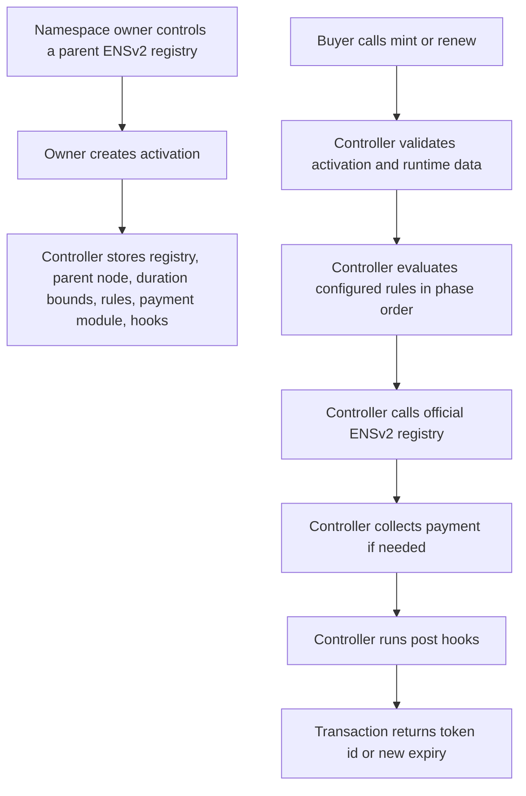

# System Overview

Namespace Contracts V2 is an activation-based ENSv2 subname sale controller.

It adds programmable sale logic in front of an official ENSv2 `IRegistry`. It does not replace the registry, resolver, or ENSv2 permission system.


## High-Level Flow



## Primary Contracts

| Contract                       | Path                                              | Purpose                                                                                   |
| ------------------------------ | ------------------------------------------------- | ----------------------------------------------------------------------------------------- |
| `NamespaceController`          | `src/NamespaceController.sol`                     | External mint/renew entry point. Dispatches rules, registry calls, payment, and hooks.    |
| `NamespaceControllerLifecycle` | `src/controller/NamespaceControllerLifecycle.sol` | Initialization, activation creation, activation status, activation ownership transfer.    |
| `NamespaceControllerModules`   | `src/controller/NamespaceControllerModules.sol`   | Module approvals, module-list storage, module config updates, runtime data length checks. |
| `NamespaceControllerRules`     | `src/controller/NamespaceControllerRules.sol`     | Rule evaluation, phase validation, flags, price composition.                              |
| `NamespaceControllerStorage`   | `src/controller/NamespaceControllerStorage.sol`   | Shared storage, registry role checks, canonical parent validation, errors.                |
| `NamespaceTypes`               | `src/libraries/NamespaceTypes.sol`                | Shared config, context, price, and rule-output types.                                     |
| `NamespaceModule`              | `src/modules/NamespaceModule.sol`                 | Base module with controller-only modifier and UUPS owner.                                 |
| `NamespaceRule`                | `src/modules/rules/NamespaceRule.sol`             | Base rule helper.                                                                         |

## Actors

| Actor            | Meaning                                           | Important authority                                                                                                       |
| ---------------- | ------------------------------------------------- | ------------------------------------------------------------------------------------------------------------------------- |
| Controller owner | Admin of the controller proxy.                    | Can upgrade controller, set root registry, approve/revoke modules.                                                        |
| Module owner     | Admin of one module proxy.                        | Can upgrade that module implementation.                                                                                   |
| Activation owner | Account that created or received an activation.   | Can update existing module config, pause/status activation, transfer activation ownership. Must retain ENSv2 admin roles. |
| Buyer            | Account receiving a newly minted subname.         | Calls `mint`; becomes ENSv2 registry owner of the minted label.                                                           |
| Payer            | Account paying for mint or renewal.               | Current controller sets payer to `msg.sender`.                                                                            |
| Rule module      | External contract implementing `IRuleModule`.     | Can pass, block, require flags, add flags, or return price effects.                                                       |
| Payment module   | External contract implementing `IPaymentModule`.  | Collects final composed price.                                                                                            |
| Post hook        | External contract implementing `IPostHookModule`. | Runs after registry write and payment.                                                                                    |
| ENSv2 registry   | Official `IPermissionedRegistry`.                 | Stores label state, token id, owner, resolver, expiry, and roles.                                                         |

## Module Stack

An activation has:

```text
n ordered rules
0 or 1 payment module
p ordered post hooks
```

The controller does not have separate "eligibility modules" and "pricing modules." A single rule interface is used for both because many real sale features combine them.

Examples:

| Feature            | Eligibility behavior                  | Pricing behavior                              |
| ------------------ | ------------------------------------- | --------------------------------------------- |
| Whitelist          | Buyer or label must prove membership. | Claim can discount or override price.         |
| Reservation        | Label can be buyer-bound or blocked.  | Claim can set an exact reserved price.        |
| Token gate         | Buyer must hold an ERC20.             | Holder can receive discount.                  |
| Human verification | Buyer proves verification.            | Verified users can receive a different price. |

## Runtime Pipeline

The controller executes `mint` and `renew` in this order:

```text
load activation
check active status and owner authority
check duration bounds
check runtime data lengths
build context
evaluate rules
call ENSv2 registry
collect payment if needed
run post hooks
emit event
```

External calls during `mint`/`renew` occur in this order:

```text
rules -> ENSv2 registry -> payment module -> post hooks -> resolver, if hooks call one
```

The registry write happens before payment and hooks. The transaction is still atomic. If payment or a hook reverts, the EVM reverts the registry write and earlier external effects in the same transaction.
