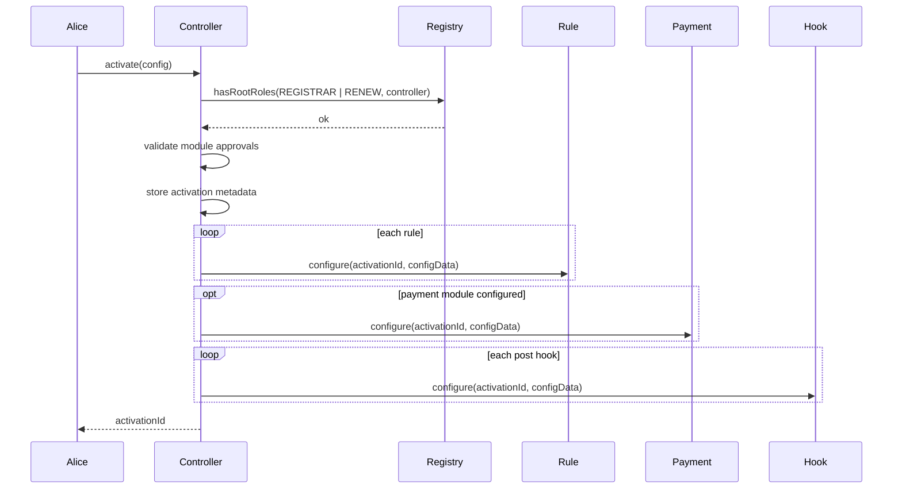

# Activation And Configuration

An activation is the sale configuration for one parent namespace such as `alice.eth`.

Alice activates once. Buyers later mint with only runtime proof/payment/hook data. They do not send sale configuration during mint.

## Activation Config

`NamespaceTypes.ActivationConfig` contains:

| Field | Meaning |
| --- | --- |
| `registry` | ENSv2 `IPermissionedRegistry` used to mint and renew labels. |
| `parentNode` | Parent namehash, for example `namehash("alice.eth")`. |
| `resolver` | Default resolver assigned to newly minted labels. |
| `buyerRoleBitmap` | ENSv2 roles granted to buyers on minted labels. |
| `rules` | Ordered `RuleConfig[]` evaluated for mint and renew. |
| `paymentModule` | Optional payment module. Required when final price can be non-zero. |
| `postHooks` | Optional hooks called after the registry write succeeds. |

`RuleConfig` contains:

| Field | Meaning |
| --- | --- |
| `module` | Rule contract address. |
| `phase` | Deterministic rule phase used to order effects. |
| `configData` | ABI-encoded activation-scoped parameters for the rule. |

`ModuleConfig` is used for payment and hooks:

| Field | Meaning |
| --- | --- |
| `module` | Payment or hook module contract. |
| `configData` | ABI-encoded activation-scoped parameters. |

## Example Activation

Alice wants to sell `*.alice.eth` with:

- sale window;
- length bounds;
- whitelist claims;
- fixed base price;
- length premium;
- token-holder discount;
- reservation custom prices;
- ERC20 revenue split;
- resolver update hook.

The activation rule order should be:

```text
GUARD       SaleWindowRule
ELIGIBILITY LabelLengthRule
ELIGIBILITY WhitelistRule
BASE_PRICE  FixedPriceRule
PREMIUM     LengthPremiumRule
DISCOUNT    TokenBalanceRule
OVERRIDE    ReservationRule
```

The same sale can later add a `WorldIdRule` or another verification rule without changing the controller.

## Activation Sequence



## Module Approval

The controller owner can require modules to be approved before activations use them.

```solidity
controller.setModuleApproval(controller.MODULE_KIND_RULE(), address(rule), true);
controller.setModuleApproval(controller.MODULE_KIND_PAYMENT(), address(payment), true);
controller.setModuleApproval(controller.MODULE_KIND_POST_HOOK(), address(hook), true);
```

The kinds are intentionally small:

| Kind | Use |
| --- | --- |
| `MODULE_KIND_RULE` | Anything implementing `IRuleModule`. |
| `MODULE_KIND_PAYMENT` | Anything implementing `IPaymentModule`. |
| `MODULE_KIND_POST_HOOK` | Anything implementing `IPostHookModule`. |

## Storage Shape

The controller stores compact module lists:

| Count | Storage strategy |
| --- | --- |
| `0` | Stores zero address and zero count. |
| `1` | Stores the module address directly. |
| `2+` | Stores packed addresses in SSTORE2 bytecode. Rules store 20-byte address plus one-byte phase. |

This avoids dynamic storage arrays in the hot activation data and keeps common one-module paths cheap.

## Updating Config

Activation owners can update existing module config:

```solidity
controller.updateModuleConfig(activationId, controller.MODULE_KIND_RULE(), index, newConfigData);
controller.updateModuleConfig(activationId, controller.MODULE_KIND_PAYMENT(), 0, newConfigData);
controller.updateModuleConfig(activationId, controller.MODULE_KIND_POST_HOOK(), index, newConfigData);
```

Important constraint: updates can reconfigure an existing module at an existing index. They do not insert, remove, or reorder modules. A new module stack requires a new activation.

Useful updates:

- rotate `ReservationRule` or `WhitelistRule` roots;
- change `SaleWindowRule` times;
- pause/unpause with `PauseRule.setPaused`;
- change fixed prices;
- change split recipients.
