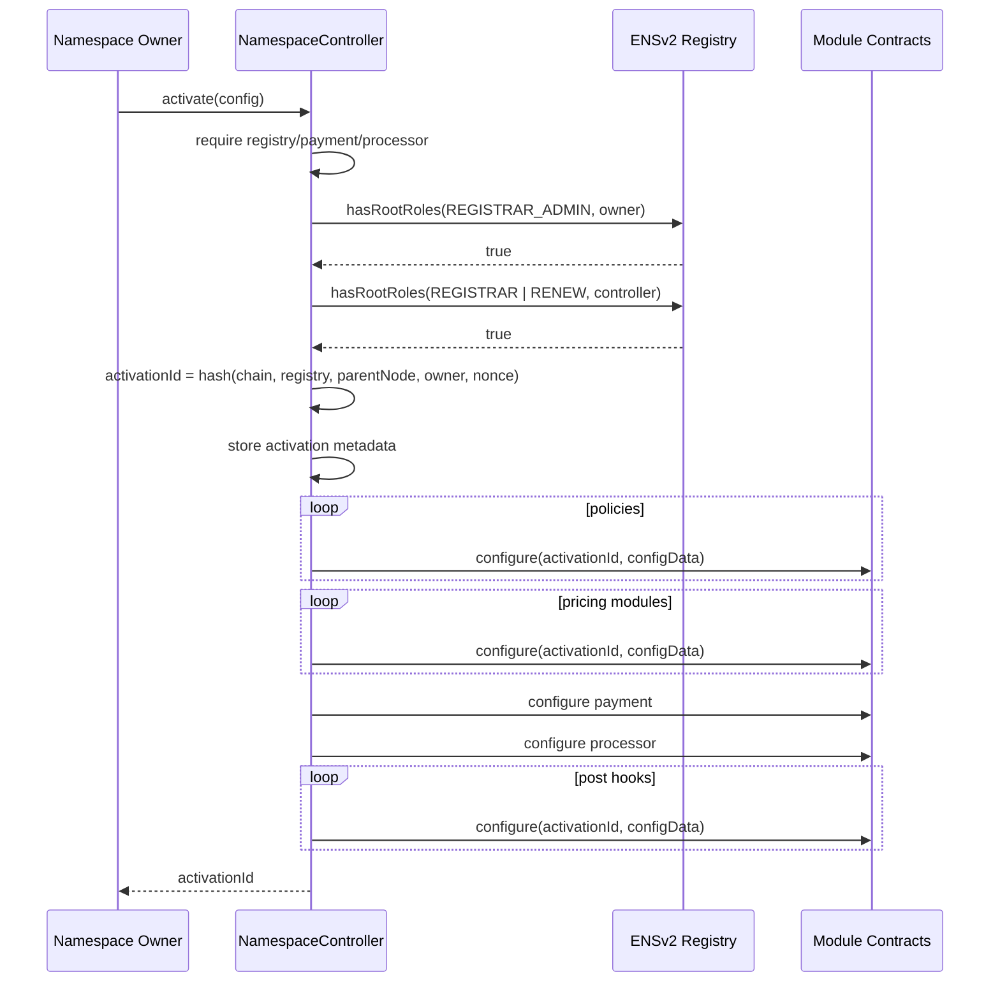

# Activation And Configuration

Activation is the setup transaction from the namespace owner. It stores the sale and tells each module to store its activation-specific parameters.

## Preconditions

Before activation:

1. The target ENSv2 registry must exist.
2. The namespace owner must have root registrar admin authority on that registry.
3. The `NamespaceController` must have root `ROLE_REGISTRAR` and `ROLE_RENEW` on the same registry.
4. The payment module and processor must be non-zero.
5. If module approval is required, every configured module must be approved by the controller owner.

## Activation Config

`NamespaceTypes.ActivationConfig` is the full activation payload:

| Field | Purpose |
| --- | --- |
| `registry` | Official ENSv2 `IPermissionedRegistry` where labels are minted. |
| `parentNode` | Parent ENS node, such as the namehash for `alice.eth`. |
| `resolver` | Default resolver written during registry mint. |
| `buyerRoleBitmap` | ENSv2 roles granted to the buyer on the minted label. |
| `policies` | Ordered policy modules that must all pass. |
| `pricingModules` | Ordered pricing modules that compose the final price. |
| `paymentModule` | Single module that collects funds. |
| `processor` | Single module that distributes or accounts for collected funds. |
| `postHooks` | Ordered hooks executed after registry writes. |

Each module config is:

```solidity
struct ModuleConfig {
    address module;
    bytes configData;
}
```

`configData` is ABI-decoded by the target module. For example, `LabelLengthPolicy` expects `LabelLengthPolicy.Params`.

## Activation Sequence



## Stored Data

The controller stores only orchestration data:

- activation owner;
- registry;
- parent node;
- resolver;
- buyer role bitmap;
- active status;
- module addresses.

Each module stores its own configuration keyed by `activationId`.

This keeps the controller generic and makes future features additive. A future "human verification" feature, for example, can be a new policy module with the same `configure/checkMint/checkRenew` shape.

## Activation Ownership

Activation ownership is separate from ENS token ownership, but it is guarded by ENSv2 registry authority.

The controller checks root registrar admin authority:

- when creating an activation;
- when enabling or disabling an activation;
- when transferring activation ownership;
- for the new owner during ownership transfer.

This prevents an old activation owner from continuing to manage a sale after losing registry admin authority.

## Module Approval Mode

Module allowlisting is enabled by default. The controller owner approves modules by kind:

```solidity
setModuleApproval(MODULE_KIND_POLICY, policyModule, true)
setModuleApproval(MODULE_KIND_PRICING, pricingModule, true)
setModuleApproval(MODULE_KIND_PAYMENT, paymentModule, true)
setModuleApproval(MODULE_KIND_PROCESSOR, processorModule, true)
```

When approval mode is enabled, activation can only use modules approved for the exact module kind where they are used. A module approved as pricing is not approved as a policy. This is useful for a curated production deployment where user activations should not point at arbitrary external modules.
