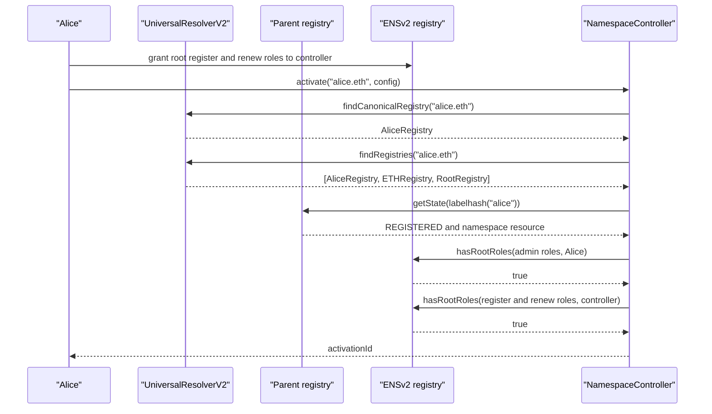
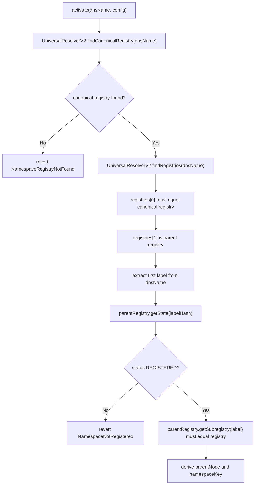

# ENSv2 Integration And Permissions

Namespace is a caller of ENSv2 registries. It is not the source of truth for ENSv2 name state.

## Integration Boundary

Namespace uses these ENSv2 registry interfaces:

| Interface | Use |
| --- | --- |
| `IRegistry` | Registry ancestry and subregistry lookup returned by UniversalResolverV2. |
| `IPermissionedRegistry` | Register labels, renew labels, read label state, check root roles. |
| `IUniversalResolverV2` | Canonical registry discovery from DNS-encoded namespace names. |

Namespace calls:

| Call | Used in | Purpose |
| --- | --- | --- |
| `universalResolver.findCanonicalRegistry(name)` | Activation | Resolve the canonical writable registry for the namespace name. |
| `universalResolver.findRegistries(name)` | Activation | Read namespace ancestry, including the parent registry that owns the namespace label. |
| `parentRegistry.getState(labelId)` | Activation and runtime staleness checks | Read namespace status and current EAC resource. |
| `parentRegistry.getSubregistry(label)` | Activation and runtime staleness checks | Confirm the parent still points to the activated registry. |
| `registry.hasRootRoles(roles, account)` | Activation and management | Verify owner and controller authority. |
| `registry.register(...)` | Mint | Create label in ENSv2 registry. |
| `registry.getState(labelId)` | Renew | Read token id, status, and expiry. |
| `registry.renew(tokenId, newExpiry)` | Renew | Extend expiry. |

Namespace does not mutate ENSv2 versioning internals. It does, however, read the parent namespace `resource` during activation. ENSv2 increments the resource version when a name expires/unregisters and is re-registered, so using that resource in the activation key prevents an old activation from silently applying to a newly acquired namespace.

## Why Namespace Uses IPermissionedRegistry

ENSv2 has multiple registry interfaces:

| Interface | What it provides |
| --- | --- |
| `IRegistry` | Registry tree reads: subregistry, resolver, parent. |
| `IStandardRegistry` | Tokenized registry writes: register, renew, unregister, resolver/subregistry updates, expiry reads. |
| `IPermissionedRegistry` | `IStandardRegistry` plus enhanced access control and label state helpers. |

Namespace currently needs `IPermissionedRegistry` because it verifies EAC roles and renewal state before executing:

| Namespace check | Required API |
| --- | --- |
| Activation owner has root admin roles. | `hasRootRoles`. |
| Controller has root register/renew roles. | `hasRootRoles`. |
| Label is currently registered before renewal. | `getState` and `Status.REGISTERED`. |
| Renewal event contains the active token id. | `getState(...).tokenId`. |

`IStandardRegistry` is not enough unless the controller gives up those checks or introduces a separate generic-registry adapter.

## Registry Roles Used By Namespace

The controller defines:

| Constant | Meaning |
| --- | --- |
| `ROLE_REGISTRAR` | Root role required for the controller to call `register`. |
| `ROLE_RENEW` | Root role required for the controller to call `renew`. |
| `ROLE_REGISTRAR_ADMIN` | Root admin role required from activation owners. |
| `ROLE_RENEW_ADMIN` | Root admin role required from activation owners. |

At activation time:

```text
activation owner must have ROLE_REGISTRAR_ADMIN | ROLE_RENEW_ADMIN
controller must have ROLE_REGISTRAR | ROLE_RENEW
```

Before later sensitive operations:

```text
activation owner must still have ROLE_REGISTRAR_ADMIN | ROLE_RENEW_ADMIN
```

## Permission Flow



If the controller does not have registry roles at activation time, activation reverts with `ControllerMissingRegistryRoles`.

If the activation owner lacks admin authority, activation or later management calls revert with `UnauthorizedActivationOwner`.

## Canonical Namespace Discovery



Why the check exists:

| Check | Why |
| --- | --- |
| UniversalResolver configured | Activation needs a canonical ENSv2 discovery source. |
| DNS name is not root | Root cannot be a sellable user namespace activation. |
| Canonical registry exists | Prevents activating missing names or fake registry addresses. |
| Parent registry exists | Needed to read the current namespace label state. |
| Parent state is `REGISTERED` | Reserved, expired, or unavailable names cannot activate sales. |
| Parent subregistry still points to registry | Prevents stale activations after the namespace is repointed. |

Failure modes:

| Failure | Error |
| --- | --- |
| UniversalResolver not set | `UniversalResolverNotConfigured` |
| Root name passed | `InvalidNamespaceName` |
| Canonical registry missing or inconsistent | `NamespaceRegistryNotFound` |
| Parent registry missing | `NamespaceParentRegistryNotFound` |
| Parent label not registered | `NamespaceNotRegistered` |

## Mint Registry Call

After rule evaluation, mint calls:

```solidity
tokenId = activation.registry.register(
    label,
    msg.sender,
    IRegistry(address(0)),
    activation.resolver,
    activation.buyerRoleBitmap,
    ctx.expiry
);
```

Parameter meaning:

| Parameter | Source | Meaning |
| --- | --- | --- |
| `label` | User input | Direct child label, not a full name. |
| `owner` | `msg.sender` | Buyer receives registry ownership. |
| `subregistry` | `address(0)` | Namespace does not create a nested subregistry during mint. |
| `resolver` | Activation config | Default resolver assigned in registry state. |
| `roleBitmap` | Activation config | Roles granted to buyer by ENSv2. |
| `expiry` | `uint64(block.timestamp) + duration` | Registration expiry. |

The ENSv2 registry can still revert for its own reasons, such as missing controller roles, unavailable labels, invalid expiry, or internal registry constraints.

## Renewal Registry Calls

Renew first reads:

```solidity
state = activation.registry.getState(labelId);
```

Then it checks:

```text
state.status == REGISTERED
labelActivations[registry][labelHash] == activationId
```

Then it calls:

```solidity
activation.registry.renew(state.tokenId, state.expiry + duration);
```

Why renewal is activation-bound:

| Check | Why |
| --- | --- |
| Label status must be registered | Avoids renewing unavailable, expired, burned, or otherwise non-renewable labels. |
| Stored activation id must match | Prevents this activation's renewal rules from being used for a label minted elsewhere. |

## Resolver Boundary

The registry stores the resolver address during registration. Resolver records are separate.

Shipped hooks use:

```solidity
IAddrResolver(resolver).setAddr(node, addr);
```

Where:

```solidity
node = keccak256(abi.encodePacked(parentNode, labelHash));
```

The controller does not verify resolver permissions. If the resolver rejects the hook call, the entire mint reverts.

## Direct Registry Bypass

Namespace only controls calls that go through `NamespaceController`.

If an ENSv2 admin or another role holder can call the registry directly, that caller can mint or renew outside Namespace sale rules. This is not a bug in Namespace; it is a permission-model decision.

Production deployments should decide which model they want:

| Model | Registry setup |
| --- | --- |
| Admin-curated sale | Trusted admins retain direct registry authority. |
| Controller-enforced public sale | Controller is the only operational public mint route; other privileged paths are removed, timelocked, or constrained. |
| Hybrid | Admin powers exist for emergency or reserved inventory, with explicit disclosure. |

## UniversalResolverV2 As Activation Dependency

`UniversalResolverV2` can discover registries from DNS-encoded names:

| Function | Activation relevance |
| --- | --- |
| `findExactRegistry(name)` | Finds the exact registry for a name if one exists. |
| `findCanonicalRegistry(name)` | Finds the registry only when it is canonical for that name. |
| `findRegistries(name)` | Returns registry ancestry, useful for off-chain tooling. |

The current controller uses UniversalResolverV2 directly in `activate(name, config)`. The frontend no longer passes `registry` or `parentNode`.

UniversalResolverV2 is used only for namespace discovery. The controller still performs explicit `IPermissionedRegistry` role checks before activation succeeds.
