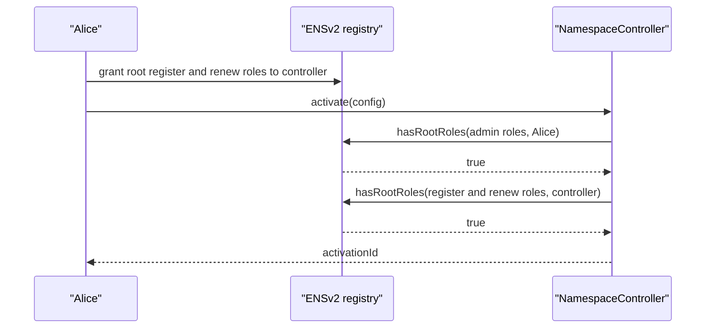
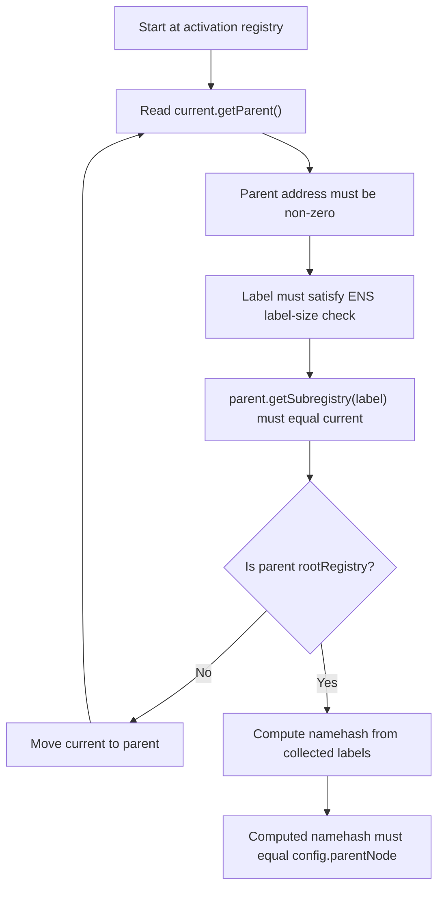

# ENSv2 Integration And Permissions

Namespace is a caller of ENSv2 registries. It is not the source of truth for ENSv2 name state.

## Integration Boundary

Namespace uses these ENSv2 registry interfaces:

| Interface | Use |
| --- | --- |
| `IRegistry` | Parent-chain traversal, subregistry lookup, root registry reference. |
| `IPermissionedRegistry` | Register labels, renew labels, read label state, check root roles. |

Namespace calls:

| Call | Used in | Purpose |
| --- | --- | --- |
| `registry.getParent()` | Activation | Walk from activation registry to configured root registry. |
| `parent.getSubregistry(label)` | Activation | Verify parent-child registry relationship. |
| `registry.hasRootRoles(roles, account)` | Activation and management | Verify owner and controller authority. |
| `registry.register(...)` | Mint | Create label in ENSv2 registry. |
| `registry.getState(labelId)` | Renew | Read token id, status, and expiry. |
| `registry.renew(tokenId, newExpiry)` | Renew | Extend expiry. |

Namespace does not directly manage ENSv2 versioning internals such as registry-internal token versioning or authorization version ids. Those remain upstream ENSv2 registry concerns. Namespace treats the registry as an external contract with the public interfaces above.

## Why Namespace Uses IPermissionedRegistry

ENSv2 has multiple registry interfaces:

| Interface | What it provides |
| --- | --- |
| `IRegistry` | Registry tree reads: subregistry, resolver, parent. |
| `IStandardRegistry` | Tokenized registry writes: register, renew, unregister, resolver/subregistry updates, expiry reads. |
| `IPermissionedRegistry` | `IStandardRegistry` plus enhanced access control and label state helpers. |

Namespace currently needs `IPermissionedRegistry` because it verifies EAC roles and renewal state before executing:

| Namespace check | Required API |
| --- | --- |
| Activation owner has root admin roles. | `hasRootRoles`. |
| Controller has root register/renew roles. | `hasRootRoles`. |
| Label is currently registered before renewal. | `getState` and `Status.REGISTERED`. |
| Renewal event contains the active token id. | `getState(...).tokenId`. |

`IStandardRegistry` is not enough unless the controller gives up those checks or introduces a separate generic-registry adapter.

## Registry Roles Used By Namespace

The controller defines:

| Constant | Meaning |
| --- | --- |
| `ROLE_REGISTRAR` | Root role required for the controller to call `register`. |
| `ROLE_RENEW` | Root role required for the controller to call `renew`. |
| `ROLE_REGISTRAR_ADMIN` | Root admin role required from activation owners. |
| `ROLE_RENEW_ADMIN` | Root admin role required from activation owners. |

At activation time:

```text
activation owner must have ROLE_REGISTRAR_ADMIN | ROLE_RENEW_ADMIN
controller must have ROLE_REGISTRAR | ROLE_RENEW
```

Before later sensitive operations:

```text
activation owner must still have ROLE_REGISTRAR_ADMIN | ROLE_RENEW_ADMIN
```

## Permission Flow



If the controller does not have registry roles at activation time, activation reverts with `ControllerMissingRegistryRoles`.

If the activation owner lacks admin authority, activation or later management calls revert with `UnauthorizedActivationOwner`.

## Canonical Parent Registry Check

The caller supplies both `registry` and `parentNode` in `ActivationConfig`. The controller verifies they match the registry's actual ENSv2 parent chain.



Why the check exists:

| Check | Why |
| --- | --- |
| `rootRegistry` configured | Without a root, there is no canonical chain endpoint. |
| Parent is non-zero | Prevents activating a detached registry. |
| Parent maps label back to child | Prevents spoofed parent labels. |
| Label size assertion | Keeps computed namehash compatible with ENS label constraints. |
| Depth limit `128` | Prevents unbounded parent-chain traversal. |
| Computed node equals supplied `parentNode` | Binds the activation to the registry's actual name. |

Failure modes:

| Failure | Error |
| --- | --- |
| Root registry not set | `RootRegistryNotConfigured` |
| Parent is zero | `RegistryParentNotConfigured` |
| Parent-child link mismatch | `RegistryParentChildMismatch` |
| Parent chain too deep | `RegistryParentChainTooDeep` |
| Computed node differs from supplied node | `RegistryParentNodeMismatch` |

## Mint Registry Call

After rule evaluation, mint calls:

```solidity
tokenId = activation.registry.register(
    label,
    msg.sender,
    IRegistry(address(0)),
    activation.resolver,
    activation.buyerRoleBitmap,
    ctx.expiry
);
```

Parameter meaning:

| Parameter | Source | Meaning |
| --- | --- | --- |
| `label` | User input | Direct child label, not a full name. |
| `owner` | `msg.sender` | Buyer receives registry ownership. |
| `subregistry` | `address(0)` | Namespace does not create a nested subregistry during mint. |
| `resolver` | Activation config | Default resolver assigned in registry state. |
| `roleBitmap` | Activation config | Roles granted to buyer by ENSv2. |
| `expiry` | `uint64(block.timestamp) + duration` | Registration expiry. |

The ENSv2 registry can still revert for its own reasons, such as missing controller roles, unavailable labels, invalid expiry, or internal registry constraints.

## Renewal Registry Calls

Renew first reads:

```solidity
state = activation.registry.getState(labelId);
```

Then it checks:

```text
state.status == REGISTERED
labelActivations[registry][labelHash] == activationId
```

Then it calls:

```solidity
activation.registry.renew(state.tokenId, state.expiry + duration);
```

Why renewal is activation-bound:

| Check | Why |
| --- | --- |
| Label status must be registered | Avoids renewing unavailable, expired, burned, or otherwise non-renewable labels. |
| Stored activation id must match | Prevents this activation's renewal rules from being used for a label minted elsewhere. |

## Resolver Boundary

The registry stores the resolver address during registration. Resolver records are separate.

Shipped hooks use:

```solidity
IAddrResolver(resolver).setAddr(node, addr);
```

Where:

```solidity
node = keccak256(abi.encodePacked(parentNode, labelHash));
```

The controller does not verify resolver permissions. If the resolver rejects the hook call, the entire mint reverts.

## Direct Registry Bypass

Namespace only controls calls that go through `NamespaceController`.

If an ENSv2 admin or another role holder can call the registry directly, that caller can mint or renew outside Namespace sale rules. This is not a bug in Namespace; it is a permission-model decision.

Production deployments should decide which model they want:

| Model | Registry setup |
| --- | --- |
| Admin-curated sale | Trusted admins retain direct registry authority. |
| Controller-enforced public sale | Controller is the only operational public mint route; other privileged paths are removed, timelocked, or constrained. |
| Hybrid | Admin powers exist for emergency or reserved inventory, with explicit disclosure. |

## UniversalResolverV2 As Discovery

`UniversalResolverV2` can discover registries from DNS-encoded names:

| Function | Activation relevance |
| --- | --- |
| `findExactRegistry(name)` | Finds the exact registry for a name if one exists. |
| `findCanonicalRegistry(name)` | Finds the registry only when it is canonical for that name. |
| `findRegistries(name)` | Returns registry ancestry, useful for off-chain tooling. |

This is useful for activation UX. A frontend can ask Universal Resolver for the registry for `alice.eth`, compute `parentNode`, and pass both to `activate`. The controller should still verify the registry parent chain on-chain.

An on-chain convenience entry point can be added later:

```solidity
activateByName(bytes dnsEncodedParentName, ActivationConfigByName config)
```

That helper would call `findCanonicalRegistry`, compute `parentNode`, then run the same internal activation checks. The core controller should not rely on Universal Resolver as the only source of truth without retaining permissioned-registry role checks.
