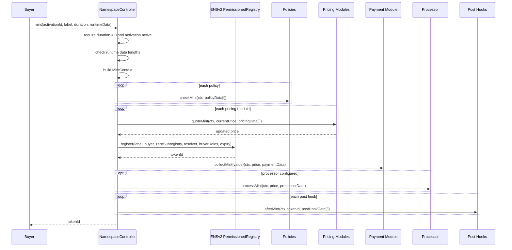
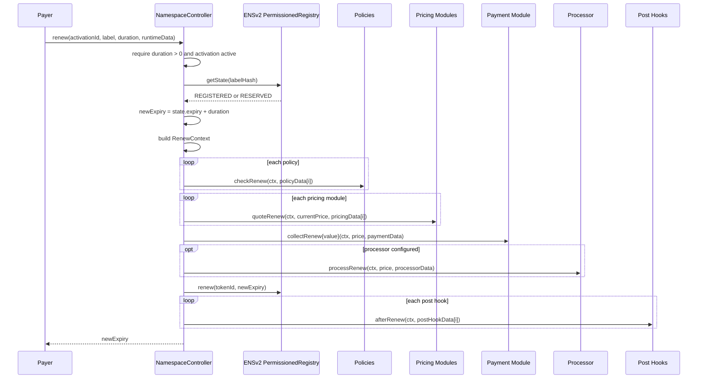

# Mint And Renewal Flow

Mint and renew are the buyer-facing execution paths. Both load an activation, validate runtime data sizes, run policies, compose price, call the ENSv2 registry, collect payment, process funds, and then run post hooks.

## Runtime Data

`NamespaceTypes.RuntimeData` is supplied per mint or renewal:

| Field | Used by |
| --- | --- |
| `policyData[]` | One entry per policy module. |
| `pricingData[]` | One entry per pricing module. |
| `paymentData` | Payment module. |
| `processorData` | Processor module. |
| `postHookData[]` | One entry per post-hook module. |

The controller checks that array lengths match the activation. This prevents accidental proof/config misalignment.

Runtime data is not configuration. Configuration is stored during activation, while runtime data proves facts that can change per buyer or per label. For example, `ReservationPolicy` stores one Merkle root during activation, and a buyer supplies `ReservationPolicy.ProofData` at the policy's array index when minting a reserved label.

```solidity
runtimeData.policyData[reservationPolicyIndex] = abi.encode(
    ReservationPolicy.ProofData({
        account: reservedBuyer,
        expiry: reservationExpiry,
        proof: merkleProof
    })
);
```

## Mint Sequence



## Mint Context

`MintContext` gives modules all common facts:

- `activationId`;
- `buyer`;
- `payer`;
- registry;
- parent node;
- label and label hash;
- duration and expiry;
- resolver;
- buyer role bitmap.

Today `buyer` and `payer` are both `msg.sender`. A future permit or sponsored mint module could extend runtime/payment behavior without changing policy and pricing interfaces.

## Renewal Sequence



## Execution Order Matters

The current mint order is deliberate:

1. policies before pricing/payment;
2. pricing before registry write;
3. registry write before payment settlement;
4. payment and optional processor before post hooks;
5. hooks after registry write.

Mint does not preflight `getState` because `PermissionedRegistry.register` already enforces availability and reserved-label rules. The controller calls `register` before payment settlement, so an unavailable label reverts before any payment transfer. If payment, processor, or hook execution later reverts, the whole transaction reverts, including the registry write and any ERC20 transfers already made in the same transaction.

Renewal still reads registry state first because it needs the existing token id and expiry to compute the new expiry.

Post hooks run after the registry mutation because they may need the minted token id or a resolver node that should only be updated after a successful mint.
