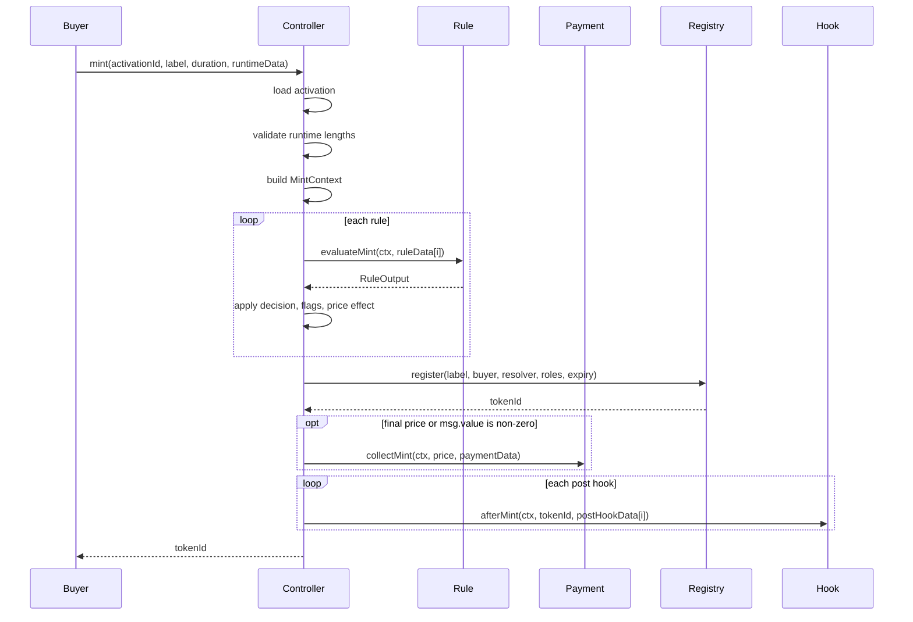
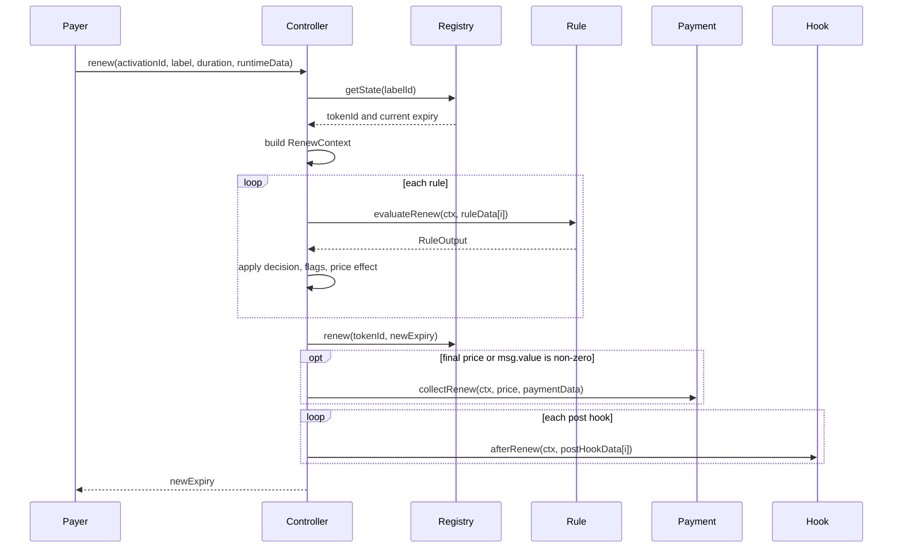

# Mint And Renewal Flow

Mint and renewal calls use stored activation config plus per-call runtime data.

## Runtime Data

`NamespaceTypes.RuntimeData` contains:

| Field | Meaning |
| --- | --- |
| `ruleData[]` | One entry per configured rule, same order as activation rules. |
| `paymentData` | Runtime data for the payment module. |
| `postHookData[]` | One entry per configured post hook. |

Runtime data is not configuration. Configuration is stored at activation time. Runtime data proves facts that differ per buyer or label, such as Merkle claims.

Example reservation claim:

```solidity
ReservationRule.Claim memory claim = ReservationRule.Claim({
    labelHash: keccak256(bytes("vip")),
    account: buyer,
    startTime: 0,
    endTime: uint64(block.timestamp + 30 days),
    mintable: true,
    token: address(usdc),
    mintPrice: 1000e6,
    renewPrice: 100e6,
    priceOp: NamespaceTypes.PriceOp.OVERRIDE,
    proof: proof
});

runtimeData.ruleData[reservationRuleIndex] = abi.encode(claim);
```

## Mint Sequence



## Renewal Sequence



The current implementation writes the ENSv2 registry before collecting payment. This is atomic: if payment or a hook reverts, the whole transaction reverts, including the registry write.

## Price Composition

The controller starts with:

```solidity
Price({token: address(0), amount: 0})
```

Each rule can return a `PriceOp`.

| PriceOp | Effect |
| --- | --- |
| `NONE` | No price change. |
| `SET_BASE` | Sets amount to `output.amount`. |
| `ADD` | Adds `output.amount`. |
| `SUBTRACT` | Subtracts with a floor at zero. |
| `DISCOUNT_BPS` | Applies basis point discount to current amount. |
| `MARKUP_BPS` | Applies basis point markup to current amount. |
| `MIN` | Raises amount to a minimum. |
| `MAX` | Caps amount at a maximum. |
| `OVERRIDE` | Replaces amount with `output.amount`. |

Absolute price operations also set/check the payment token. The default engine does not allow mixed payment tokens in one evaluation.

## Example: Reserved Custom Price

For `reserved.alice.eth`:

```text
FixedPriceRule      SET_BASE 10 USDC
LengthPremiumRule   ADD      2 USDC
ReservationRule     OVERRIDE 1000 USDC
Final price                  1000 USDC
```

For the wrong buyer:

```text
ReservationRule reverts ReservedForDifferentAccount
```

For a blocked reservation:

```text
ReservationRule reverts ReservedLabelBlocked
```

## Failure Behavior

Any revert reverts the full transaction, including registry writes and ERC20 transfers made earlier in the same transaction.

Common failures:

| Failure | Source |
| --- | --- |
| Runtime length mismatch | Controller |
| Label outside bounds | `LabelLengthRule` |
| Sale closed | `SaleWindowRule` |
| Missing claim | `ReservationRule` or `WhitelistRule` |
| Mixed payment tokens | Controller |
| Wrong payment token | Payment module |
| Label unavailable | ENSv2 registry |
