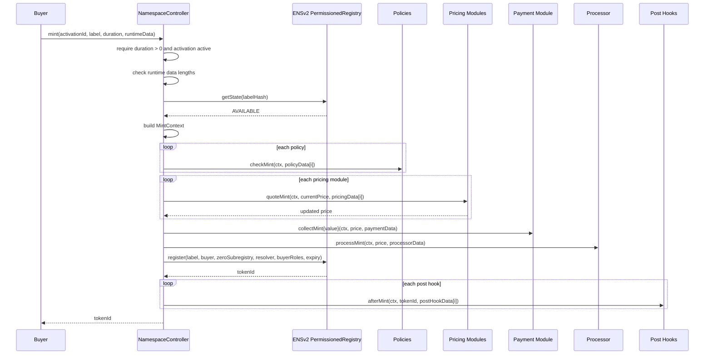
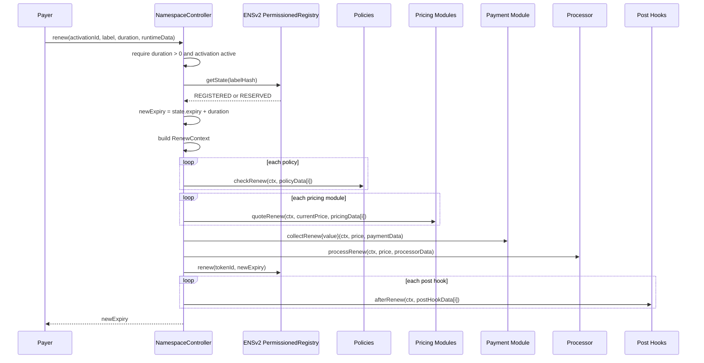

# Mint And Renewal Flow

Mint and renew are the buyer-facing execution paths. Both load an activation, validate runtime data sizes, run policies, compose price, collect payment, process funds, and call the ENSv2 registry.

## Runtime Data

`NamespaceTypes.RuntimeData` is supplied per mint or renewal:

| Field | Used by |
| --- | --- |
| `policyData[]` | One entry per policy module. |
| `pricingData[]` | One entry per pricing module. |
| `paymentData` | Payment module. |
| `processorData` | Processor module. |
| `postHookData[]` | One entry per post-hook module. |

The controller checks that array lengths match the activation. This prevents accidental proof/config misalignment.

## Mint Sequence

## Mint Context

`MintContext` gives modules all common facts:

- `activationId`;
- `buyer`;
- `payer`;
- registry;
- parent node;
- label and label hash;
- duration and expiry;
- resolver;
- buyer role bitmap.

Today `buyer` and `payer` are both `msg.sender`. A future permit or sponsored mint module could extend runtime/payment behavior without changing policy and pricing interfaces.

## Renewal Sequence

## Execution Order Matters

The current order is deliberate:

1. availability/state check first;
2. policies before pricing/payment;
3. payment before registry write;
4. processor before registry write;
5. hooks after registry write.

Post hooks run after the registry mutation because they may need the minted token id or a resolver node that should only be updated after a successful mint.

