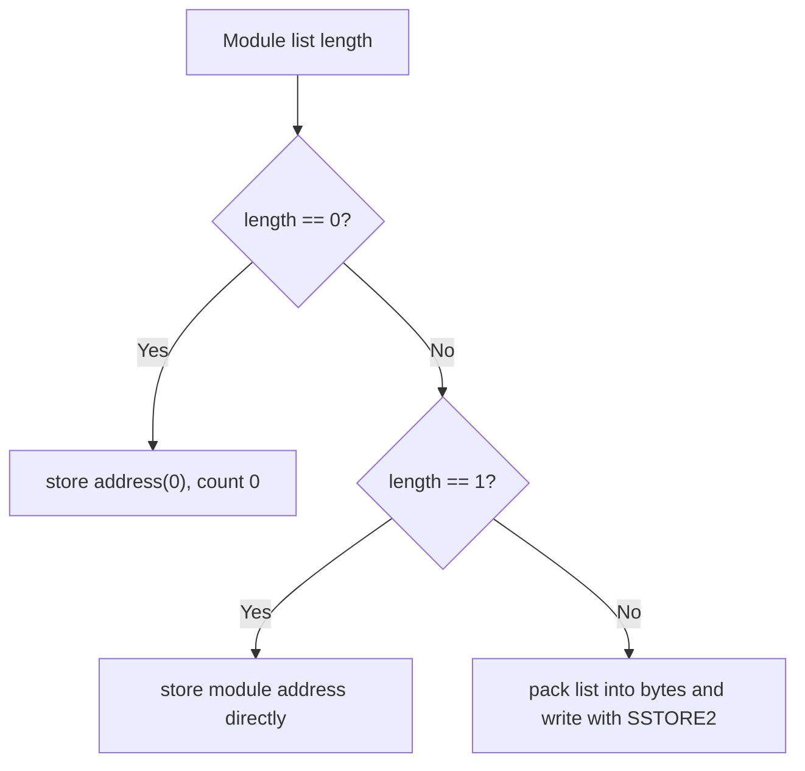

# Data Model And Storage

This document describes the data structures that make an activation executable.

## Activation Id

`activate(name, config)` resolves the namespace and computes a deterministic key:

```solidity
activationId = keccak256(
    abi.encode(block.chainid, address(registry), parentNode, address(parentRegistry), namespaceResource)
);
```

`activationId` is equal to this namespace key.

Properties:

| Component | Purpose |
| --- | --- |
| `block.chainid` | Avoids cross-chain id reuse. |
| `registry` | Binds id to the canonical writable ENSv2 registry for the namespace. |
| `parentNode` | Binds id to the namespace namehash, such as `namehash("alice.eth")`. |
| `parentRegistry` | Binds id to the registry that owns the namespace label. |
| `namespaceResource` | Binds id to the current ENSv2 EAC resource for the namespace label. |

Because the parent namespace resource is included, expiry/unregister/re-register creates a new activation namespace. Token id changes caused by ENSv2 role regeneration do not change the activation id because the EAC resource is unchanged.

The controller rejects a second activation for the same current namespace key with `NamespaceAlreadyActivated`.

## ActivationConfig

`NamespaceTypes.ActivationConfig` is the external input to `activate`.

| Field | Type | Stored in controller | Can update in same activation |
| --- | --- | --- | --- |
| `resolver` | `address` | yes | no |
| `buyerRoleBitmap` | `uint256` | yes | no |
| `minDuration` | `uint64` | yes | no |
| `maxDuration` | `uint64` | yes | no |
| `rules` | `RuleConfig[]` | addresses and phases only | module params yes, list no |
| `paymentModule` | `ModuleConfig` | address only | module params yes, address no |
| `postHooks` | `ModuleConfig[]` | addresses only | module params yes, list no |

`configData` for rules, payment module, and hooks is not stored in the controller. It is passed to each module's `configure(activationId, configData)`.

`registry`, `parentRegistry`, `parentNode`, and `namespaceResource` are derived from the DNS-encoded `name` argument using `UniversalResolverV2` and the parent `IPermissionedRegistry`.

## Internal ActivationData

The controller stores:

| Field | Purpose |
| --- | --- |
| `owner` | Activation manager. |
| `registry` | ENSv2 registry target. |
| `parentRegistry` | ENSv2 registry that owns the namespace label. |
| `namespaceKey` | Deterministic one-activation-per-namespace key. |
| `parentNode` | Canonical parent namehash. |
| `namespaceLabelHash` | Hash of the namespace label in its parent registry. |
| `namespaceResource` | Parent registry EAC resource captured at activation. |
| `namespaceLabel` | Label used to verify the parent subregistry pointer at runtime. |
| `resolver` | Resolver used on registry registration. |
| `buyerRoleBitmap` | Roles granted to buyers. |
| `minDuration` | Minimum allowed duration. |
| `maxDuration` | Maximum allowed duration. |
| `active` | Runtime mint/renew switch. |
| `ruleCount` | Number of rules, capped at `255`. |
| `firstRulePhase` | Phase for single-rule fast path. |
| `postHookCount` | Number of hooks, capped at `255`. |
| `paymentModule` | Payment module address or zero. |
| `rules` | Rule address or SSTORE2 pointer. |
| `postHooks` | Hook address or SSTORE2 pointer. |

## Module List Encoding

The controller stores rules and hooks differently depending on list length.



Encoding:

| List | Encoding when length is `2+` |
| --- | --- |
| Rules | `20 bytes module address + 1 byte phase` per rule. |
| Post hooks | `20 bytes module address` per hook. |

Why this exists:

| Reason | Explanation |
| --- | --- |
| Avoid dynamic storage arrays | Hot activation reads stay compact. |
| Keep single-module paths cheap | The common path reads one stored address. |
| Support larger stacks | SSTORE2 can store packed module data without many storage slots. |

## Module Config Storage

Modules store their own activation-scoped parameters:

```solidity
mapping(bytes32 activationId => Params params) public params;
```

or equivalent internal mappings.

This means:

| Consequence | Explanation |
| --- | --- |
| Config can be updated without changing controller storage. | `updateModuleConfig` calls the existing module's `configure`. |
| Same module can serve many activations. | State is keyed by `activationId`. |
| Same module address should not appear twice with different config in one activation. | The second configure overwrites the same `activationId` slot. |

## RuntimeData

`NamespaceTypes.RuntimeData` is supplied to `mint` and `renew`.

| Field | Controller validation | Consumer |
| --- | --- | --- |
| `ruleData` | Must equal `ruleCount`. | `ruleData[i]` is passed to rule `i`. |
| `paymentData` | Not length-checked. | Passed to payment module if payment dispatch occurs. |
| `postHookData` | Must equal `postHookCount`. | `postHookData[i]` is passed to hook `i`. |

Runtime data is per-call input, not stored sale configuration.

Examples:

| Runtime item | Where it goes |
| --- | --- |
| Reservation Merkle claim | `ruleData[reservationRuleIndex]` |
| Whitelist Merkle claim | `ruleData[whitelistRuleIndex]` |
| Payment permit payload | `paymentData`, for a payment module that supports permits |
| Resolver address override | `postHookData[setAddrHookIndex]` |

## MintContext

`MintContext` is built by the controller after initial checks:

| Field | Value |
| --- | --- |
| `activationId` | User-supplied activation id. |
| `buyer` | `msg.sender`. |
| `payer` | `msg.sender`. |
| `registry` | Activation registry. |
| `parentNode` | Activation parent node. |
| `label` | User-supplied label. |
| `labelHash` | `keccak256(bytes(label))`. |
| `duration` | User-supplied duration. |
| `expiry` | `uint64(block.timestamp) + duration`. |
| `resolver` | Activation resolver. |
| `buyerRoleBitmap` | Activation buyer role bitmap. |

`buyer` and `payer` are currently the same. Future meta-transaction or delegated payment support would need explicit controller changes.

## RenewContext

`RenewContext` is built after registry state is loaded:

| Field | Value |
| --- | --- |
| `activationId` | User-supplied activation id. |
| `payer` | `msg.sender`. |
| `registry` | Activation registry. |
| `parentNode` | Activation parent node. |
| `label` | User-supplied label. |
| `labelHash` | `keccak256(bytes(label))`. |
| `tokenId` | `state.tokenId` from registry. |
| `duration` | User-supplied duration. |
| `currentExpiry` | `state.expiry` from registry. |
| `newExpiry` | `state.expiry + duration`. |

Renew does not pass a buyer because renewal payment authority is not currently tied to registry ownership by the controller. Registry and modules decide their own constraints.

## Price

Rules compose one final price:

```solidity
struct Price {
    address token;
    uint256 amount;
}
```

Meaning:

| Field | Meaning |
| --- | --- |
| `token == address(0)` | Native ETH payment. |
| `token != address(0)` | ERC20 token address. |
| `amount == 0` | Free unless `msg.value` is non-zero. |

The controller rejects mixed tokens across absolute price operations in a single rule evaluation.

## Label Activation Mapping

After successful registry registration, the controller stores:

```solidity
labelActivations[address(registry)][labelHash] = activationId;
```

Renewal requires the stored activation id to match the renewal activation id.

Why:

| Reason | Explanation |
| --- | --- |
| Prevent wrong renewal policy | A cheap renewal activation cannot renew a label minted through a stricter activation. |
| Namespace-level binding | Only the activation that minted the label can renew it. |
| Keep renewal state minimal | Mapping stores only the activation id needed for policy binding. |

Limitation:

| Limitation | Consequence |
| --- | --- |
| Labels minted outside Namespace have no mapping. | They cannot renew through this controller unless controller logic changes. |
