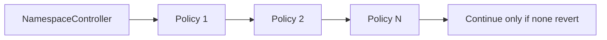
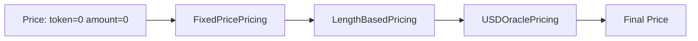

# Module Catalog

Modules are activation-scoped contracts. The controller calls `configure(activationId, configData)` during activation, then calls the module during mint or renewal.

All modules inherit or implement the same controller-only configuration pattern.

## Policy Modules

Policies are gates. Every configured policy must pass.



### SaleWindowPolicy

Purpose: enable minting and renewal only inside a time window.

Config:

```solidity
SaleWindowPolicy.Params({
    startTime: uint64,
    endTime: uint64
})
```

Flow:

1. Load params for `activationId`.
2. If `startTime != 0`, current time must be at or after start.
3. If `endTime != 0`, current time must be at or before end.

### LabelLengthPolicy

Purpose: enforce byte-length bounds.

Config:

```solidity
LabelLengthPolicy.Params({
    minLength: uint16,
    maxLength: uint16
})
```

Flow:

1. Compute `bytes(label).length`.
2. Revert if below `minLength`.
3. Revert if above `maxLength`, unless `maxLength == 0`.

Unicode note: this is byte length, not grapheme count. Emoji-aware or normalized-label rules should be separate policies.

### ERC20BalanceGatePolicy

Purpose: require buyer or renewal payer to hold enough ERC20.

Config:

```solidity
ERC20BalanceGatePolicy.Params({
    token: ERC20,
    minBalance: uint256
})
```

Flow:

1. Mint checks `ctx.buyer`.
2. Renewal checks `ctx.payer`.
3. Module calls `token.balanceOf(account)`.
4. Revert if balance is below `minBalance`.

### ERC721BalanceGatePolicy

Purpose: require buyer or renewal payer to hold enough NFTs from an ERC721 collection.

Config:

```solidity
ERC721BalanceGatePolicy.Params({
    token: ERC721,
    minBalance: uint256
})
```

Flow is the same as ERC20 gating, but uses `ERC721.balanceOf(account)`.

### ReservationPolicy

Purpose: reserve exact labels for specific buyers without storing every reservation on-chain.

Config:

```solidity
ReservationPolicy.Params({
    reservationRoot: bytes32
})
```

Runtime data:

```solidity
abi.encode(ReservationPolicy.ProofData({
    account: address,
    expiry: uint64,
    proof: bytes32[]
}))
```

Each Merkle leaf represents:

- `labelHash`;
- reserved `account`;
- `expiry`.

Leaves are compatible with Solady Merkle proof verification and can be computed on-chain with:

```solidity
reservationPolicy.leaf(labelHash, account, expiry)
```

`account == address(0)` creates a public reservation leaf. That means the label must still provide a valid proof, but any buyer can mint it. `expiry == 0` means the reservation never expires.

Flow:

1. If `reservationRoot == bytes32(0)`, allow.
2. Decode runtime `ProofData`.
3. Recompute the leaf from `ctx.labelHash`, `account`, and `expiry`.
4. Verify the proof against the stored activation root.
5. If the proof is expired, allow public mint.
6. If `account != address(0)` and the buyer is not `account`, revert.

Important: when a non-zero root is configured, every mint must provide a proof. This keeps storage small and moves large reservation lists off-chain while still enforcing them on-chain.

### PausePolicy

Purpose: let the activation owner pause both minting and renewal checks for a namespace activation.

Config: none.

Runtime data: none.

Control function:

```solidity
pausePolicy.setPaused(activationId, true);
pausePolicy.setPaused(activationId, false);
```

Flow:

1. `setPaused` loads the activation from `NamespaceController`.
2. Caller must equal the activation owner.
3. `checkMint` and `checkRenew` revert while paused.

The activation owner is the controller's verified namespace admin for that activation. This is the operational owner of the configured parent namespace sale.

### MerkleWhitelistPolicy

Purpose: allowlist mints or renewals using Merkle roots.

Config:

```solidity
MerkleWhitelistPolicy.Params({
    mintRoot: bytes32,
    renewRoot: bytes32,
    leafMode: LeafMode
})
```

Runtime data:

```solidity
abi.encode(bytes32[] proof)
```

Leaf modes:

| Mode | Leaf includes |
| --- | --- |
| `ACCOUNT` | account only |
| `ACCOUNT_LABEL` | account and label hash |

If a root is `bytes32(0)`, that side of the whitelist is disabled.

### CompositeMintPolicy

Purpose: bundle common sale-window, label-length, ERC20 balance, reservation, and whitelist checks into one policy module call.

This is a gas-optimized path for activations that would otherwise configure several standard policy modules. The individual modules remain useful when a namespace needs independent policy composition or different policy ownership boundaries.

Config:

```solidity
CompositeMintPolicy.Params({
    startTime: uint64,
    endTime: uint64,
    minLength: uint16,
    maxLength: uint16,
    gateToken: ERC20,
    minBalance: uint256,
    reservationRoot: bytes32,
    whitelistMintRoot: bytes32,
    whitelistRenewRoot: bytes32,
    whitelistLeafMode: MerkleWhitelistPolicy.LeafMode
})
```

Mint runtime data:

```solidity
abi.encode(
    CompositeMintPolicy.ReservationProofData({
        account: address,
        expiry: uint64,
        proof: bytes32[]
    }),
    bytes32[] whitelistProof
)
```

Renew runtime data:

```solidity
abi.encode(bytes32[] whitelistProof)
```

Flow:

1. Check sale window.
2. Check label byte length.
3. Check ERC20 balance if `gateToken` is non-zero.
4. Check reservation proof if `reservationRoot` is non-zero.
5. Check whitelist proof against the mint or renewal root if configured.

## Pricing Modules

Pricing modules run in order. Each module receives the current price and returns an updated price.



All pricing modules enforce token compatibility. A later pricing module cannot silently switch payment tokens after a previous module set one.

### FixedPricePricing

Adds fixed mint and renewal amounts with optional sparse exact byte-length overrides.

Config:

```solidity
FixedPricePricing.Params({
    token: address,
    defaultMintAmount: uint128,
    defaultRenewAmount: uint128,
    lengthPrices: FixedPricePricing.LengthPrice[]
})
```

Each `LengthPrice` is:

```solidity
FixedPricePricing.LengthPrice({
    length: uint16,
    mintAmount: uint128,
    renewAmount: uint128
})
```

Flow:

1. Compute `bytes(label).length`.
2. Use the first exact `length` match.
3. If nothing matches, use the default mint or renewal amount.

This avoids padding array entries for unused lengths. For example, a sale can price length 4 and length 8 labels without storing empty buckets for lengths 1-3 or 5-7.

The sparse override rows are packed into an `SSTORE2` blob during activation. This avoids one storage slot per override while preserving the `lengthPrices(activationId)` getter.

### LengthBasedPricing

Adds `ratePerSecond * duration` based on label byte length.

Config:

```solidity
LengthBasedPricing.Params({
    token: address,
    mintPricePerSecondByLength: uint128[],
    renewPricePerSecondByLength: uint128[]
})
```

Index `0` prices one-byte labels. Labels longer than the table use the final bucket.

Mint and renewal rate tables are packed into `SSTORE2` blobs during activation. Quotes copy only the selected `uint128` rate from bytecode instead of loading the whole table.

### USDOraclePricing

Converts USD-denominated prices to token amounts using a Chainlink-compatible oracle.

Config:

```solidity
USDOraclePricing.Params({
    token: address,
    oracle: IAggregatorV3,
    tokenDecimals: uint8,
    maxStaleness: uint64,
    mintUsdPrice: uint128,
    renewUsdPrice: uint128
})
```

Flow:

1. Read latest oracle answer.
2. Reject non-positive answer.
3. Reject stale answer when `maxStaleness != 0`.
4. Convert USD amount to token amount and round up.

### OnlyNumberPricing

Adds a premium when the entire label is ASCII number-only, such as `1234`.

Config:

```solidity
LabelClassPricing.Params({
    token: address,
    mintAmount: uint128,
    renewAmount: uint128
})
```

Non-matching labels pass through without changing the current price.

### OnlyLetterPricing

Adds a premium when the entire label is ASCII letter-only, such as `alice` or `Team`.

It uses the same `LabelClassPricing.Params` config as `OnlyNumberPricing`.

### OnlyEmojiPricing

Adds a premium when the entire label is emoji-only.

It accepts common emoji codepoint ranges, variation selector `U+FE0F`, zero-width joiner `U+200D`, and skin-tone modifiers when attached to emoji content. It uses the same `LabelClassPricing.Params` config as `OnlyNumberPricing`.

### CompositePricing

Combines the common price stack into one pricing module:

- optional label-class premium for number-only, letter-only, or emoji-only labels;
- fixed mint and renewal amounts;
- exact-length fixed overrides;
- per-second length-based renewal rates.

Config:

```solidity
CompositePricing.Params({
    token: address,
    labelClass: CompositePricing.LabelClass,
    classMintAmount: uint128,
    classRenewAmount: uint128,
    fixedMintAmount: uint128,
    fixedRenewAmount: uint128,
    lengthPrices: CompositePricing.LengthPrice[],
    mintRates: LengthBasedPricing.LengthRule[],
    renewRates: LengthBasedPricing.LengthRule[]
})
```

Flow:

1. Reject mixed payment tokens.
2. Add the class premium if the label matches the configured class.
3. Add the fixed mint or renewal amount.
4. Add the exact-length fixed override when one exists.
5. Add the matching per-second length rate multiplied by duration.

Use this when an activation needs several standard pricing dimensions and gas is more important than swapping each pricing component independently.

## Payment Module

### ERC20PaymentModule

Collects ERC20 payment from the payer to a configured recipient.

Config:

```solidity
ERC20PaymentModule.Params({
    token: ERC20,
    recipient: address
})
```

Flow:

1. Reject native ETH sent to ERC20 payment.
2. Ensure final price token equals configured token.
3. If amount is non-zero, call `safeTransferFrom(payer, recipient, amount)`.

For split sales, set `recipient` to an `ERC20SplitProcessor`.

### ERC20SplitPaymentModule

Collects ERC20 payment from the payer and sends it directly to split recipients in the same payment module call.

Config:

```solidity
ERC20SplitPaymentModule.Params({
    token: address,
    splits: ERC20SplitPaymentModule.Split[]
})
```

Rules:

- every recipient must be non-zero;
- total bps must equal `10_000`;
- native token payment is not supported.

Flow:

1. Reject native ETH sent to ERC20 payment.
2. Ensure final price token equals configured token.
3. Transfer each recipient share from payer with `safeTransferFrom`.
4. Send the final recipient the remainder to avoid dust.

Use this instead of `ERC20PaymentModule + ERC20SplitProcessor` when the activation wants ERC20 revenue splits and does not need a separate processor step.

## Processor Modules

Processors run after payment collection. They are optional; direct-settlement activations can use a zero processor and have the payment module send funds directly to the final recipient.

### NoopProcessor

Does nothing. It is kept as a module example and for deployments that want an explicit processor address, but the gas-efficient direct-settlement path is to set the activation processor to zero.

### ERC20SplitProcessor

Splits ERC20 funds held by the processor contract according to basis points.

Config:

```solidity
ERC20SplitProcessor.Split[] splits
```

Rules:

- every recipient must be non-zero;
- total bps must equal `10_000`;
- native token payment is not supported.

Flow:

1. Payment module transfers ERC20 funds to processor.
2. Processor transfers shares to recipients.
3. Last recipient receives the remainder to avoid dust.

## Post-Hook Modules

### SetAddrToBuyerHook

Sets resolver `addr(node)` after mint.

Runtime data:

- empty bytes: set `addr` to buyer;
- `abi.encode(address)`: set `addr` to override address.

Flow:

1. Require resolver is configured.
2. Decode optional override.
3. Compute child node from parent node and label hash.
4. Call `resolver.setAddr(node, address)`.

Renewal is intentionally a no-op.

### BatchSetAddrToBuyerHook

Sets one or more resolver `addr(node)` values in a single post-hook module call.

Runtime data:

- empty bytes: set `addr` to buyer once;
- tightly packed 20-byte addresses: one resolver write per address;
- zero packed address: use buyer for that write.

Flow:

1. Require resolver is configured.
2. Compute child node from parent node and label hash once.
3. If runtime data is empty, call `resolver.setAddr(node, buyer)`.
4. Otherwise require runtime data length is a multiple of 20.
5. Loop through packed addresses and call `resolver.setAddr(node, address)` for each value.

Use this when an activation needs multiple resolver writes from the same hook. It keeps the controller hook list shorter and avoids repeated controller-to-hook calls.
