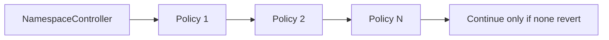
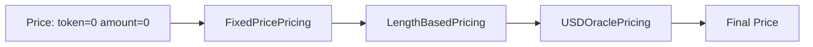

# Module Catalog

Modules are activation-scoped contracts. The controller calls `configure(activationId, configData)` during activation, then calls the module during mint or renewal.

All modules inherit or implement the same controller-only configuration pattern.

## Policy Modules

Policies are gates. Every configured policy must pass.



### SaleWindowPolicy

Purpose: enable minting and renewal only inside a time window.

Config:

```solidity
SaleWindowPolicy.Params({
    startTime: uint64,
    endTime: uint64
})
```

Flow:

1. Load params for `activationId`.
2. If `startTime != 0`, current time must be at or after start.
3. If `endTime != 0`, current time must be at or before end.

### LabelLengthPolicy

Purpose: enforce byte-length bounds.

Config:

```solidity
LabelLengthPolicy.Params({
    minLength: uint16,
    maxLength: uint16
})
```

Flow:

1. Compute `bytes(label).length`.
2. Revert if below `minLength`.
3. Revert if above `maxLength`, unless `maxLength == 0`.

Unicode note: this is byte length, not grapheme count. Emoji-aware or normalized-label rules should be separate policies.

### ERC20BalanceGatePolicy

Purpose: require buyer or renewal payer to hold enough ERC20.

Config:

```solidity
ERC20BalanceGatePolicy.Params({
    token: IERC20,
    minBalance: uint256
})
```

Flow:

1. Mint checks `ctx.buyer`.
2. Renewal checks `ctx.payer`.
3. Module calls `token.balanceOf(account)`.
4. Revert if balance is below `minBalance`.

### ERC721BalanceGatePolicy

Purpose: require buyer or renewal payer to hold enough NFTs from an ERC721 collection.

Config:

```solidity
ERC721BalanceGatePolicy.Params({
    token: IERC721,
    minBalance: uint256
})
```

Flow is the same as ERC20 gating, but uses `IERC721.balanceOf(account)`.

### ReservationPolicy

Purpose: reserve exact labels for specific buyers, or block labels until reservation expiry.

Config:

```solidity
ReservationPolicy.Params({
    reservations: ReservationInput[]
})
```

Each reservation contains:

- `labelHash`;
- allowed `account`;
- `expiry`.

Flow:

1. Load reservation for `ctx.labelHash`.
2. If no reservation exists, allow.
3. If reservation expired, allow.
4. If reserved account is not the buyer, revert.

### MerkleWhitelistPolicy

Purpose: allowlist mints or renewals using Merkle roots.

Config:

```solidity
MerkleWhitelistPolicy.Params({
    mintRoot: bytes32,
    renewRoot: bytes32,
    leafMode: LeafMode
})
```

Runtime data:

```solidity
abi.encode(bytes32[] proof)
```

Leaf modes:

| Mode | Leaf includes |
| --- | --- |
| `ACCOUNT` | account only |
| `ACCOUNT_LABEL` | account and label hash |

If a root is `bytes32(0)`, that side of the whitelist is disabled.

## Pricing Modules

Pricing modules run in order. Each module receives the current price and returns an updated price.



All pricing modules enforce token compatibility. A later pricing module cannot silently switch payment tokens after a previous module set one.

### FixedPricePricing

Adds fixed mint and renewal amounts with optional sparse exact byte-length overrides.

Config:

```solidity
FixedPricePricing.Params({
    token: address,
    defaultMintAmount: uint128,
    defaultRenewAmount: uint128,
    lengthPrices: FixedPricePricing.LengthPrice[]
})
```

Each `LengthPrice` is:

```solidity
FixedPricePricing.LengthPrice({
    length: uint16,
    mintAmount: uint128,
    renewAmount: uint128
})
```

Flow:

1. Compute `bytes(label).length`.
2. Use the first exact `length` match.
3. If nothing matches, use the default mint or renewal amount.

This avoids padding array entries for unused lengths. For example, a sale can price length 4 and length 8 labels without storing empty buckets for lengths 1-3 or 5-7.

### LengthBasedPricing

Adds `ratePerSecond * duration` based on label byte length.

Config:

```solidity
LengthBasedPricing.Params({
    token: address,
    mintPricePerSecondByLength: uint128[],
    renewPricePerSecondByLength: uint128[]
})
```

Index `0` prices one-byte labels. Labels longer than the table use the final bucket.

### USDOraclePricing

Converts USD-denominated prices to token amounts using a Chainlink-compatible oracle.

Config:

```solidity
USDOraclePricing.Params({
    token: address,
    oracle: IAggregatorV3,
    tokenDecimals: uint8,
    maxStaleness: uint64,
    mintUsdPrice: uint128,
    renewUsdPrice: uint128
})
```

Flow:

1. Read latest oracle answer.
2. Reject non-positive answer.
3. Reject stale answer when `maxStaleness != 0`.
4. Convert USD amount to token amount and round up.

### OnlyNumberPricing

Adds a premium when the entire label is ASCII number-only, such as `1234`.

Config:

```solidity
LabelClassPricing.Params({
    token: address,
    mintAmount: uint128,
    renewAmount: uint128
})
```

Non-matching labels pass through without changing the current price.

### OnlyLetterPricing

Adds a premium when the entire label is ASCII letter-only, such as `alice` or `Team`.

It uses the same `LabelClassPricing.Params` config as `OnlyNumberPricing`.

### OnlyEmojiPricing

Adds a premium when the entire label is emoji-only.

It accepts common emoji codepoint ranges, variation selector `U+FE0F`, zero-width joiner `U+200D`, and skin-tone modifiers when attached to emoji content. It uses the same `LabelClassPricing.Params` config as `OnlyNumberPricing`.

## Payment Module

### ERC20PaymentModule

Collects ERC20 payment from the payer to a configured recipient.

Config:

```solidity
ERC20PaymentModule.Params({
    token: IERC20,
    recipient: address
})
```

Flow:

1. Reject native ETH sent to ERC20 payment.
2. Ensure final price token equals configured token.
3. If amount is non-zero, call `safeTransferFrom(payer, recipient, amount)`.

For split sales, set `recipient` to an `ERC20SplitProcessor`.

## Processor Modules

Processors run after payment collection.

### NoopProcessor

Does nothing. Use when the payment module already sends funds to the final recipient.

### ERC20SplitProcessor

Splits ERC20 funds held by the processor contract according to basis points.

Config:

```solidity
ERC20SplitProcessor.Split[] splits
```

Rules:

- every recipient must be non-zero;
- total bps must equal `10_000`;
- native token payment is not supported.

Flow:

1. Payment module transfers ERC20 funds to processor.
2. Processor transfers shares to recipients.
3. Last recipient receives the remainder to avoid dust.

## Post-Hook Modules

### SetAddrToBuyerHook

Sets resolver `addr(node)` after mint.

Runtime data:

- empty bytes: set `addr` to buyer;
- `abi.encode(address)`: set `addr` to override address.

Flow:

1. Require resolver is configured.
2. Decode optional override.
3. Compute child node from parent node and label hash.
4. Call `resolver.setAddr(node, address)`.

Renewal is intentionally a no-op.
