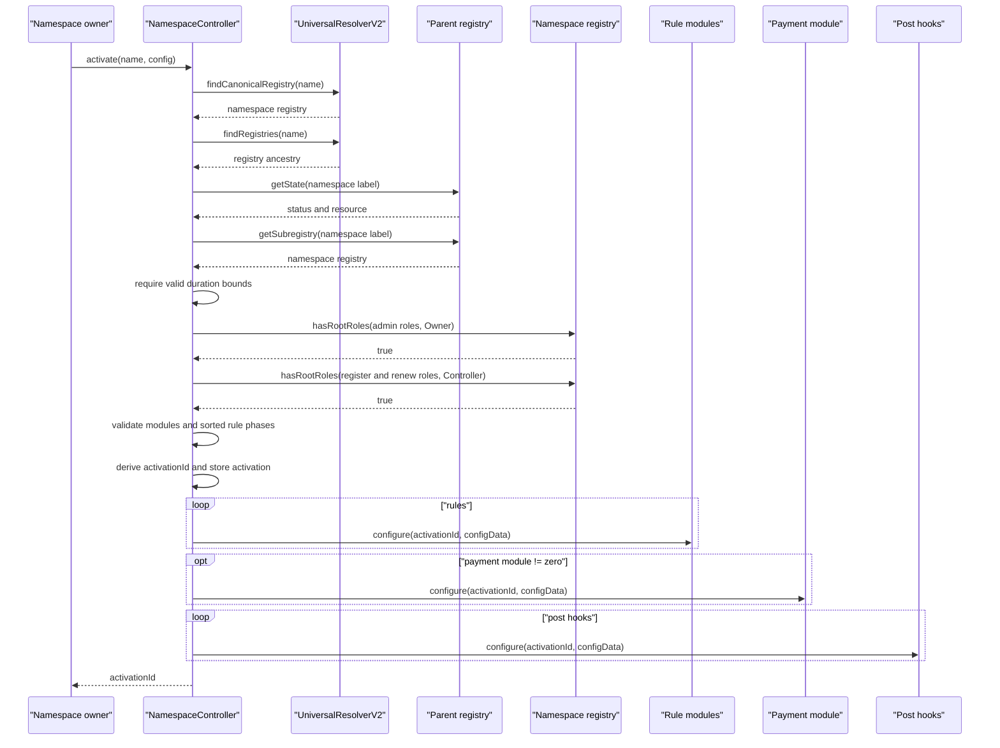
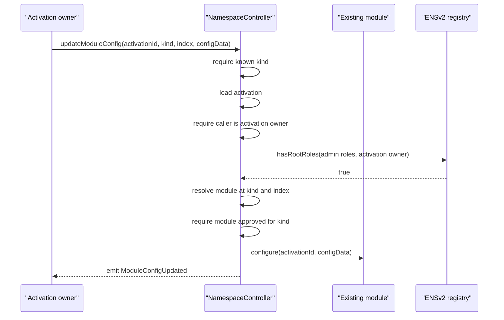

# Activation Lifecycle

Activation turns a namespace owner's intended sale configuration into executable controller and module state.

## Zero-To-One Activation Flow

```text
1. Deploy and initialize controller.
2. Deploy and initialize modules.
3. Controller owner approves modules.
4. Controller owner sets ENSv2 UniversalResolverV2.
5. ENSv2 registry admin grants controller register and renew roles.
6. Namespace owner calls `activate(name, config)`.
7. Controller resolves the namespace registry and validates permissions, durations, modules, and phases.
8. Controller stores activation.
9. Controller calls configure on every configured module.
10. Activation id is returned and sale can be used.
```

## Required Pre-State

Before `activate`:

| Requirement | Why |
| --- | --- |
| Controller proxy initialized | Sets owner and enables module approval enforcement. |
| `universalResolver` set | Needed for canonical namespace discovery from DNS-encoded names. |
| Modules initialized with controller address | `configure` and runtime calls require `onlyController`. |
| Modules approved by kind when approvals are required | Activation rejects unapproved modules. |
| Activation caller has ENSv2 root admin roles | Caller must be authorized for the namespace. |
| Controller has ENSv2 register and renew roles | Controller must be able to execute future mints/renews. |

## Activation Sequence



## Checks In Order

| Order | Check | Why it exists |
| --- | --- | --- |
| 1 | `universalResolver != address(0)` | Activation needs canonical ENSv2 discovery. |
| 2 | DNS name is not root. | Root is not a user namespace sale target. |
| 3 | UniversalResolverV2 returns a canonical registry. | Prevents fake or detached registry activation. |
| 4 | Parent registry exists and label status is `REGISTERED`. | Prevents activating reserved, expired, or unavailable namespaces. |
| 5 | Parent subregistry still points to the resolved registry. | Prevents activating stale or inconsistent registry links. |
| 6 | `config.maxDuration != 0` | Prevents an activation that can never accept a valid duration. |
| 7 | `config.minDuration <= config.maxDuration` | Prevents impossible duration bounds. |
| 8 | Payment module is approved if non-zero | Payment module controls asset movement. |
| 9 | Caller has registry admin roles | Sale config must be created by an authorized namespace admin. |
| 10 | Controller has register/renew roles | Future runtime calls need registry execution authority. |
| 11 | Rule count and hook count are at most `255` | Counts are stored as `uint8`. |
| 12 | Every configured module is non-zero and approved for its kind | Prevents invalid and uncurated external execution. |
| 13 | Rule phases are non-descending | Ensures deterministic rule pipeline. |

## Activation Storage

The controller stores:

```text
owner = msg.sender
registry = resolved namespace registry
parentRegistry = resolved parent registry
namespaceKey = deterministic activation key
parentNode = namehash(name)
namespaceLabelHash = labelhash(first label)
namespaceResource = parent registry resource for the namespace label
namespaceLabel = first label
resolver = config.resolver
buyerRoleBitmap = config.buyerRoleBitmap
minDuration = config.minDuration
maxDuration = config.maxDuration
active = true
rules = compact rule list
paymentModule = config.paymentModule.module
postHooks = compact hook list
```

Then it emits:

```text
ActivationCreated(activationId, owner, registry, parentNode)
ActivationStatusChanged(activationId, true)
```

Although the activation is stored before module `configure` calls, the whole `activate` call is atomic. If any `configure` call reverts, storage and events revert.

## Activation Multiplicity

Current implementation:

```text
There is one activation per current namespace key.
```

The key includes chain id, namespace registry, parent node, parent registry, and parent namespace resource. Re-registered namespaces get a fresh resource and can activate again. A second activation for the same current resource reverts with `NamespaceAlreadyActivated`.

Why this distinction matters:

| Design | Issue |
| --- | --- |
| Name expires and is bought again | Parent registry resource changes; old activation becomes stale. |
| Registry root roles change | Activation id stays stable; runtime admin checks enforce authority. |
| ENSv2 token id changes due to role regeneration | Activation id stays stable because the resource did not change. |
| Parent subregistry pointer changes | Runtime staleness check rejects mint and renew through the old activation. |

## Module Configure Phase

Each module receives:

```solidity
configure(bytes32 activationId, bytes calldata configData)
```

Design rule for modules:

| Requirement | Reason |
| --- | --- |
| Restrict `configure` to the controller | Prevents arbitrary accounts from changing activation module parameters. |
| Decode exactly the documented params type | Keeps frontend/backend encoding deterministic. |
| Store by `activationId` | Allows one module to serve many activations. |
| Validate config immediately | Bad config should fail before activation succeeds. |

## Updating Module Config

`updateModuleConfig(activationId, kind, index, configData)` updates an existing module.

Sequence:



What can be changed:

| Can update | Examples |
| --- | --- |
| Existing rule parameters | Fixed prices, whitelist root, reservation root, sale window. |
| Existing payment parameters | Recipient, split recipients, split bps. |
| Existing hook parameters | Hook-specific config, if the hook stores any. |

What cannot be changed inside the same activation:

| Cannot update | Required action |
| --- | --- |
| Rule module address | Create a new activation. |
| Rule order or phase | Create a new activation. |
| Add/remove hooks | Create a new activation. |
| Payment module address | Create a new activation. |
| Namespace name, resolver, duration bounds, buyer roles | Create a new activation. |

## Activation Status

`setActivationStatus(activationId, active)` changes `activation.active`.

Checks:

| Check | Why |
| --- | --- |
| Activation exists | Avoids writing unknown ids. |
| Caller is activation owner | Prevents third-party pause/unpause. |
| Activation owner still has registry admin roles | Prevents stale admin from managing sale state. |

`active == false` blocks both `mint` and `renew`.

## PauseRule Versus Activation Status

There are two pause mechanisms:

| Mechanism | Where stored | Who controls | Effect |
| --- | --- | --- | --- |
| Activation status | Controller | Activation owner | Blocks before rule evaluation. |
| `PauseRule` | Rule module | Activation owner | Blocks when rule is evaluated. |

Use activation status for whole-activation operational shutdown. Use `PauseRule` when pause behavior should be part of the configured rule stack and visible as a rule.

## Ownership Transfer

`transferActivationOwnership(activationId, newOwner)`:

| Check | Why |
| --- | --- |
| `newOwner != address(0)` | Prevents orphaned activations. |
| Caller is current activation owner | Prevents unauthorized transfer. |
| Current owner still has registry admin roles | Ensures current owner is still valid. |
| New owner has registry admin roles | Ensures future owner can manage the namespace sale. |

This changes only Namespace activation ownership. It does not transfer ENSv2 name ownership or registry roles.
