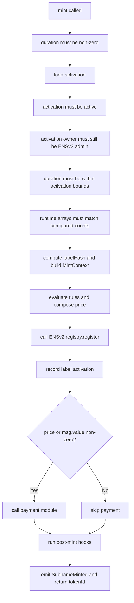
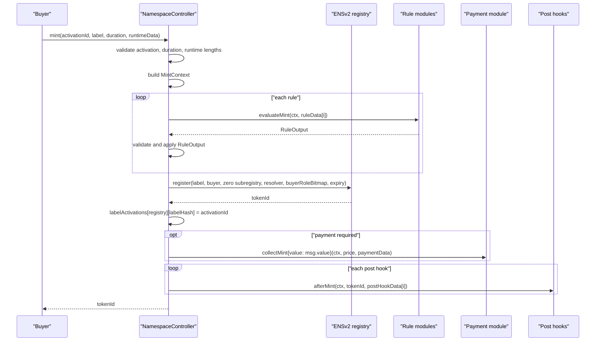

# Mint Flow

This document traces `NamespaceController.mint` from call input to final event.

## Entry Point

```solidity
function mint(
    bytes32 activationId,
    string calldata label,
    uint64 duration,
    NamespaceTypes.RuntimeData calldata runtimeData
) external payable returns (uint256 tokenId);
```

Inputs:

| Input | Meaning |
| --- | --- |
| `activationId` | Stored sale configuration to execute. |
| `label` | Direct child label, such as `bob`, not `bob.alice.eth`. |
| `duration` | Registration duration in seconds. |
| `runtimeData.ruleData` | One payload per configured rule. |
| `runtimeData.paymentData` | Payload for payment module if payment is collected. |
| `runtimeData.postHookData` | One payload per configured post hook. |
| `msg.value` | Native ETH payment value. |

## Flow Diagram



## Sequence Diagram



## Step-By-Step Checks

| Step | Code behavior | Why it exists |
| --- | --- | --- |
| 1 | Revert if `duration == 0`. | Zero-duration registrations are nonsensical and can bypass time-based pricing assumptions. |
| 2 | Load activation by id. | Unknown activation ids should not execute arbitrary module data. |
| 3 | Revert if activation is inactive. | Allows sale owner to stop minting and renewal through this activation. |
| 4 | Check activation owner still has registry admin roles. | Prevents a stale activation owner from continuing to operate a namespace after losing ENSv2 authority. |
| 5 | Check duration bounds. | Enforces sale-level minimum and maximum duration. |
| 6 | Check `ruleData.length == ruleCount`. | Ensures each configured rule receives exactly one runtime payload. |
| 7 | Check `postHookData.length == postHookCount`. | Ensures each configured hook receives exactly one runtime payload. |
| 8 | Compute `labelHash = keccak256(bytes(label))`. | ENSv2 registry state is keyed by label hash; modules also use it for claims. |
| 9 | Build `MintContext`. | Gives all modules the same immutable operation context. Computed expiry uses checked `uint64` arithmetic. |
| 10 | Evaluate rules. | Applies gating and pricing before registry state changes. |
| 11 | Register through ENSv2. | Official registry creates the subname and token id. |
| 12 | Store label-to-activation mapping. | Renewal later requires the same activation id. |
| 13 | Collect payment if needed. | Final price is enforced after successful registry write. |
| 14 | Run hooks. | Optional side effects such as resolver writes happen after mint. |
| 15 | Emit event. | Indexers can track mints and payments. |

## MintContext Construction

```solidity
ctx = MintContext({
    activationId: activationId,
    buyer: msg.sender,
    payer: msg.sender,
    registry: activation.registry,
    parentNode: activation.parentNode,
    label: label,
    labelHash: bytes32(labelId),
    duration: duration,
    expiry: uint64(block.timestamp) + duration,
    resolver: activation.resolver,
    buyerRoleBitmap: activation.buyerRoleBitmap
});
```

Implications:

| Field | Implication |
| --- | --- |
| `buyer == payer == msg.sender` | Current controller does not support third-party payer or meta-transaction payer separation. |
| `expiry` uses current block timestamp | Timestamp-sensitive tests and UIs must account for block-time drift. |
| `labelHash` uses raw bytes | Off-chain normalization must be consistent before submitting labels/proofs. |

## Registry Registration

The controller calls:

```solidity
activation.registry.register(
    label,
    msg.sender,
    IRegistry(address(0)),
    activation.resolver,
    activation.buyerRoleBitmap,
    ctx.expiry
);
```

Why registry call is after rules:

| Reason | Explanation |
| --- | --- |
| Avoid invalid registry writes | Blocked labels should never reach registry registration. |
| Price must be known first | Payment collection uses the composed final price. |
| Modules need pre-mint context | Eligibility modules evaluate the intended label before state changes. |

Why payment is after registry:

| Reason | Explanation |
| --- | --- |
| Registry can still reject label availability or permissions. | Payment should not settle if registry mint fails. |
| Atomicity protects against later reverts. | If payment or hooks fail, registry state reverts too. |

## Payment Dispatch

The controller calls payment only when:

```solidity
price.amount != 0 || msg.value != 0
```

Cases:

| Case | Result |
| --- | --- |
| Free mint and no native value | Payment module is not called and may be unset. |
| Non-zero price | Payment module must be configured and approved. |
| Non-zero `msg.value` with zero price | Payment module is still called and should reject unless config accepts it. |
| ERC20 price with native module | Native module rejects token mismatch. |
| Native price with ERC20 module | ERC20 module rejects native value or token mismatch. |

Buyer must approve the payment module for ERC20 payments because the module pulls funds directly from `ctx.payer`.

## Hook Dispatch

Hooks run in configured order after payment:

```solidity
IPostHookModule(hook).afterMint(ctx, tokenId, postHookData[i]);
```

Why hooks are after payment:

| Reason | Explanation |
| --- | --- |
| Hooks are optional post-mint side effects. | Resolver writes should happen only when registration and payment succeeded. |
| Hooks receive token id. | Token id exists only after registry registration. |

If any hook reverts, the entire mint reverts.

## Event

On success:

```solidity
SubnameMinted(
    activationId,
    labelHash,
    label,
    msg.sender,
    tokenId,
    price.token,
    price.amount
);
```

The event reports the final composed price, not each rule's intermediate effects.

## Common Failure Sources

| Failure | Source |
| --- | --- |
| Unknown activation | Controller |
| Inactive activation | Controller |
| Lost owner registry admin authority | Controller |
| Runtime array mismatch | Controller |
| Sale closed or paused | Rule module |
| Bad Merkle proof | Rule module |
| Illegal rule price operation | Controller rule engine |
| Label unavailable | ENSv2 registry |
| Wrong ERC20 allowance | Payment module or ERC20 token |
| Resolver permission failure | Post hook or resolver |
