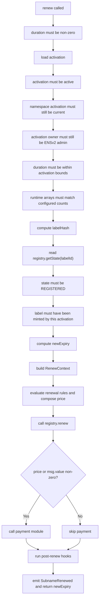
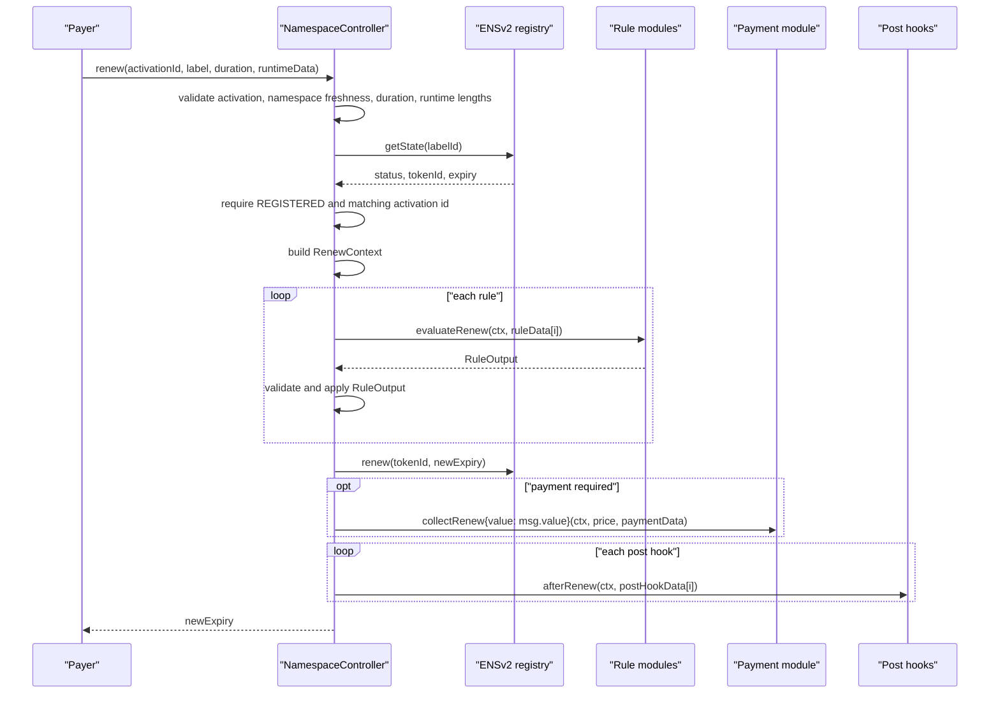

# Renewal Flow

Renewal extends an existing ENSv2 label's expiry through the same activation that minted it.

## Entry Point

```solidity
function renew(
    bytes32 activationId,
    string calldata label,
    uint64 duration,
    NamespaceTypes.RuntimeData calldata runtimeData
) external payable returns (uint64 newExpiry);
```

Inputs:

| Input | Meaning |
| --- | --- |
| `activationId` | Activation whose renewal rules and payment config will execute. |
| `label` | Direct child label to renew. |
| `duration` | Renewal extension in seconds. |
| `runtimeData.ruleData` | One payload per configured rule. |
| `runtimeData.paymentData` | Payload for payment module if payment is collected. |
| `runtimeData.postHookData` | One payload per configured post hook. |
| `msg.value` | Native ETH payment value. |

## Flow Diagram



## Sequence Diagram



## Step-By-Step Checks

| Step | Code behavior | Why it exists |
| --- | --- | --- |
| 1 | Revert if `duration == 0`. | Zero extension has no useful registry effect and can bypass pricing assumptions. |
| 2 | Load activation by id. | Renewal must use a known sale configuration. |
| 3 | Revert if activation inactive. | Sale owner can stop renewals as well as mints. |
| 4 | Check namespace is still current. | Prevents old activations after namespace expiry/re-register or subregistry replacement. |
| 5 | Check activation owner still has registry admin roles. | Prevents stale Namespace owner from managing renewals. |
| 6 | Check duration bounds. | Applies the same configured min/max duration policy to renewal. |
| 7 | Check runtime data lengths. | Ensures every configured rule/hook receives exactly one payload. |
| 8 | Compute `labelHash`. | Used for registry state lookup and activation binding. |
| 9 | Read registry state. | Renewal needs token id, status, and current expiry. |
| 10 | Require status `REGISTERED`. | Avoids renewing labels that registry says are not active. |
| 11 | Require stored label activation equals input activation id. | Prevents cross-activation renewal policy abuse. |
| 12 | Compute `newExpiry = state.expiry + duration`. | Renewal extends from current expiry, not current timestamp. |
| 13 | Build `RenewContext`. | Gives modules the same renewal context. |
| 14 | Evaluate renewal rules. | Applies renewal-specific gates and pricing. |
| 15 | Call registry `renew`. | Official ENSv2 registry updates expiry. |
| 16 | Collect payment if needed. | Enforces final renewal price. |
| 17 | Run post-renew hooks. | Allows future hooks to react to renewal. |
| 18 | Emit event. | Indexers can track renewal and price. |

## Activation Binding

After mint, the controller stores:

```solidity
labelActivations[address(registry)][labelHash] = activationId;
```

Renew requires:

```solidity
labelActivations[address(registry)][labelHash] == activationId;
```

Why:

| Attack or mistake | Prevention |
| --- | --- |
| Use a cheap renewal activation for an expensive mint campaign. | Renewal must use original activation id. |
| Renew a label minted directly in registry without Namespace rules. | No stored activation id, so renewal fails. |
| Renew a label from a previous campaign with new campaign terms. | Stored activation id must match. |

If the business needs renewals to migrate between campaigns, that requires an explicit migration design. The current controller intentionally does not infer migration.

## RenewContext Construction

```solidity
ctx = RenewContext({
    activationId: activationId,
    payer: msg.sender,
    registry: activation.registry,
    parentNode: activation.parentNode,
    label: label,
    labelHash: labelHash,
    tokenId: state.tokenId,
    duration: duration,
    currentExpiry: state.expiry,
    newExpiry: state.expiry + duration
});
```

Implications:

| Field | Implication |
| --- | --- |
| `payer == msg.sender` | Any caller can attempt to pay renewal unless rules or registry prevent it. |
| No buyer field | Renewal context is payer-centric. |
| `newExpiry` extends from current expiry | Renewals preserve remaining time. |

## Payment And Hooks

Payment dispatch is identical to mint:

```text
payment module is called only if final price or msg.value is non-zero
```

Post-renew hooks are called after payment:

```solidity
IPostHookModule(hook).afterRenew(ctx, postHookData[i]);
```

Current shipped resolver hooks no-op on renewal. The interface exists so future hooks can react to renewal events.

## Event

On success:

```solidity
SubnameRenewed(
    activationId,
    labelHash,
    label,
    state.tokenId,
    newExpiry,
    price.token,
    price.amount
);
```

## Common Failure Sources

| Failure | Source |
| --- | --- |
| Label not registered | Controller after registry `getState` |
| Namespace activation stale or unavailable | Controller |
| Label minted through another activation | Controller activation binding |
| Renewal rule rejects payer or label | Rule module |
| Wrong renewal proof | Reservation or whitelist rule |
| Payment approval missing | ERC20 token/payment module |
| Registry renew rejects role or expiry | ENSv2 registry |
