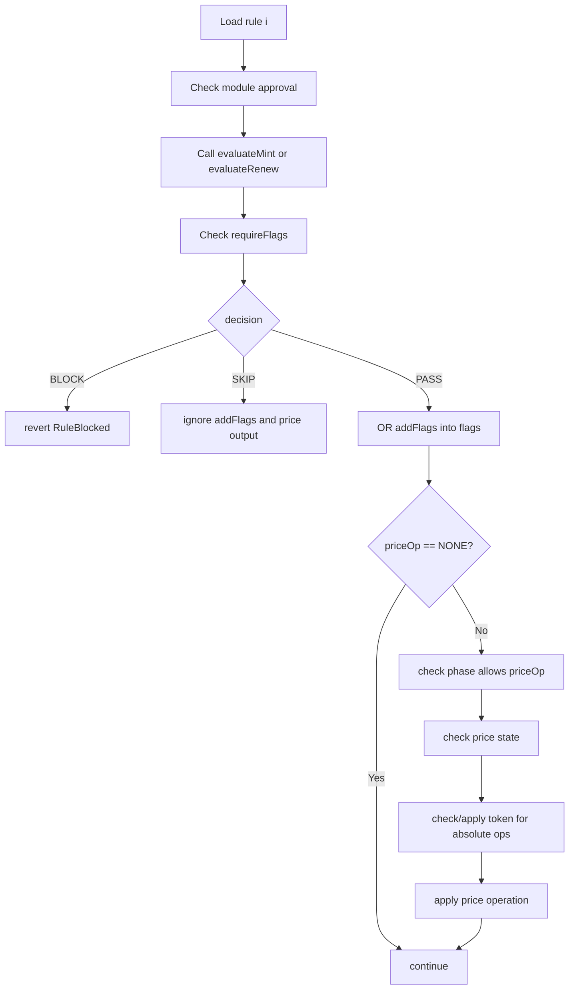

# Rule Engine

The rule engine is the deterministic composition layer for access checks, flags, and pricing.

It lives in `src/controller/NamespaceControllerRules.sol`.

## Rule Evaluation Inputs

The engine receives:

| Input | Source |
| --- | --- |
| Ordered rule list | Activation storage. |
| Rule phase for each rule | Activation storage. |
| Shared context | Built by controller for mint or renewal. |
| `ruleData[i]` | Runtime data supplied by caller. |

Each rule returns:

```solidity
RuleOutput({
    decision,
    priceOp,
    bps,
    token,
    amount,
    addFlags,
    requireFlags
});
```

## Evaluation State

The engine starts with:

```solidity
amount = 0;
flags = 0;
token = address(0);
status = 0;
```

Internal status bits:

| Bit | Meaning |
| --- | --- |
| `STATUS_TOKEN_SET` | A token has been established by an absolute price operation. |
| `STATUS_BASE_SET` | `SET_BASE` has been used. |
| `STATUS_PRICE_MUTATED` | Any price mutation has occurred. |
| `STATUS_OVERRIDDEN` | `OVERRIDE` has been used. |
| `STATUS_DISCOUNTED` | A discount-style operation has occurred. Currently internal only. |

## Per-Rule Flow



Important detail: `requireFlags` is checked before `decision`. A rule that returns `SKIP` can still revert if its required flags are missing.

## Decisions

| Decision | Engine behavior |
| --- | --- |
| `PASS` | Apply `addFlags` and, if present, price effect. |
| `BLOCK` | Revert with `RuleBlocked`. |
| `SKIP` | Ignore `addFlags` and price effect. Continue to next rule. |

Modules may also revert with their own specific errors instead of returning `BLOCK`.

## Flags

Flags are a generic `uint256` bitset carried through rule evaluation.

Use cases:

| Use case | Pattern |
| --- | --- |
| Verification dependency | Verification rule adds `VERIFIED`; later pricing rule requires `VERIFIED`. |
| Multi-step eligibility | First rule proves account class; second rule applies class-specific constraints. |
| Future integrations | World ID or other identity module can add a flag consumed by later module. |

Engine behavior:

```solidity
if (output.requireFlags != 0 && (state.flags & output.requireFlags) != output.requireFlags) {
    revert RequiredRuleFlagsMissing(...);
}

if (output.decision == PASS) {
    state.flags |= output.addFlags;
}
```

A skipped rule does not add flags.

## Rule Phases

Allowed non-`NONE` price operations:

| Phase | Allowed operations |
| --- | --- |
| `GUARD` | none |
| `ELIGIBILITY` | none |
| `BASE_PRICE` | `SET_BASE` |
| `PREMIUM` | `ADD`, `MARKUP_BPS`, `MIN` |
| `DISCOUNT` | `SUBTRACT`, `DISCOUNT_BPS`, `MAX` |
| `OVERRIDE` | `OVERRIDE` |
| `FINAL_CHECK` | `MIN`, `MAX` |

Why this matrix exists:

| Phase | Reason for restriction |
| --- | --- |
| `GUARD` | Fast global checks should not mutate price. |
| `ELIGIBILITY` | Eligibility should not secretly price. |
| `BASE_PRICE` | Exactly one rule should establish base price. |
| `PREMIUM` | Premiums increase or enforce minimums before discounts. |
| `DISCOUNT` | Discounts and caps need an existing price. |
| `OVERRIDE` | Exact custom price must be explicit and final. |
| `FINAL_CHECK` | Last-stage invariant bounds only. |

`PriceOp.NONE` is accepted from any phase.

## Price Operations

| Operation | Formula | Requires prior price mutation | Uses `token` field |
| --- | --- | --- | --- |
| `NONE` | no change | no | no |
| `SET_BASE` | `amount = output.amount` | no | yes |
| `ADD` | `amount += output.amount` | no | yes |
| `SUBTRACT` | `amount = max(0, amount - output.amount)` | yes | yes |
| `DISCOUNT_BPS` | `amount = ceil(amount * (10_000 - bps) / 10_000)` | yes | no |
| `MARKUP_BPS` | `amount = ceil(amount * (10_000 + bps) / 10_000)` | yes | no |
| `MIN` | `amount = max(amount, output.amount)` | no | yes |
| `MAX` | `amount = min(amount, output.amount)` | yes | yes |
| `OVERRIDE` | `amount = output.amount` | no | yes |

Basis-point operations require `bps <= 10_000`.

Rounding:

```solidity
ceil(x * y / denominator)
```

returns zero if `x == 0` or `y == 0`; otherwise it rounds up.

## Price-State Guards

| Guard | Error |
| --- | --- |
| `SET_BASE` after a base already exists | `RuleBasePriceAlreadySet` |
| Any price op after `OVERRIDE` | `RulePriceAlreadyOverridden` |
| `SUBTRACT`, `DISCOUNT_BPS`, `MARKUP_BPS`, or `MAX` before any price mutation | `RulePriceOperationBeforePrice` |
| `bps > 10_000` | `InvalidRuleBps` |

Why `ADD` and `MIN` can run before `SET_BASE`:

| Operation | Reason |
| --- | --- |
| `ADD` | A premium-only sale can be valid if no base price is configured. |
| `MIN` | A minimum can establish a floor in premium/final-check contexts. |

If product policy requires a base price for every paid sale, enforce that through stack design or a future final-check rule.

## Token Consistency

Absolute price operations set or check the payment token:

```text
SET_BASE, ADD, SUBTRACT, MIN, MAX, OVERRIDE
```

First absolute operation sets `state.token`. Later absolute operations must use the same token.

Basis-point operations do not carry a token; they modify the current amount.

Why:

| Reason | Explanation |
| --- | --- |
| One final payment module | The controller dispatches one final `Price`. |
| Prevent mixed settlement | A single mint cannot require both USDC and WETH without custom payment logic. |
| Safer payment modules | Payment modules receive one token and one amount. |

## Example: Normal Sale

```text
BASE_PRICE   FixedPriceRule       SET_BASE       100 USDC
PREMIUM      LengthPremiumRule    ADD             20 USDC
DISCOUNT     TokenBalanceRule     DISCOUNT_BPS    10%
FINAL        none                                108 USDC
```

## Example: Reservation Override

```text
BASE_PRICE   FixedPriceRule       SET_BASE        100 USDC
PREMIUM      LengthPremiumRule    ADD              20 USDC
OVERRIDE     ReservationRule      OVERRIDE       1000 USDC
FINAL        none                               1000 USDC
```

Any price operation after the reservation override reverts.

## Example: Flag Dependency

Hypothetical future stack:

```text
ELIGIBILITY  WorldIdRule       PASS addFlags = VERIFIED
DISCOUNT     VerifiedDiscount  requireFlags = VERIFIED, DISCOUNT_BPS = 20%
```

If `WorldIdRule` fails to add the flag, `VerifiedDiscount` reverts with `RequiredRuleFlagsMissing`.

## Module Approval During Runtime

Before calling each rule, the controller checks:

```text
module != address(0)
if moduleApprovalRequired: approvedModules[MODULE_KIND_RULE][module] == true
```

Why:

| Reason | Explanation |
| --- | --- |
| Approval revocation can stop unsafe modules. | Active activations fail when they reach a revoked rule. |
| Runtime safety survives old activations. | A module approved at activation time must still be approved at execution time. |

This means governance can break a live activation by revoking a module. Treat revocation as an explicit emergency control.
