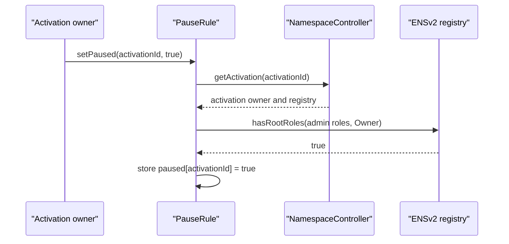
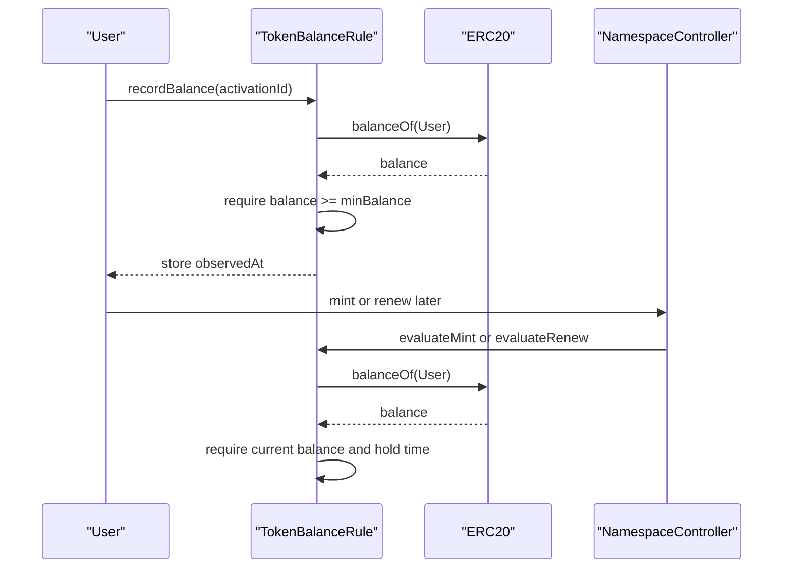

# Rule Modules

This document specifies every shipped rule module.

All rule modules implement:

```solidity
function evaluateMint(MintContext calldata ctx, bytes calldata runtimeData)
    external
    returns (RuleOutput memory);

function evaluateRenew(RenewContext calldata ctx, bytes calldata runtimeData)
    external
    returns (RuleOutput memory);
```

All shipped rules are activation-scoped and configured through:

```solidity
configure(bytes32 activationId, bytes calldata configData)
```

## Phase Placement Summary

| Rule | Typical phase | Price output |
| --- | --- | --- |
| `PauseRule` | `GUARD` | none |
| `SaleWindowRule` | `GUARD` | none |
| `LabelLengthRule` | `ELIGIBILITY` | none |
| `TokenBalanceRule` | `ELIGIBILITY` or `DISCOUNT` | `DISCOUNT_BPS` when discount configured |
| `FixedPriceRule` | `BASE_PRICE` | `SET_BASE` |
| `LengthPremiumRule` | `PREMIUM` | `ADD` |
| `LabelClassRule` | depends on `priceOp` | `NONE`, `SET_BASE`, `ADD`, `OVERRIDE` |
| `USDOracleRule` | depends on `priceOp` | `NONE`, `SET_BASE`, `ADD`, `OVERRIDE` |
| `ReservationRule` | depends on `priceOp` | `NONE`, `ADD`, `OVERRIDE` |
| `WhitelistRule` | depends on claim | `NONE`, `DISCOUNT_BPS`, `ADD`, `OVERRIDE` |

## PauseRule

Purpose: activation-owner controlled pause switch.

Config:

```text
none
```

Runtime data:

```text
ignored
```

Owner action:

```solidity
pauseRule.setPaused(activationId, true);
pauseRule.setPaused(activationId, false);
```

Sequence:



Checks:

| Check | Why |
| --- | --- |
| Caller equals activation owner | Only sale owner can pause this rule. |
| Caller still has registry admin roles | Keeps pause authority aligned with ENSv2 authority. |
| `paused[activationId] == false` during evaluation | Blocks mint and renewal while paused. |

Output: `PASS` with no price effect.

Recommended phase: `GUARD`.

## SaleWindowRule

Purpose: block mint and renewal outside a timestamp window.

Config ABI:

```solidity
abi.encode(SaleWindowRule.Params({
    startTime: uint64(startTime),
    endTime: uint64(endTime)
}))
```

Bounds:

| Field | `0` means |
| --- | --- |
| `startTime` | No lower bound. |
| `endTime` | No upper bound. |

Checks:

| Check | Error |
| --- | --- |
| `endTime == 0 || startTime <= endTime` | `InvalidSaleWindow` |
| `block.timestamp >= startTime` when start is non-zero | `SaleNotStarted` |
| `block.timestamp <= endTime` when end is non-zero | `SaleEnded` |

Why this rule exists:

| Requirement | Implementation |
| --- | --- |
| Sale deadline | Set `endTime`. |
| Delayed launch | Set `startTime`. |
| Open-ended sale after launch | Set `startTime`, keep `endTime = 0`. |

Output: `PASS` with no price effect.

Recommended phase: `GUARD`.

## LabelLengthRule

Purpose: enforce raw byte-length bounds.

Config ABI:

```solidity
abi.encode(LabelLengthRule.Params({
    minLength: uint16(3),
    maxLength: uint16(12)
}))
```

Checks:

| Check | Error |
| --- | --- |
| `maxLength == 0 || minLength <= maxLength` | `InvalidLengthBounds` |
| `bytes(label).length >= minLength` | `LabelTooShort` |
| `maxLength == 0 || bytes(label).length <= maxLength` | `LabelTooLong` |

Why byte length:

| Reason | Consequence |
| --- | --- |
| Cheap and deterministic on-chain | No Unicode normalization or grapheme parsing in this rule. |
| Matches label hash input | Uses exact submitted bytes. |
| UI can be stricter | Frontend/backend should enforce ENS normalization and user-facing grapheme rules before transaction. |

Output: `PASS` with no price effect.

Recommended phase: `ELIGIBILITY`.

## TokenBalanceRule

Purpose: require an ERC20 balance, optional hold time, and optional discount.

Config ABI:

```solidity
abi.encode(TokenBalanceRule.Params({
    token: ERC20(address(token)),
    minBalance: minBalance,
    discountBps: discountBps,
    minHoldTime: minHoldTime
}))
```

Configure checks:

| Check | Error |
| --- | --- |
| `token != address(0)` | `InvalidTokenBalanceRule` |
| `discountBps <= 10_000` | `InvalidDiscountBps` |
| If `minBalance != 0`, `minHoldTime != 0` | `InvalidTokenBalanceHoldTime` |

Runtime checks:

| Check | Error |
| --- | --- |
| `token.balanceOf(account) >= minBalance` | `InsufficientTokenBalance` |
| If hold time configured, `recordBalance` was called and enough time passed | `TokenBalanceHoldTimeNotMet` |

Hold-time flow:



Modes:

| Mode | Config | Phase |
| --- | --- | --- |
| Gate only | `minBalance > 0`, `discountBps = 0` | `ELIGIBILITY` |
| Discount only | `minBalance = 0`, `discountBps > 0` | `DISCOUNT` |
| Gate plus discount | `minBalance > 0`, `discountBps > 0` | `DISCOUNT` |

Output:

| Condition | Output |
| --- | --- |
| `discountBps == 0` | `PASS`, `PriceOp.NONE` |
| `discountBps > 0` | `PASS`, `PriceOp.DISCOUNT_BPS`, `bps = discountBps` |

## FixedPriceRule

Purpose: establish base price, with optional exact byte-length overrides.

Config ABI:

```solidity
FixedPriceRule.LengthPrice[] memory lengthPrices = ...;

abi.encode(FixedPriceRule.Params({
    token: address(usdc),
    defaultMintAmount: uint128(100e6),
    defaultRenewAmount: uint128(25e6),
    lengthPrices: lengthPrices
}))
```

`LengthPrice`:

```solidity
struct LengthPrice {
    uint16 length;
    uint128 mintAmount;
    uint128 renewAmount;
}
```

Selection:

```text
if bytes(label).length matches a LengthPrice.length:
    use that mintAmount or renewAmount
else:
    use defaultMintAmount or defaultRenewAmount
```

Checks:

| Check | Error |
| --- | --- |
| `lengthPrices.length <= 255` | `TooManyLengthPrices` |
| No duplicate length override | `DuplicateLengthPrice` |
| Label byte length is non-zero | `EmptyLabel` |

Output: `PriceOp.SET_BASE`.

Required phase: `BASE_PRICE`.

## LengthPremiumRule

Purpose: add duration-scaled premiums by label byte length.

Config ABI:

```solidity
abi.encode(LengthPremiumRule.Params({
    token: address(usdc),
    mintPricePerSecondByLength: mintRates,
    renewPricePerSecondByLength: renewRates
}))
```

Table lookup:

| Label bytes | Rate index |
| --- | --- |
| `1` | `0` |
| `2` | `1` |
| `n` within table | `n - 1` |
| longer than table | last index |

Amount:

```text
selectedRatePerSecond * duration
```

Checks:

| Check | Error |
| --- | --- |
| Mint and renew tables are non-empty | `EmptyPricingTable` |
| Each table length is at most `255` | `PricingTableTooLong` |
| Label byte length is non-zero | `EmptyLabel` |

Output: `PriceOp.ADD`.

Required phase: `PREMIUM`.

## LabelClassRule

Purpose: gate or price labels by class.

Config ABI:

```solidity
abi.encode(LabelClassRule.Params({
    token: address(usdc),
    labelClass: LabelClassRule.LabelClass.NUMBER,
    requireMatch: true,
    mintAmount: uint128(500e6),
    renewAmount: uint128(100e6),
    priceOp: NamespaceTypes.PriceOp.ADD
}))
```

Supported classes:

| Class | Match |
| --- | --- |
| `NUMBER` | Every byte is ASCII `0-9`. |
| `LETTER` | Every byte is ASCII `A-Z` or `a-z`. |
| `EMOJI` | UTF-8 emoji codepoints in supported ranges, with modifier support. |

Checks:

| Check | Error |
| --- | --- |
| `priceOp` is `NONE`, `SET_BASE`, `ADD`, or `OVERRIDE` | `InvalidLabelClassPriceOp` |
| Emoji parsing sees valid UTF-8 | `InvalidUtf8Label` |
| If `requireMatch`, label matches selected class | `LabelClassMismatch` |

Output:

| Condition | Output |
| --- | --- |
| Non-match and `requireMatch == false` | Pass, no price effect. |
| Match and `priceOp == NONE` | Pass, no price effect. |
| Match and selected amount is zero | Pass, no price effect. |
| Match and amount non-zero | Configured `priceOp` with mint or renew amount. |

Required phase:

| Configured `priceOp` | Phase |
| --- | --- |
| `NONE` | `ELIGIBILITY` or any phase where no price effect is intended |
| `SET_BASE` | `BASE_PRICE` |
| `ADD` | `PREMIUM` |
| `OVERRIDE` | `OVERRIDE` |

## USDOracleRule

Purpose: quote USD-denominated prices in a payment token using a Chainlink-compatible token/USD oracle.

Config ABI:

```solidity
abi.encode(USDOracleRule.Params({
    token: address(token),
    oracle: IAggregatorV3(address(oracle)),
    tokenDecimals: uint8(18),
    maxStaleness: uint64(1 days),
    mintUsdPrice: uint128(100e18),
    renewUsdPrice: uint128(25e18),
    priceOp: NamespaceTypes.PriceOp.SET_BASE
}))
```

Formula:

```text
ceil(usdAmount * 10^tokenDecimals * 10^oracleDecimals / oracleAnswer / 1e18)
```

Checks:

| Check | Error |
| --- | --- |
| Oracle is non-zero | `ZeroOracle` |
| `maxStaleness != 0` | `InvalidMaxStaleness` |
| `tokenDecimals <= 18` | `InvalidTokenDecimals` |
| `oracle.decimals() <= 18` | `InvalidOracleDecimals` |
| `priceOp` is `NONE`, `SET_BASE`, `ADD`, or `OVERRIDE` | `InvalidUSDOraclePriceOp` |
| Latest answer is positive | `InvalidOraclePrice` |
| Oracle round is complete | `InvalidOracleRound` |
| Latest answer is not stale | `StaleOraclePrice` |

Required phase:

| Configured `priceOp` | Phase |
| --- | --- |
| `SET_BASE` | `BASE_PRICE` |
| `ADD` | `PREMIUM` |
| `OVERRIDE` | `OVERRIDE` |
| `NONE` | Any phase, usually not useful |

Operational requirement: confirm oracle direction. The implementation assumes token/USD.

## ReservationRule

Purpose: prove label-specific reservation claims that can bind, block, or price labels.

Config ABI:

```solidity
abi.encode(ReservationRule.Params({
    root: reservationRoot
}))
```

Runtime ABI:

```solidity
abi.encode(ReservationRule.Claim({
    labelHash: keccak256(bytes(label)),
    account: reservedAccount,
    startTime: startTime,
    endTime: endTime,
    mintable: true,
    token: address(usdc),
    mintPrice: uint128(1000e6),
    renewPrice: uint128(100e6),
    priceOp: NamespaceTypes.PriceOp.OVERRIDE,
    proof: proof
}))
```

Claim behavior:

| Field | Behavior |
| --- | --- |
| `labelHash` | Must equal current label hash. |
| `account` | If non-zero and claim applies, buyer or payer must match. |
| `startTime` | Claim reverts before start. |
| `endTime` | Expired claim does not apply and emits no price effect. |
| `mintable` | Active false claim blocks. |
| `priceOp` | `NONE`, `ADD`, or `OVERRIDE`. |
| `mintPrice` / `renewPrice` | Amount for selected operation. |
| `proof` | Merkle proof for double-hashed leaf. |

Checks:

| Check | Error |
| --- | --- |
| Runtime claim exists when root is non-zero | `MissingReservationClaim` |
| Claim label matches and proof verifies | `InvalidReservationClaim` |
| Claim has started | `ReservationNotStarted` |
| Active claim is mintable | `ReservedLabelBlocked` |
| Active account-bound claim matches caller | `ReservedForDifferentAccount` |
| `priceOp` is `NONE`, `ADD`, or `OVERRIDE` | `InvalidReservationPriceOp` |

Important design detail:

| Root | Behavior |
| --- | --- |
| `bytes32(0)` | Rule is disabled; it passes with no price effect. |
| non-zero | Every evaluated label must provide a valid exact-label claim. Missing claims revert. |

Required phase:

| Behavior | Phase |
| --- | --- |
| Gate/block only | `ELIGIBILITY` |
| Add premium | `PREMIUM` |
| Exact reserved price | `OVERRIDE` |

## WhitelistRule

Purpose: prove mint or renewal allowlist claims with optional block, discount, add, or override behavior.

Config ABI:

```solidity
abi.encode(WhitelistRule.Params({
    mintRoot: mintRoot,
    renewRoot: renewRoot
}))
```

Runtime ABI:

```solidity
abi.encode(WhitelistRule.Claim({
    labelHash: optionalLabelHash,
    account: optionalAccount,
    startTime: startTime,
    endTime: endTime,
    mintable: true,
    token: address(usdc),
    mintPrice: uint128(0),
    renewPrice: uint128(0),
    discountBps: uint16(1000),
    priceOp: NamespaceTypes.PriceOp.NONE,
    proof: proof
}))
```

Claim matching:

| Field | Behavior |
| --- | --- |
| `labelHash == bytes32(0)` | Matches any label. |
| `labelHash != bytes32(0)` | Must match current label. |
| `account == address(0)` | Matches any buyer/payer. |
| `account != address(0)` | Must match current buyer/payer. |
| `startTime` | Claim reverts before start. |
| `endTime` | Claim reverts at or after end. |
| `mintable == false` | Claim blocks. |

Checks:

| Check | Error |
| --- | --- |
| Runtime claim exists when operation root is non-zero | `MissingWhitelistClaim` |
| Proof verifies | `InvalidWhitelistClaim` |
| Claim has started | `WhitelistNotStarted` |
| Claim has not expired | `WhitelistClaimExpired` |
| Claim is mintable | `WhitelistClaimBlocked` |
| Account matches when constrained | `WhitelistAccountMismatch` |
| Label matches when constrained | `WhitelistLabelMismatch` |
| `discountBps <= 10_000` | `InvalidWhitelistDiscount` |
| `priceOp` is `NONE`, `ADD`, or `OVERRIDE` when no discount | `InvalidWhitelistPriceOp` |

Output precedence:

```text
if discountBps != 0:
    emit DISCOUNT_BPS and ignore priceOp/mintPrice/renewPrice
else if priceOp != NONE:
    emit ADD or OVERRIDE
else:
    no price effect
```

Required phase:

| Behavior | Phase |
| --- | --- |
| Allowlist only | `ELIGIBILITY` |
| BPS discount | `DISCOUNT` |
| Add fee/premium | `PREMIUM` |
| Exact whitelist price | `OVERRIDE` |

## Merkle Leaf Rules

`ReservationRule` and `WhitelistRule` both:

| Property | Requirement |
| --- | --- |
| Double-hash leaf | Hash encoded claim fields, then hash the inner hash. |
| Exclude proof from leaf | `proof` is runtime verification data only. |
| Use sorted-pair proof verification | Each pair is ordered by hash comparison before hashing. |
| Depend on exact Solidity field order | Off-chain tree builder must match contract encoding. |

Any mismatch in label normalization, field order, types, proof sorting, or root version invalidates proofs.
