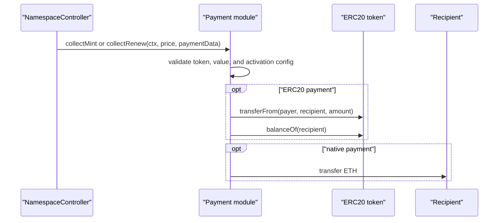

# Payment Modules

Payment modules collect the final composed price after rule evaluation and after the ENSv2 registry write.

The controller calls payment only when:

```solidity
price.amount != 0 || msg.value != 0
```

If payment is needed, the configured payment module must be non-zero and approved for `MODULE_KIND_PAYMENT` when module approvals are required.

## Payment Sequence



## NativePaymentModule

Purpose: collect native ETH to one recipient.

Config ABI:

```solidity
abi.encode(NativePaymentModule.Params({
    recipient: treasury
}))
```

Runtime payment data:

```text
ignored
```

Checks:

| Check | Error | Why |
| --- | --- | --- |
| `recipient != address(0)` | `InvalidPaymentRecipient` | Avoids burning revenue. |
| `price.token == address(0)` | `PaymentTokenMismatch` | Native module must not settle ERC20 prices. |
| `msg.value == price.amount` | `NativePaymentAmountMismatch` | Requires exact native payment. |

Settlement:

```text
if price.amount != 0:
    transfer price.amount ETH to recipient
```

## ERC20PaymentModule

Purpose: collect one ERC20 payment from payer to one recipient.

Config ABI:

```solidity
abi.encode(ERC20PaymentModule.Params({
    token: ERC20(address(usdc)),
    recipient: treasury
}))
```

Runtime payment data:

```text
ignored
```

Checks:

| Check | Error | Why |
| --- | --- | --- |
| `token != address(0)` | `InvalidPaymentToken` | ERC20 module cannot settle native prices. |
| `recipient != address(0)` | `InvalidPaymentRecipient` | Avoids burning revenue. |
| `msg.value == 0` | `NativeValueNotAccepted` | Prevents accidental native ETH transfer. |
| `price.token == configured token` | `PaymentTokenMismatch` | Ensures rule engine token matches payment config. |
| Recipient receives exactly `price.amount` | `PaymentAmountMismatch` | Rejects fee-on-transfer or deflationary behavior. |

Settlement:

```solidity
SafeTransferLib.safeTransferFrom(token, payer, recipient, price.amount);
```

The buyer/payer must approve the payment module, not the controller.

## ERC20SplitPaymentModule

Purpose: collect one ERC20 price and split it directly across recipients.

Config ABI:

```solidity
ERC20SplitPaymentModule.Split[] memory splits = new ERC20SplitPaymentModule.Split[](2);
splits[0] = ERC20SplitPaymentModule.Split({recipient: alice, bps: 7500});
splits[1] = ERC20SplitPaymentModule.Split({recipient: protocol, bps: 2500});

abi.encode(ERC20SplitPaymentModule.Params({
    token: address(usdc),
    splits: splits
}))
```

Checks:

| Check | Error | Why |
| --- | --- | --- |
| `token != address(0)` | `InvalidPaymentToken` | Split module supports ERC20 only. |
| Every recipient is non-zero | `InvalidSplitRecipient` | Avoids burning revenue. |
| Total bps equals `10_000` | `InvalidSplitBps` | Ensures full amount is allocated. |
| `msg.value == 0` | `NativeValueNotAccepted` | Prevents accidental ETH transfer. |
| `price.token == configured token` | `PaymentTokenMismatch` | Ensures final rule price uses expected token. |
| Each recipient receives exact amount | `PaymentAmountMismatch` | Rejects fee-on-transfer behavior. |

Split algorithm:

```text
total = price.amount
remaining = total
for every split except the last:
    amount = floor(total * split.bps / 10_000)
    remaining -= amount
    transfer amount
transfer remaining to last split recipient
```

Why final recipient receives the remainder:

| Reason | Explanation |
| --- | --- |
| Integer division truncates | Earlier splits can lose dust. |
| Full amount must be transferred | Final split absorbs rounding remainder. |
| Deterministic | Recipient order determines remainder owner. |

## Payment Design Constraints

| Constraint | Explanation |
| --- | --- |
| One payment module per activation | Controller dispatches one final `Price`. |
| One token per final price | Rule engine rejects mixed tokens. |
| Payment after registry write | If registry registration/renewal fails, payment is never collected. |
| Transaction atomicity | If payment fails, registry write reverts. |
| Current modules ignore `paymentData` | Future modules may use it for permits, signatures, or cross-chain proofs. |

## Future Payment Module Patterns

A future payment module can implement:

| Pattern | Considerations |
| --- | --- |
| ERC20 permit payment | Decode permit from `paymentData`, call permit, then transfer. |
| ERC721 payment | Rule engine would need price representation changes if token id matters. |
| Multi-token basket | Requires custom controller/payment design because current `Price` is one token and amount. |
| Cross-chain payment proof | Payment module must define finality and replay rules. |
| Protocol fee plus seller payout | Either use split module or a custom module with fee accounting. |

Any payment module must treat `ctx.payer` as the account being charged unless the controller is extended to support delegated payers.
