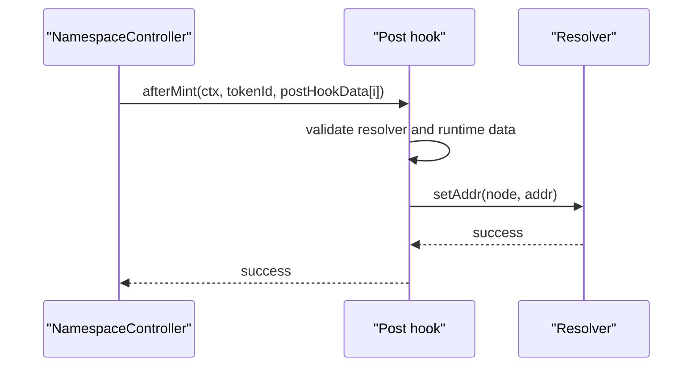
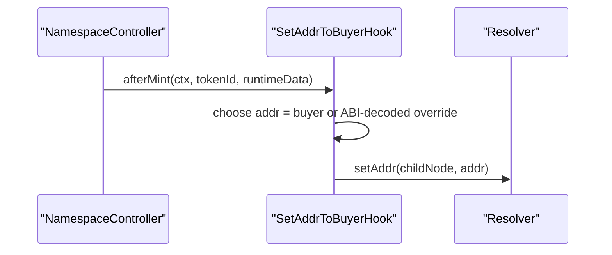

# Post Hooks And Resolvers

Post hooks run after the ENSv2 registry write and after payment settlement.

They are optional side-effect modules. The shipped hooks update resolver `addr(node)` records after mint and no-op after renewal.

## Hook Sequence



If any hook reverts, the entire mint or renewal transaction reverts.

## Hook Ordering

Hooks execute in activation order.

| Property | Behavior |
| --- | --- |
| `postHookData.length` | Must equal configured hook count. |
| `postHookData[i]` | Passed only to hook `i`. |
| Hook approval | Checked before each hook call when approvals are required. |
| Failure | Reverts full transaction. |

## Resolver Node Calculation

Both shipped hooks compute:

```solidity
node = keccak256(abi.encodePacked(ctx.parentNode, ctx.labelHash));
```

This is the ENS child node for:

```text
label.parentName
```

Example:

```text
parentNode = namehash("alice.eth")
labelHash = keccak256(bytes("bob"))
node = namehash("bob.alice.eth")
```

## SetAddrToBuyerHook

Purpose: set one resolver `addr(node)` value after mint.

Config:

```text
none
```

Runtime hook data:

| Data | Behavior |
| --- | --- |
| empty | Set `addr(node)` to `ctx.buyer`. |
| `abi.encode(address)` | Set `addr(node)` to supplied override address. |

Checks:

| Check | Error | Why |
| --- | --- | --- |
| `ctx.resolver != address(0)` | `ResolverNotConfigured` | Hook cannot write without resolver. |
| Runtime data is empty or exactly 32 bytes | `InvalidRuntimeDataLength` | Prevents ambiguous address decoding. |

Mint sequence:



Renew behavior:

```text
afterRenew is intentionally no-op.
```

## BatchSetAddrToBuyerHook

Purpose: perform one or more `setAddr(node, addr)` calls after mint.

Config:

```text
none
```

Runtime hook data:

| Data | Behavior |
| --- | --- |
| empty | Calls `setAddr(node, ctx.buyer)` once. |
| packed 20-byte addresses | Calls `setAddr(node, addr)` once per address. |
| packed zero address | Replaced with `ctx.buyer`. |

Checks:

| Check | Error | Why |
| --- | --- | --- |
| `ctx.resolver != address(0)` | `ResolverNotConfigured` | Hook cannot write without resolver. |
| Non-empty runtime data length is divisible by `20` | `InvalidRuntimeDataLength` | Ensures packed addresses align. |

Important behavior:

| Behavior | Consequence |
| --- | --- |
| All writes target the same node. | A standard resolver will keep the final written address. |
| Multiple calls are external resolver calls. | Gas increases with number of packed addresses. |
| Zero packed address means buyer. | Allows compact "default to buyer" entries. |

Renew behavior:

```text
afterRenew is intentionally no-op.
```

## Resolver Permission Requirements

The hook calls the resolver from the hook contract address, not from the buyer.

Production must ensure:

| Requirement | Why |
| --- | --- |
| Activation resolver is non-zero | Shipped hooks revert otherwise. |
| Resolver accepts writes from hook/controller path | Otherwise mint reverts. |
| Resolver function matches `IAddrResolver.setAddr(bytes32,address)` | Hook uses this minimal interface. |
| Hook behavior matches resolver semantics | Batch writes may overwrite previous values on standard resolvers. |

## Future Hook Patterns

Possible future hooks:

| Hook | Data needed | Risk |
| --- | --- | --- |
| Set text records | Key/value runtime data or activation config. | Resolver permissions and gas. |
| Set coin-type records | Coin type and address bytes. | Encoding correctness. |
| Emit integration callback | Integration-specific payload. | External callback can revert mint. |
| Mint companion NFT | Recipient and metadata. | Reentrancy and external mint failure. |
| Notify off-chain gateway | Usually not enforceable on-chain unless callback state matters. | Unnecessary critical-path reverts. |

Design rule: hooks should be idempotent or safe to retry because a reverted transaction rolls back all earlier effects.
