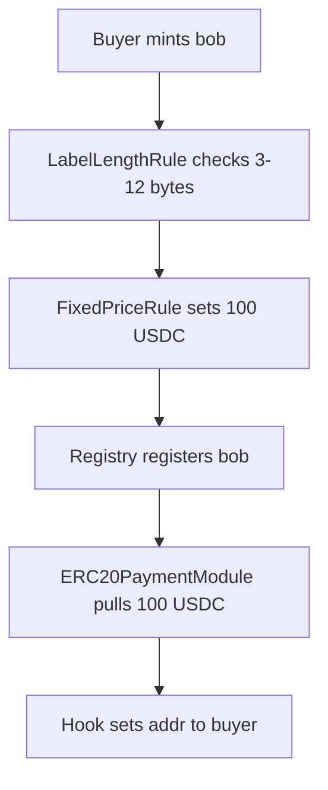
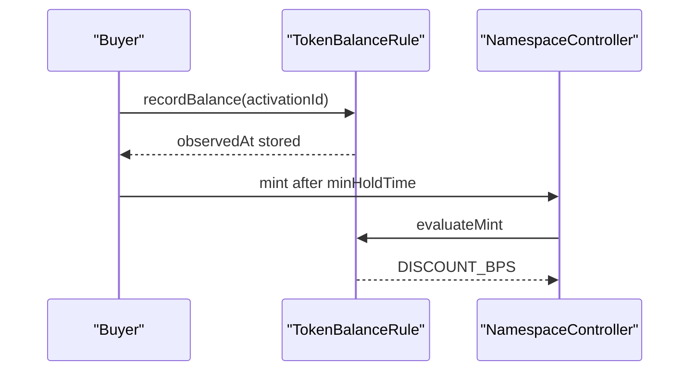

# Example Sale Blueprints

These examples show how to assemble activations from shipped modules.

The examples are conceptual. Exact config encoding should use the Solidity structs documented in the module specs.

## Simple Fixed-Price ERC20 Sale

Goal:

```text
Anyone can mint.
3 to 12 byte labels.
100 USDC mint, 25 USDC renewal.
Payment goes to Alice.
Resolver addr is set to buyer after mint.
```

Stack:

| Order | Module | Phase |
| --- | --- | --- |
| 1 | `LabelLengthRule` | `ELIGIBILITY` |
| 2 | `FixedPriceRule` | `BASE_PRICE` |

Payment:

```text
ERC20PaymentModule(token = USDC, recipient = Alice)
```

Hook:

```text
SetAddrToBuyerHook
```

Flow:



## Deadline Sale With Length Premium

Goal:

```text
Sale ends at a deadline.
Shorter labels cost more per second.
Base price plus length premium.
```

Stack:

| Order | Module | Phase | Effect |
| --- | --- | --- | --- |
| 1 | `SaleWindowRule` | `GUARD` | Blocks after deadline. |
| 2 | `LabelLengthRule` | `ELIGIBILITY` | Enforces allowed byte lengths. |
| 3 | `FixedPriceRule` | `BASE_PRICE` | Sets base. |
| 4 | `LengthPremiumRule` | `PREMIUM` | Adds duration-scaled premium. |

Why this order:

| Order reason | Explanation |
| --- | --- |
| Deadline first | Fails before expensive pricing. |
| Eligibility before pricing | Invalid labels do not need price computation. |
| Base before premium | Premium adds to an existing base. |

## Token-Holder Discount

Goal:

```text
Token holders get 15% discount.
Holder must have recorded eligible balance at least 1 day earlier.
```

Stack:

| Order | Module | Phase |
| --- | --- | --- |
| 1 | `FixedPriceRule` | `BASE_PRICE` |
| 2 | `TokenBalanceRule` | `DISCOUNT` |

User flow:



Why `DISCOUNT` phase:

```text
TokenBalanceRule emits DISCOUNT_BPS when discountBps is non-zero.
DISCOUNT_BPS is legal only in DISCOUNT phase.
```

## Reserved Exact Price

Goal:

```text
vip.alice.eth is reserved for one account.
It costs exactly 1000 USDC, ignoring normal price.
Other reserved labels can be blocked.
```

Stack:

| Order | Module | Phase |
| --- | --- | --- |
| 1 | `FixedPriceRule` | `BASE_PRICE` |
| 2 | `LengthPremiumRule` | `PREMIUM` |
| 3 | `ReservationRule` | `OVERRIDE` |

Reservation claim:

```text
labelHash = keccak256(bytes("vip"))
account = reserved buyer
mintable = true
mintPrice = 1000 USDC
priceOp = OVERRIDE
```

Price flow:

```text
FixedPriceRule      SET_BASE    100 USDC
LengthPremiumRule   ADD          20 USDC
ReservationRule     OVERRIDE   1000 USDC
final                           1000 USDC
```

Blocked label claim:

```text
mintable = false
```

Result:

```text
ReservationRule reverts ReservedLabelBlocked while claim applies.
```

## Whitelist Discount

Goal:

```text
Whitelisted accounts can mint any label with 20% discount.
Non-whitelisted accounts cannot mint.
```

Stack:

| Order | Module | Phase |
| --- | --- | --- |
| 1 | `WhitelistRule` | `DISCOUNT` |
| 2 | `FixedPriceRule` | `BASE_PRICE` |

This stack is invalid because `DISCOUNT` comes before `BASE_PRICE`. Correct stack:

| Order | Module | Phase |
| --- | --- | --- |
| 1 | `FixedPriceRule` | `BASE_PRICE` |
| 2 | `WhitelistRule` | `DISCOUNT` |

Claim:

```text
account = buyer
labelHash = 0
mintable = true
discountBps = 2000
```

Important: this means whitelist proof is checked after base price. That is acceptable because no registry write occurs until all rules pass. If you need allowlist failure to happen earlier for gas, split the concept:

| Order | Module | Phase | Purpose |
| --- | --- | --- | --- |
| 1 | `WhitelistRule` instance A | `ELIGIBILITY` | Requires allowlist proof, no price effect. |
| 2 | `FixedPriceRule` | `BASE_PRICE` | Sets price. |
| 3 | `WhitelistRule` instance B | `DISCOUNT` | Applies discount. |

Use separate module proxy addresses or separate rule contracts if the two whitelist instances need different configs in one activation.

## Revenue Split Sale

Goal:

```text
Alice receives 80%.
Protocol receives 20%.
Payment token is USDC.
```

Payment module:

```text
ERC20SplitPaymentModule
splits:
  Alice    8000 bps
  Protocol 2000 bps
```

Rounding:

```text
The final recipient receives any integer division remainder.
```

If protocol should receive dust, place protocol last.

## Free Claim With Resolver Setup

Goal:

```text
Whitelisted accounts can claim for free.
Resolver addr is set to buyer.
```

Stack:

| Order | Module | Phase |
| --- | --- | --- |
| 1 | `WhitelistRule` | `ELIGIBILITY` |

Payment:

```text
none
```

Hook:

```text
SetAddrToBuyerHook
```

Runtime:

```text
ruleData[0] = whitelist claim
paymentData = empty
postHookData[0] = empty
msg.value = 0
```

Because final price and `msg.value` are zero, the controller does not call a payment module.
