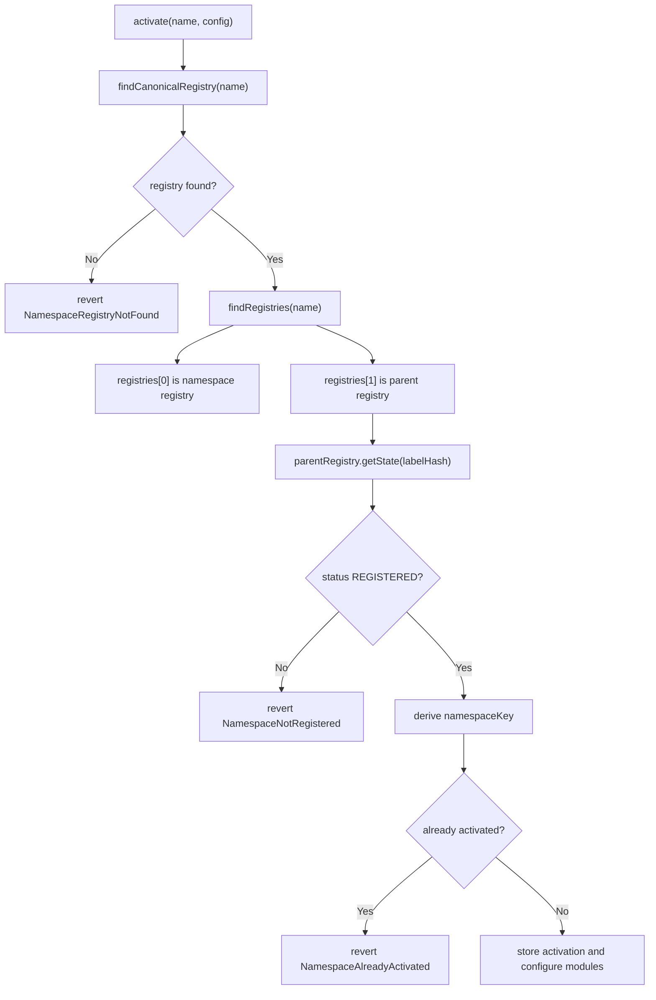

# Activation Interface Recommendations

This document records the activation design that is now implemented and the tradeoffs that remain open for future versions.

## Current Activation API

```solidity
function activate(bytes calldata name, NamespaceTypes.ActivationConfig calldata config)
    external
    returns (bytes32 activationId);
```

`name` is the DNS-encoded parent namespace, for example `NameCoder.encode("alice.eth")`.

`ActivationConfig` no longer contains `registry` or `parentNode`. The controller derives both through `UniversalResolverV2`.

```solidity
struct ActivationConfig {
    address resolver;
    uint256 buyerRoleBitmap;
    uint64 minDuration;
    uint64 maxDuration;
    RuleConfig[] rules;
    ModuleConfig paymentModule;
    ModuleConfig[] postHooks;
}
```

## Why The Controller Still Uses IPermissionedRegistry

`IStandardRegistry` exposes the write functions Namespace needs:

| Function | Needed by Namespace |
| --- | --- |
| `register(...)` | Mint subnames. |
| `renew(anyId, newExpiry)` | Renew subnames. |
| `getExpiry(anyId)` | Lower-level expiry reads. |

But the controller also needs permission and state APIs:

| Needed by controller | Exposed by |
| --- | --- |
| Activation owner root admin check | `IPermissionedRegistry.hasRootRoles` |
| Controller register/renew role check | `IPermissionedRegistry.hasRootRoles` |
| Parent namespace status/resource | `IPermissionedRegistry.getState` |
| Renewal token id/status/expiry | `IPermissionedRegistry.getState` |

So the core controller remains intentionally typed to `IPermissionedRegistry`. A future generic-registry adapter would need a different authority model.

## One Activation Per Namespace

The implemented activation id is deterministic:

```solidity
activationId = keccak256(
    abi.encode(
        block.chainid,
        address(namespaceRegistry),
        parentNode,
        address(parentRegistry),
        namespaceResource
    )
);
```

`activationId == namespaceKey`.

This creates one activation per current namespace registration. A second activation for the same namespace resource reverts with `NamespaceAlreadyActivated`.

## Why The Key Uses Resource, Not Token Id

ENSv2 `PermissionedRegistry` tracks two version concepts:

| ENSv2 value | When it changes | Activation impact |
| --- | --- | --- |
| `eacVersionId` / resource | Unregister/re-register or expired re-registration. | Should create a new activation namespace. |
| `tokenVersionId` / token id | Unregister/re-register and role regeneration. | Should not automatically invalidate activation. |

Role grants/revocations can regenerate token ids without changing the namespace's EAC resource. If activation ids used token ids, normal permission edits could accidentally orphan a sale. Using the resource keeps the activation stable across role maintenance while still separating old owners from new registrations.

## UniversalResolverV2 Flow



The controller also verifies `parentRegistry.getSubregistry(label) == namespaceRegistry`.

## Runtime Staleness Checks

`mint` and `renew` re-check the parent namespace before using an activation:

| Check | Error |
| --- | --- |
| Parent namespace status is still `REGISTERED`. | `NamespaceActivationUnavailable` |
| Parent namespace resource still equals stored resource. | `NamespaceActivationStale` |
| Parent subregistry still points to stored registry. | `NamespaceRegistryChanged` |

This prevents an old activation from minting after the parent name expires, is re-registered, or is repointed to a different registry.

## Resolver Is Still Explicit

UniversalResolverV2 can find the resolver for `alice.eth`, but that is not necessarily the resolver Alice wants assigned to every minted subname.

The activation `resolver` remains explicit because it controls what gets written into:

```solidity
registry.register(label, buyer, address(0), activation.resolver, buyerRoleBitmap, expiry)
```

## Future Considerations

The current model is strict: one activation per namespace resource. Future versions may want a replacement flow that keeps historical renewals alive while allowing a new sale stack for future mints.

Possible extension:

```solidity
replaceActivation(bytes name, ActivationConfig config, bool keepRenewals)
```

That should be designed explicitly. It should not silently route old labels to new renewal rules.
