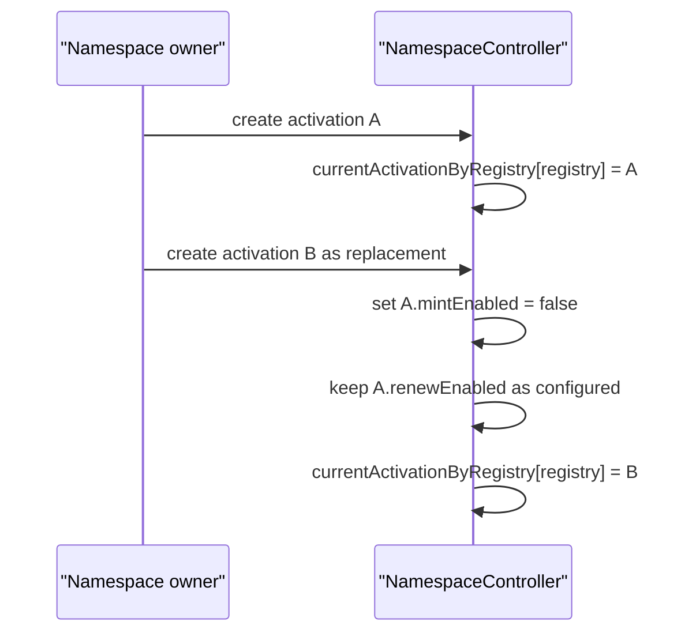
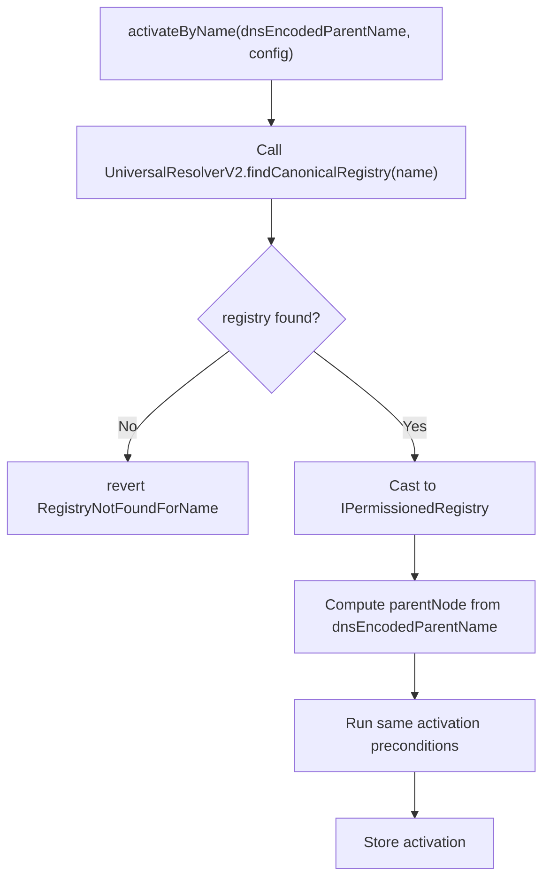

# Activation Interface Recommendations

This document answers three open architecture questions:

1. Why the controller currently uses `IPermissionedRegistry` instead of `IStandardRegistry`.
2. Whether a namespace should have multiple activations.
3. Whether activation can accept a name and use `UniversalResolverV2` instead of requiring registry and parent-node inputs.

It is design guidance. The current contracts still use the activation API described in the earlier spec files unless noted otherwise.

## Registry Interface Choice

### Current Choice

`ActivationConfig.registry` is typed as:

```solidity
IPermissionedRegistry registry;
```

This is stricter than `IStandardRegistry`.

### Why Not Only IStandardRegistry

`IStandardRegistry` exposes the write functions Namespace needs:

| Function | Needed by Namespace |
| --- | --- |
| `register(...)` | Mint subnames. |
| `renew(anyId, newExpiry)` | Renew subnames. |
| `getExpiry(anyId)` | Read expiry if using lower-level renewal logic. |
| `getSubregistry(label)` / `getParent()` | Registry tree validation. |

But `IStandardRegistry` does not expose the permission and state APIs the current controller uses:

| Needed by current controller | Exposed by | Why Namespace uses it |
| --- | --- | --- |
| `hasRootRoles(...)` | `IEnhancedAccessControl`, inherited by `IPermissionedRegistry` | Verify activation owner authority and controller register/renew authority. |
| `getState(anyId)` | `IPermissionedRegistry` | Read status, expiry, token id, resource, and latest owner in one call. |
| `Status.REGISTERED` | `IPermissionedRegistry` | Ensure renewal only applies to active registered labels. |
| `getTokenId(anyId)` | `IPermissionedRegistry` | Available if token id is needed outside `getState`. |
| `latestOwnerOf(tokenId)` | `IPermissionedRegistry` | Available for state-aware integrations. |

The concrete ENSv2 `UserRegistry` inherits `PermissionedRegistry`, and `PermissionedRegistry` supports `IPermissionedRegistry`, `IStandardRegistry`, and `IRegistry`. For the current intended target, `IPermissionedRegistry` is the accurate interface.

### What Would Break If We Used IStandardRegistry

If the controller stored only `IStandardRegistry`, it would need to drop or redesign:

| Current invariant | Issue with `IStandardRegistry` only |
| --- | --- |
| Activation owner must have registrar-admin and renew-admin roles. | No `hasRootRoles`. |
| Controller must have register and renew roles at activation time. | No `hasRootRoles`. |
| Renewal requires current status `REGISTERED`. | No `getState` or `Status`. |
| Renewal event emits registry token id. | No direct token-id lookup for versioned token ids. |
| Activation management authority remains aligned with ENSv2 EAC. | No EAC surface. |

The registry call itself would still revert if the controller lacks permission, but the controller would lose early, explicit, user-readable validation.

### Recommendation

Keep the core controller typed to `IPermissionedRegistry`.

Use `IStandardRegistry` only in a separate adapter or future generic mode if the product intentionally wants to support non-EAC registries and accepts weaker activation-owner checks.

Recommended naming improvement:

```solidity
IPermissionedRegistry permissionedRegistry;
```

This makes the security assumption visible in the activation config.

## One Activation Per Namespace

### Current Behavior

The current controller derives activation ids with a nonce:

```solidity
keccak256(abi.encode(block.chainid, registry, parentNode, owner, nonce))
```

That means the same owner can create multiple activations for the same registry and parent node.

### Product Goal

For user-facing behavior, a namespace should have one current sale activation at a time.

For example:

```text
alice.eth should not have two simultaneous public mint configurations.
```

This is the right product direction because it avoids:

| Problem | Why it matters |
| --- | --- |
| Buyer confusion | Users should not choose between competing activation ids for one name. |
| Indexer ambiguity | One current sale config is easier to index and display. |
| Rule bypass by alternate activation | A seller should not accidentally leave an older, cheaper activation live. |
| Operational mistakes | Config updates should target the known current activation. |

### Do Not Enforce One Activation Forever

The controller should not permanently limit a namespace to one activation ever.

Reasons:

| Reason | Explanation |
| --- | --- |
| Module stack is immutable | Changing rule order, phases, payment module address, or hook list requires a new activation. |
| Sales evolve | A namespace may need a v2 sale stack after adding new modules. |
| Emergency migration | A bad module stack may require replacing the activation. |
| Historical renewals | Labels minted under an old stack may need predictable renewal behavior. |

### Recommended Model

Use one current mint activation per canonical namespace, while keeping historical activations addressable.

Suggested controller state:

```solidity
mapping(address registry => bytes32 activationId) public currentActivationByRegistry;
```

Because activation already validates the registry's canonical parent, the registry address is the simplest key for "one current activation for this namespace."

Alternative key:

```solidity
mapping(bytes32 parentNode => bytes32 activationId) public currentActivationByParentNode;
```

This is also valid, but the registry address better captures ENSv2's actual writable namespace. If a registry can be linked from multiple names, a registry-level key prevents two current sale configs from operating on the same underlying child namespace.

### Recommended Status Split

The current `active` boolean blocks both mint and renew.

For one-current-activation support, split this into:

```solidity
bool mintEnabled;
bool renewEnabled;
bool archived;
```

Why:

| Flag | Purpose |
| --- | --- |
| `mintEnabled` | Only true for the current mint activation for a registry. |
| `renewEnabled` | Can remain true for historical activations. |
| `archived` | Marks an activation as intentionally retired. |

### Recommended Mint Rule

`mint` should require:

```solidity
currentActivationByRegistry[address(activation.registry)] == activationId
activation.mintEnabled == true
```

This ensures one current public sale path per registry.

### Recommended Renewal Rule

Renewals should stay bound to the activation that minted the label:

```solidity
labelActivations[address(registry)][labelHash] == activationId
activation.renewEnabled == true
```

Why:

| Reason | Explanation |
| --- | --- |
| Predictable renewal pricing | A label minted under one sale stack renews under that stack unless explicitly migrated. |
| Avoid accidental repricing | A new activation should not silently change renewal terms for old labels. |
| Avoid stranded renewals | Replacing the current mint activation should not automatically disable old renewals. |

If the product wants new terms to apply to old labels, add an explicit migration function rather than implicitly routing renewals to the latest activation.

### Replacement Flow

Recommended future flow:



This gives the UI one current mint activation while preserving historical renewal behavior.

### Minimal Simpler Model

A simpler model is:

```solidity
mapping(address registry => bytes32 activationId) public activeActivationByRegistry;
bool active;
```

But this is weaker because disabling the old activation to create a new one also disables renewals for labels minted through the old activation. Use it only if the product intentionally wants old renewals to stop when a new sale starts.

## Activation Arguments

### Current Activation Inputs

Current activation requires:

| Field | Why it is required today |
| --- | --- |
| `registry` | The controller needs the exact writable ENSv2 registry to call `register` and `renew`. |
| `parentNode` | The controller binds the registry to a canonical namehash and passes it to hooks/modules. |
| `resolver` | The registry registration needs a default resolver for new labels. |
| `buyerRoleBitmap` | ENSv2 needs explicit buyer role assignment. |
| `minDuration` / `maxDuration` | Sale-level duration policy. |
| `rules` | Sale gates and price composition. |
| `paymentModule` | Settlement logic. |
| `postHooks` | Post-registry side effects. |

Many of these are not accidental complexity. They are the actual sale parameters.

However, `registry` and `parentNode` can be made easier for users by deriving them from a full ENS name.

## UniversalResolverV2 For Activation

ENSv2 `UniversalResolverV2` exposes registry discovery helpers:

| Function | Use |
| --- | --- |
| `findExactRegistry(bytes dnsName)` | Returns the exact registry for a DNS-encoded name, or zero if missing. |
| `findCanonicalRegistry(bytes dnsName)` | Returns the exact registry only if it is canonical for that name. |
| `findRegistries(bytes dnsName)` | Returns registry ancestry in label order. |
| `findCanonicalName(IRegistry registry)` | Returns canonical DNS-encoded name for a registry. |

This can improve activation UX, but it should be used carefully.

### Name-Based Activation Shape

A future helper could be:

```solidity
function activateByName(
    bytes calldata dnsEncodedParentName,
    ActivationConfigByName calldata config
) external returns (bytes32 activationId);
```

Where `ActivationConfigByName` removes `registry` and `parentNode`:

```solidity
struct ActivationConfigByName {
    address resolver;
    uint256 buyerRoleBitmap;
    uint64 minDuration;
    uint64 maxDuration;
    RuleConfig[] rules;
    ModuleConfig paymentModule;
    ModuleConfig[] postHooks;
}
```

Internal flow:



### Why Full Name, Not Label

A label alone is ambiguous:

```text
alice
```

It does not say whether the intended namespace is:

```text
alice.eth
alice.box
alice.someparent.eth
```

Name-based activation must accept a full DNS-encoded parent name such as:

```text
alice.eth
club.alice.eth
```

### Should Resolver Be Derived Too

Do not automatically derive the default subname resolver from Universal Resolver.

Reason:

| Resolver source | Issue |
| --- | --- |
| Parent name resolver from `findResolver` | This is the resolver responsible for parent records, not necessarily the resolver Alice wants assigned to every minted subname. |
| Exact registry resolver entry | This is name state, not sale config. |
| Explicit activation `resolver` | Clear and deterministic for all mints. |

Keep `resolver` explicit, or provide a product-level default in a wrapper or factory.

### On-Chain Universal Resolver Tradeoffs

| Benefit | Cost |
| --- | --- |
| User passes one full name instead of registry and parent node. | More external calls during activation. |
| Less frontend-specific registry discovery logic. | Controller now depends on Universal Resolver deployment and behavior. |
| Can reject non-canonical registry names directly. | Must still check registry supports permissioned APIs and roles. |

### Recommended Approach

For the core controller:

```text
Keep activate(config) with explicit registry and parentNode.
Continue verifying the registry's canonical parent chain on-chain.
```

For product UX:

```text
Use UniversalResolverV2 off-chain in the app to discover registry and parentNode.
Pass explicit registry and parentNode to activate.
Let the controller verify the result.
```

For a later convenience layer:

```text
Add activateByName(...) as a wrapper/helper entry point.
It should resolve the registry through UniversalResolverV2, compute parentNode, then call the same internal activation path.
```

This gives good UX without making the lowest-level controller depend on Universal Resolver for its core security.

## Recommended Next Contract Changes

If we decide to implement the product direction, the next contract change should be:

1. Add one-current-mint-activation tracking keyed by registry.
2. Split `active` into `mintEnabled` and `renewEnabled`.
3. Make `mint` require the activation is the current mint activation for its registry.
4. Keep `renew` bound to `labelActivations` and `renewEnabled`.
5. Add explicit replacement flow for a namespace owner to replace current mint activation.
6. Optionally add `activateByName` or a separate helper contract using `UniversalResolverV2`.

Do not switch to `IStandardRegistry` unless the controller intentionally drops ENSv2 EAC authority checks or introduces a separate adapter for generic standard registries.
