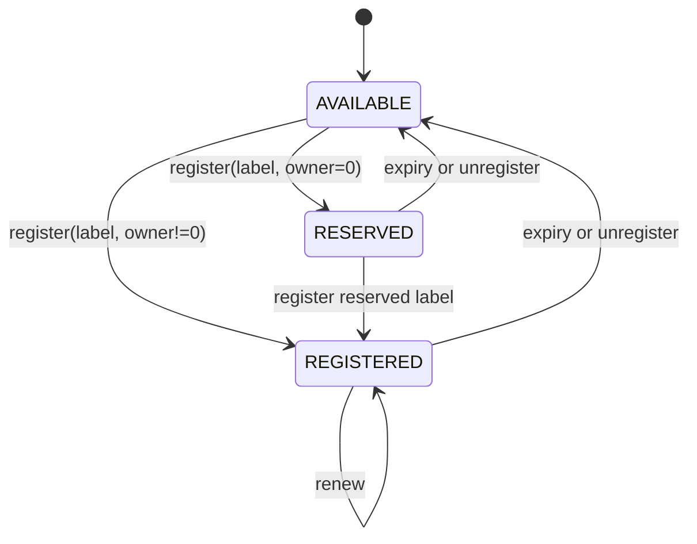
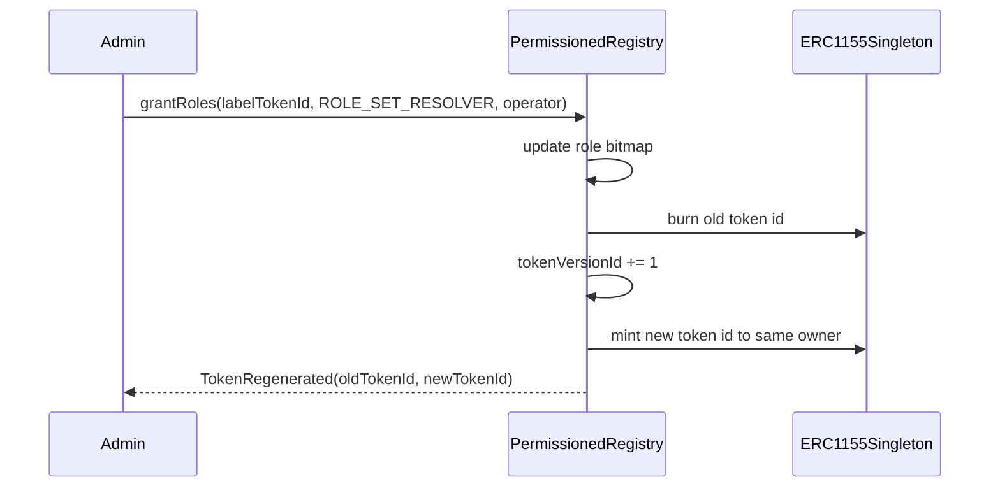
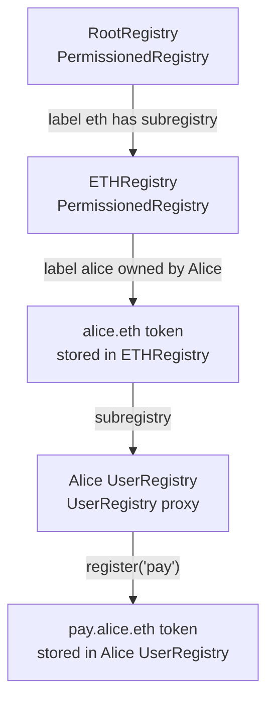
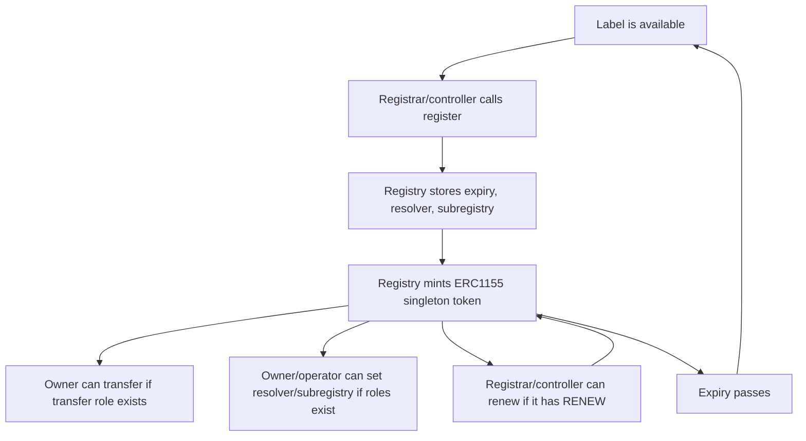

# ENSv2 Architecture From Scratch

## The Core Idea

ENSv2 is a tree of registries.

A registry is a contract that manages direct child labels under one parent namespace. It does not manage every full name globally. It only knows about one level below it.

```text
RootRegistry manages: eth, reverse, com, org, ...
ETHRegistry manages: alice.eth, bob.eth, vitalik.eth, ...
AliceRegistry manages: pay.alice.eth, blog.alice.eth, team.alice.eth, ...
```

The same `PermissionedRegistry` implementation can be used at each level.

## How One Label Is Stored

Inside a `PermissionedRegistry`, each direct child label has:

- an owner token;
- an expiry;
- an optional resolver;
- an optional child registry;
- permission state.

Source shape:

```solidity
struct Entry {
    uint32 eacVersionId;
    uint32 tokenVersionId;
    IRegistry subregistry;
    uint64 expiry;
    address resolver;
}
```

The owner is stored in `ERC1155Singleton`, not in `Entry`.

| Field | Meaning |
| --- | --- |
| `eacVersionId` | Version used to derive the current permission resource for this label. |
| `tokenVersionId` | Version used to derive the current ERC1155 token id. |
| `subregistry` | The registry that manages children under this label. |
| `expiry` | Unix timestamp when the label becomes available again. |
| `resolver` | Resolver for this label or names below it through wildcard-style resolution. |

## Direct Label Versus Full Name

In ENSv2, `register()` always registers one direct label in the current registry.

| Desired name | Function call | Registry called |
| --- | --- | --- |
| `alice.eth` | `register("alice", ...)` | `ETHRegistry` |
| `pay.alice.eth` | `register("pay", ...)` | Alice's child registry |
| `x.pay.alice.eth` | `register("x", ...)` | `pay.alice.eth` child registry |

This is the most important architectural point for subname minting.

## Registry Interfaces

### `IRegistry`

Minimal interface used by resolution traversal:

```solidity
function getSubregistry(string calldata label) external view returns (IRegistry);
function getResolver(string calldata label) external view returns (address);
function getParent() external view returns (IRegistry parent, string memory label);
```

### `IStandardRegistry`

Mutation interface:

```solidity
function register(
    string calldata label,
    address owner,
    IRegistry registry,
    address resolver,
    uint256 roleBitmap,
    uint64 expiry
) external returns (uint256 tokenId);

function renew(uint256 anyId, uint64 newExpiry) external;
function unregister(uint256 anyId) external;
function setSubregistry(uint256 anyId, IRegistry registry) external;
function setResolver(uint256 anyId, address resolver) external;
function setParent(IRegistry parent, string calldata label) external;
function getExpiry(uint256 anyId) external view returns (uint64 expiry);
```

### `IPermissionedRegistry`

State and permission helpers:

```solidity
function getState(uint256 anyId) external view returns (State memory);
function getStatus(uint256 anyId) external view returns (Status);
function getResource(uint256 anyId) external view returns (uint256);
function getTokenId(uint256 anyId) external view returns (uint256);
function latestOwnerOf(uint256 tokenId) external view returns (address);
```

`anyId` can be:

- raw label hash;
- current token id;
- current permission resource id.

The registry canonicalizes it internally by zeroing the lower 32 version bits.

## Label Id, Resource Id, Token Id

ENSv2 uses `LibLabel.id(label)`:

```solidity
uint256 labelId = uint256(keccak256(bytes(label)));
```

Then version bits are inserted into the lower 32 bits:

```solidity
LibLabel.withVersion(anyId, versionId)
```

There are three related ids:

| Id | Purpose |
| --- | --- |
| Storage id | Label hash with version bits zeroed; used to find `Entry`. |
| Resource id | Label hash plus `eacVersionId`; used by `EnhancedAccessControl`. |
| Token id | Label hash plus `tokenVersionId`; used by `ERC1155Singleton`. |

## Registry Status

The registry reports:

```solidity
enum Status {
    AVAILABLE,
    RESERVED,
    REGISTERED
}
```

State transitions:



Source behavior:

- `AVAILABLE`: `block.timestamp >= expiry`.
- `RESERVED`: not expired, but token owner is zero.
- `REGISTERED`: not expired and token owner is non-zero.
- `ownerOf(tokenId)` returns zero when the token is expired or stale.

## Token Model: ERC1155Singleton

ENSv2 name tokens are ERC1155-like, but each token id can only have one owner.

This contract stores:

```solidity
mapping(uint256 id => address account) private _owners;
```

So:

- `ownerOf(id)` returns the one owner;
- `balanceOf(account, id)` is either `1` or `0`;
- transfers emit ERC1155 events;
- amount greater than `1` reverts.

## Why Token IDs Can Change

Token ids are intentionally mutable. The label identity is stable, but the token id version can change.

Token ids change when:

- a name is unregistered and later re-registered;
- roles on that name are granted or revoked.

The reason: a token listed on a marketplace should not silently keep the same id after its permissions change.



Apps and indexers should track label identity plus current token id, not assume the first token id is permanent.

## Root, ETH, User Registries



`RootRegistry` and `ETHRegistry` are regular `PermissionedRegistry` deployments. `UserRegistry` is an upgradeable registry implementation intended for user-owned namespaces.

## Canonical Registry Location

A registry can say:

```solidity
getParent() -> (parentRegistry, label)
```

But consumers should verify that the parent agrees:

```text
registry.getParent() = (P, "alice")
P.getSubregistry("alice") must equal registry
```

`UniversalResolverV2.findCanonicalRegistry()` and `LibRegistry.findCanonicalName()` perform this style of check.

## End-To-End Name Lifecycle



