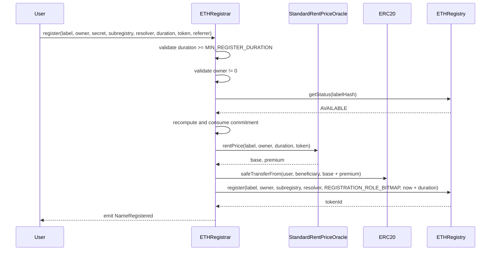
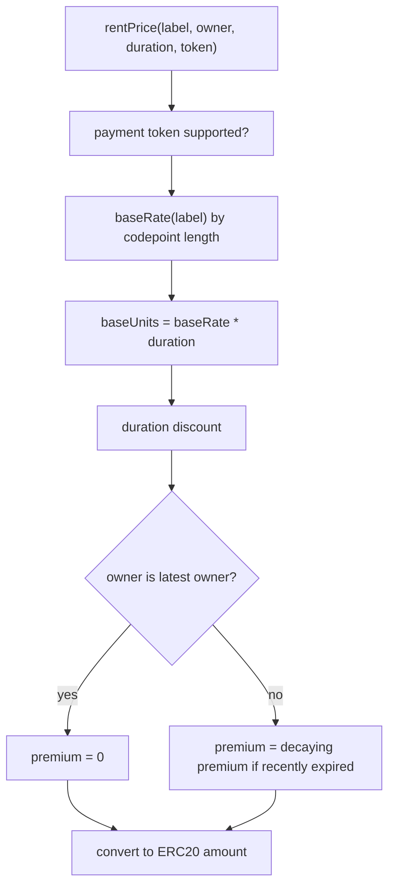
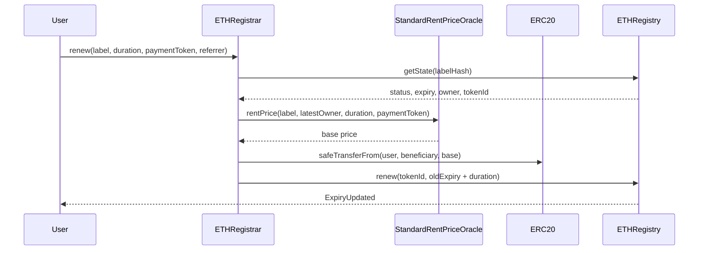

# Dot ETH Minting Flow

`.eth` names are minted through `ETHRegistrar`, but the actual ownership state lives in `ETHRegistry`.

Think of it as:

```text
ETHRegistrar = policy, payment, commitment, price
ETHRegistry  = storage, ownership token, expiry, resolver, child registry
```

## Contracts Involved

| Contract | Role |
| --- | --- |
| `ETHRegistrar` | Public controller for registering and renewing `.eth` labels. |
| `ETHRegistry` | `PermissionedRegistry` that stores `.eth` labels. |
| `StandardRentPriceOracle` | Calculates base price and premium in accepted ERC20 tokens. |
| payment ERC20 | Token transferred from registrant to beneficiary. |
| optional resolver | Initial resolver set on the `.eth` label. |
| optional subregistry | Initial child registry for subnames under the `.eth` label. |

## Deployment Relationship

`ETHRegistry` grants `ETHRegistrar` root roles:

```text
ROLE_REGISTRAR
ROLE_RENEW
```

That lets the registrar call:

- `ETHRegistry.register(...)`
- `ETHRegistry.renew(...)`

The registrar does not own names itself. It only performs checks and then writes into the registry.

## Register Step 1: Commit

The user first creates a commitment:

```solidity
commitment = keccak256(
    abi.encode(
        label,
        owner,
        secret,
        subregistry,
        resolver,
        duration,
        referrer
    )
);
```

Then calls:

```solidity
ETHRegistrar.commit(commitment);
```

The registrar stores `commitmentAt[commitment] = block.timestamp`.

Why commit exists:

- prevents someone from seeing a pending registration and copying it;
- hides the label and registration parameters until reveal;
- enforces a time window through `MIN_COMMITMENT_AGE` and `MAX_COMMITMENT_AGE`.

## Register Step 2: Reveal And Mint

After the minimum commitment age, the user calls:

```solidity
register(
    label,
    owner,
    secret,
    subregistry,
    resolver,
    duration,
    paymentToken,
    referrer
)
```

Sequence:



## What ETHRegistry Stores

When `ETHRegistrar` calls `ETHRegistry.register("alice", ...)`, the registry:

1. checks `alice` is available;
2. stores `expiry`;
3. stores `subregistry`;
4. stores `resolver`;
5. mints an ERC1155 singleton token to `owner`;
6. grants owner the registration role bitmap;
7. emits registry events.

Events include:

- `LabelRegistered`;
- `SubregistryUpdated` if non-zero;
- `ResolverUpdated` if non-zero;
- `TokenResource`;
- ERC1155 `TransferSingle`.

## Default Roles Given To A New ETH Owner

`ETHRegistrar` uses `REGISTRATION_ROLE_BITMAP`:

```text
ROLE_SET_SUBREGISTRY
ROLE_SET_SUBREGISTRY_ADMIN
ROLE_SET_RESOLVER
ROLE_SET_RESOLVER_ADMIN
ROLE_CAN_TRANSFER_ADMIN
```

Meaning:

- owner can set/change child registry for their `.eth`;
- owner can set/change resolver for their `.eth`;
- owner can transfer the `.eth` token;
- owner has admin for resolver/subregistry roles on the token.

The owner does not receive root registrar rights on `ETHRegistry`. That would let them mint arbitrary `.eth` names, so only the registrar keeps root `ROLE_REGISTRAR`.

## Price Calculation

`ETHRegistrar` delegates pricing to `StandardRentPriceOracle`.



Important behavior:

- empty label or label longer than 255 bytes is invalid;
- labels with base rate `0` are invalid;
- longer labels use the final configured base-rate bucket;
- unsupported ERC20 token reverts;
- previous owner does not pay premium when re-registering/renewing.

## Renewal Flow

Renewal is simpler than registration.



Renewal only extends expiry. The registry rejects attempts to reduce expiry.

## How This Maps To Namespace

For subnames, Namespace can use the same pattern:

```text
Namespace controller = policy, payment, whitelist, gates
UserRegistry         = storage, token ownership, expiry, resolver, child registry
```

The key difference: Namespace's controller registers labels in a user's `UserRegistry`, not in `ETHRegistry`.

