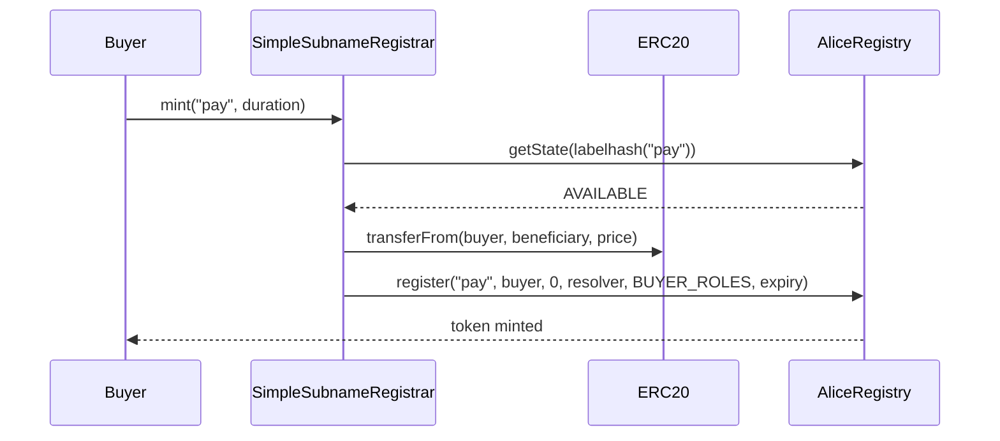

# Example Registry And Registrar

This file shows a minimal ENSv2-style subname setup. It is not a full production contract, but it demonstrates how the registry and controller pieces fit together.

## Actors

```text
Alice owns alice.eth
AliceRegistry manages direct labels under alice.eth
SimpleSubnameRegistrar sells labels in AliceRegistry
Buyer mints pay.alice.eth
```

## Step 1: AliceRegistry

In ENSv2, a user registry should normally be a `UserRegistry` proxy, initialized with root roles for the namespace owner.

Conceptual setup:

```solidity
UserRegistry aliceRegistry = deployUserRegistryProxy();

aliceRegistry.initialize(
    alice,
    ROLE_REGISTRAR_ADMIN |
    ROLE_RENEW_ADMIN |
    ROLE_SET_RESOLVER_ADMIN |
    ROLE_SET_SUBREGISTRY_ADMIN |
    ROLE_UPGRADE |
    ROLE_UPGRADE_ADMIN
);
```

Alice then attaches it to `alice.eth`:

```solidity
ethRegistry.setSubregistry(aliceTokenId, aliceRegistry);
```

After that, resolution traversal can move from `alice.eth` to `AliceRegistry`.

## Step 2: Simple Registrar Contract

This is the minimal shape of a Namespace-like subname registrar.

```solidity
// SPDX-License-Identifier: MIT
pragma solidity ^0.8.20;

import {SafeERC20, IERC20} from "@openzeppelin/contracts/token/ERC20/utils/SafeERC20.sol";

import {IPermissionedRegistry} from "../lib/contracts-v2/contracts/src/registry/interfaces/IPermissionedRegistry.sol";
import {IRegistry} from "../lib/contracts-v2/contracts/src/registry/interfaces/IRegistry.sol";
import {LibLabel} from "../lib/contracts-v2/contracts/src/utils/LibLabel.sol";

contract SimpleSubnameRegistrar {
    using SafeERC20 for IERC20;

    IPermissionedRegistry public immutable registry;
    IERC20 public immutable paymentToken;
    address public immutable beneficiary;
    address public immutable resolver;
    uint256 public immutable pricePerSecond;
    uint64 public immutable minDuration;

    uint256 private constant ROLE_REGISTRAR = 1 << 0;
    uint256 private constant ROLE_RENEW = 1 << 16;
    uint256 private constant ROLE_SET_RESOLVER = 1 << 24;
    uint256 private constant ROLE_SET_RESOLVER_ADMIN = ROLE_SET_RESOLVER << 128;
    uint256 private constant ROLE_CAN_TRANSFER_ADMIN = (1 << 28) << 128;

    uint256 public constant REQUIRED_ROOT_ROLES = ROLE_REGISTRAR | ROLE_RENEW;
    uint256 public constant BUYER_ROLES = ROLE_SET_RESOLVER |
        ROLE_SET_RESOLVER_ADMIN |
        ROLE_CAN_TRANSFER_ADMIN;

    error NameNotAvailable(string label);
    error DurationTooShort(uint64 duration);

    constructor(
        IPermissionedRegistry registry_,
        IERC20 paymentToken_,
        address beneficiary_,
        address resolver_,
        uint256 pricePerSecond_,
        uint64 minDuration_
    ) {
        registry = registry_;
        paymentToken = paymentToken_;
        beneficiary = beneficiary_;
        resolver = resolver_;
        pricePerSecond = pricePerSecond_;
        minDuration = minDuration_;
    }

    function mint(string calldata label, uint64 duration) external returns (uint256 tokenId) {
        if (duration < minDuration) revert DurationTooShort(duration);

        IPermissionedRegistry.State memory state = registry.getState(LibLabel.id(label));
        if (state.status != IPermissionedRegistry.Status.AVAILABLE) {
            revert NameNotAvailable(label);
        }

        uint256 price = pricePerSecond * duration;
        paymentToken.safeTransferFrom(msg.sender, beneficiary, price);

        tokenId = registry.register(
            label,
            msg.sender,
            IRegistry(address(0)),
            resolver,
            BUYER_ROLES,
            uint64(block.timestamp) + duration
        );
    }

    function renew(string calldata label, uint64 duration) external {
        IPermissionedRegistry.State memory state = registry.getState(LibLabel.id(label));
        if (state.status == IPermissionedRegistry.Status.AVAILABLE) {
            revert NameNotAvailable(label);
        }

        uint256 price = pricePerSecond * duration;
        paymentToken.safeTransferFrom(msg.sender, beneficiary, price);

        registry.renew(state.tokenId, state.expiry + duration);
    }
}
```

## Required Registry Grant

For the example registrar to work, Alice must grant it root roles on AliceRegistry:

```solidity
aliceRegistry.grantRootRoles(
    simpleRegistrar.REQUIRED_ROOT_ROLES(),
    address(simpleRegistrar)
);
```

Without `ROLE_REGISTRAR`, `mint()` reverts inside `registry.register()`.

Without `ROLE_RENEW`, `renew()` reverts inside `registry.renew()`.

## What Happens When Buyer Mints



The registry stores:

```text
label: pay
owner: buyer
resolver: resolver
subregistry: address(0)
expiry: block.timestamp + duration
roles: BUYER_ROLES on pay's resource
```

## Extending This Into Namespace

Production Namespace contracts would replace fixed fields with configurable modules:

| Example field | Namespace production version |
| --- | --- |
| `pricePerSecond` | length-based/dynamic `IPriceStrategy` |
| one `paymentToken` | ERC20 allowlist and payment processor |
| no whitelist | Merkle/NFT/ERC20 eligibility strategy |
| one `resolver` | resolver config per namespace or per mint |
| no per-wallet limits | allocation tracking |
| no expiry policy | grace, premium, renewal rules |
| no referrer | referral events and split logic |

The registry interaction stays the same: once policy passes, call `register()` or `renew()`.
