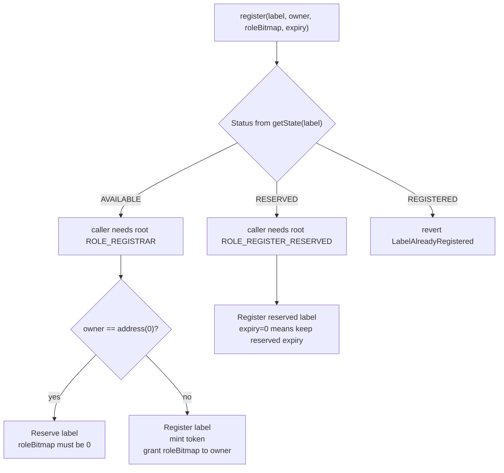
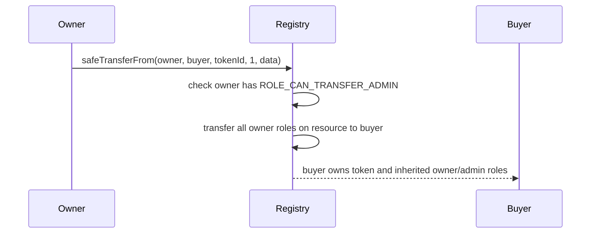

# ENSv2 Permissions Deep Dive

ENSv2 permissions are built on `EnhancedAccessControl` and role libraries.

There are two permission systems to keep separate:

1. Registry permissions: who can register, renew, transfer, set resolver, set subregistry.
2. Resolver permissions: who can set address, text, contenthash, and other resolver records.

## EnhancedAccessControl In Plain English

`EnhancedAccessControl` stores a bitmap of roles for each account inside each resource.

```text
resource id -> account -> role bitmap
```

A resource is just a `uint256`. The child contract defines what that id means.

In `PermissionedRegistry`, the resource is the current name resource id.

In `PermissionedResolver`, the resource is `keccak256(namehash, recordPart)`.

## Root Resource

`ROOT_RESOURCE = 0`.

Root roles apply to every resource in the contract.

When checking roles:

```text
effective roles = roles[ROOT_RESOURCE][account] | roles[resource][account]
```

So:

- root `ROLE_REGISTRAR` on Alice's `UserRegistry` can register any available direct child under `alice.eth`;
- token-level `ROLE_SET_RESOLVER` on `pay.alice.eth` can only set resolver for that specific label.

## Role Bitmap Layout

Roles are packed into a `uint256`.

```text
bits 0..127      regular roles
bits 128..255    admin roles
```

A role's admin role is:

```solidity
ROLE_ADMIN = ROLE << 128;
```

Each role occupies a nybble-sized slot. ENSv2 uses one bit inside each nybble, leaving count packing room.

Role assignee counts are also packed, and each role can have at most 15 assignees per resource.

## Grant And Revoke Rules

Public functions:

```solidity
grantRoles(resource, roleBitmap, account)
grantRootRoles(roleBitmap, account)
revokeRoles(resource, roleBitmap, account)
revokeRootRoles(roleBitmap, account)
```

Important rules:

- `grantRoles()` cannot be used for `ROOT_RESOURCE`; use `grantRootRoles()`.
- caller must hold the admin role for every role being granted.
- caller must hold the admin role for every role being revoked.
- zero account is invalid.
- invalid role bitmaps revert.

## Registry Roles

Defined in `RegistryRolesLib`.

| Role | Bit | Scope | Meaning |
| --- | --- | --- | --- |
| `ROLE_REGISTRAR` | `1 << 0` | root only | Can register available labels and reserve labels. |
| `ROLE_REGISTER_RESERVED` | `1 << 4` | root only | Can turn a reserved label into a registered label. |
| `ROLE_SET_PARENT` | `1 << 8` | root only | Can set canonical parent registry and label. |
| `ROLE_UNREGISTER` | `1 << 12` | root or token | Can unregister a label. |
| `ROLE_RENEW` | `1 << 16` | root or token | Can extend expiry. |
| `ROLE_SET_SUBREGISTRY` | `1 << 20` | root or token | Can change a label's child registry. |
| `ROLE_SET_RESOLVER` | `1 << 24` | root or token | Can change a label's resolver. |
| `ROLE_CAN_TRANSFER_ADMIN` | `(1 << 28) << 128` | root or token owner | Owner must have this to transfer the token. |
| `ROLE_UPGRADE` | `1 << 124` | root only | Can authorize UUPS upgrades for upgradeable registries. |

Each regular role except `ROLE_CAN_TRANSFER_ADMIN` has an admin role:

```text
ROLE_REGISTRAR_ADMIN = ROLE_REGISTRAR << 128
ROLE_RENEW_ADMIN = ROLE_RENEW << 128
...
```

`ROLE_CAN_TRANSFER_ADMIN` is intentionally admin-only in the upper half. If the owner loses it, the token becomes non-transferable.

## Registry Permission Examples

### Let Namespace Sell Subnames

On Alice's `UserRegistry`:

```solidity
registry.grantRootRoles(ROLE_REGISTRAR | ROLE_RENEW, namespaceController);
```

Namespace can mint and renew direct labels under Alice's registry, but cannot automatically set resolver/subregistry on existing names unless those roles are also granted.

### Let A User Manage Their Resolver

When minting `pay.alice.eth`, grant the buyer:

```text
ROLE_SET_RESOLVER
ROLE_SET_RESOLVER_ADMIN
ROLE_CAN_TRANSFER_ADMIN
```

The buyer can update resolver and transfer the subname.

### Make A Subname Soulbound

Do not grant `ROLE_CAN_TRANSFER_ADMIN`, or revoke it from the owner.

Transfer checks:

```text
if owner does not have ROLE_CAN_TRANSFER_ADMIN -> transfer reverts
```

## Registration Permission Flow



## Transfer Permission Flow



Delegated third-party roles remain delegated. A transfer does not wipe operators.

## Resolver Roles

Defined in `PermissionedResolverLib`.

| Role | Meaning |
| --- | --- |
| `ROLE_SET_ADDR` | Set ETH or coin-type address records. |
| `ROLE_SET_TEXT` | Set text records. |
| `ROLE_SET_CONTENTHASH` | Set contenthash. |
| `ROLE_SET_PUBKEY` | Set public key. |
| `ROLE_SET_ABI` | Set ABI record. |
| `ROLE_SET_INTERFACE` | Set interface implementer. |
| `ROLE_SET_NAME` | Set reverse name record. |
| `ROLE_SET_ALIAS` | Set resolver alias; root only. |
| `ROLE_CLEAR` | Clear all records by bumping record version. |
| `ROLE_SET_DATA` | Set generic data records. |
| `ROLE_UPGRADE` | Upgrade resolver proxy. |

Resolver permissions are not automatically the same as registry permissions. Owning a token does not automatically grant resolver write permissions unless the resolver is configured that way.

