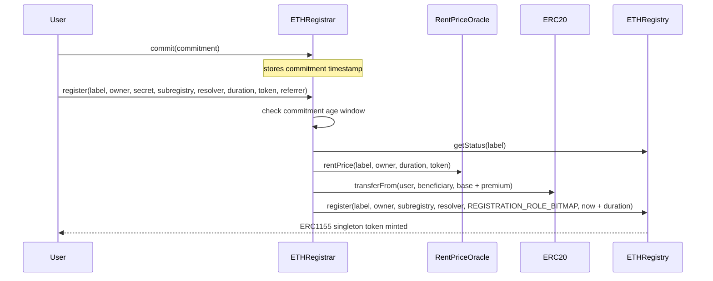
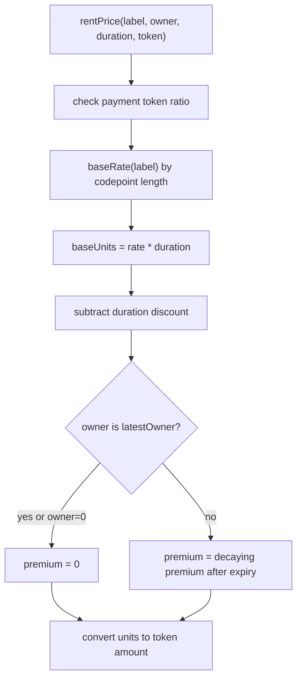
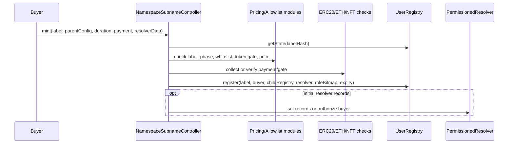

# Registration, Pricing, And Renewals

## ETHRegistrar Is The Reference Registrar Pattern

`ETHRegistrar` is the ENSv2 `.eth` public registrar. It is not a generic subname marketplace, but it is the best source pattern for how ENS expects policy contracts to sit in front of a registry.

It owns no label storage. Instead, it:

1. validates availability and commitments;
2. computes price through an oracle;
3. collects ERC20 payment;
4. calls `ETHRegistry.register()`;
5. calls `ETHRegistry.renew()` for renewals.

That separation is exactly what Namespace should copy: registry is storage/permission primitive, Namespace controller is business logic.

## Commit-Reveal Flow

Registration uses two transactions.



The commitment binds:

```solidity
keccak256(abi.encode(label, owner, secret, subregistry, resolver, duration, referrer))
```

For Namespace, commit-reveal is optional. It is useful for high-value namespaces where front-running label choice matters. For ordinary subname minting, a direct mint flow may be simpler.

## Default Role Bitmap For .eth Registrations

`ETHRegistrar` grants new owners:

- `ROLE_SET_SUBREGISTRY`
- `ROLE_SET_SUBREGISTRY_ADMIN`
- `ROLE_SET_RESOLVER`
- `ROLE_SET_RESOLVER_ADMIN`
- `ROLE_CAN_TRANSFER_ADMIN`

It does not grant the owner registrar rights on the `.eth` registry root. Instead, owner can attach a child registry to their name and manage records.

Namespace should choose role bitmaps per product:

| Product | Suggested owner role bitmap |
| --- | --- |
| Normal transferable subname | `SET_RESOLVER`, `SET_RESOLVER_ADMIN`, `CAN_TRANSFER_ADMIN` |
| Subname can create nested subnames | also `SET_SUBREGISTRY`, `SET_SUBREGISTRY_ADMIN`, and deploy/attach child registry |
| Soulbound subname | omit or revoke `ROLE_CAN_TRANSFER_ADMIN` |
| Managed profile subname | omit resolver admin; give resolver roles through `PermissionedResolver` instead |

## StandardRentPriceOracle

`StandardRentPriceOracle` computes price with three components:

1. Base rent by label codepoint length.
2. Duration discount over time.
3. Expiry premium for recently expired names.

It supports multiple ERC20 payment tokens through fixed ratios.



Pricing details:

- `baseRate(label)` returns zero for invalid/disabled lengths.
- labels longer than configured base-rate array use the final rate.
- duration discount is an integrated piecewise-linear function.
- premium decays exponentially after expiry until `premiumPeriod`.
- prior owner pays no premium.
- unsupported payment tokens revert.

## How Renewals Work

`ETHRegistrar.renew(label, duration, paymentToken, referrer)`:

1. reads registry state;
2. rejects if name is available;
3. prices base rent only;
4. transfers payment;
5. calls `REGISTRY.renew(tokenId, state.expiry + duration)`.

`PermissionedRegistry.renew()` rejects if new expiry is lower than current expiry.

For Namespace:

- Decide whether anyone can renew, only owner can renew, or only approved payer can renew.
- Decide whether renewal payment goes to namespace owner, protocol, referrer, or split recipients.
- Decide whether expired subnames can be re-registered instantly or have premium/grace behavior.

## Registrar Controller Pattern For Namespace



Controller permissions needed on each user registry:

| Feature | Registry role needed |
| --- | --- |
| Sell new direct subnames | `ROLE_REGISTRAR` on registry root |
| Renew sold direct subnames | `ROLE_RENEW` on registry root |
| Reserve labels for allowlists | `ROLE_REGISTRAR` on registry root with `owner=0` |
| Claim reserved labels | `ROLE_REGISTER_RESERVED` on registry root |
| Force resolver on minted names later | `ROLE_SET_RESOLVER` on token or root |
| Force child registry changes later | `ROLE_SET_SUBREGISTRY` on token or root |
| Unregister/clawback | `ROLE_UNREGISTER` on token or root |

Least privilege recommendation: grant the Namespace controller only root `REGISTRAR` and `RENEW` by default. Add stronger roles only for explicitly managed products.

