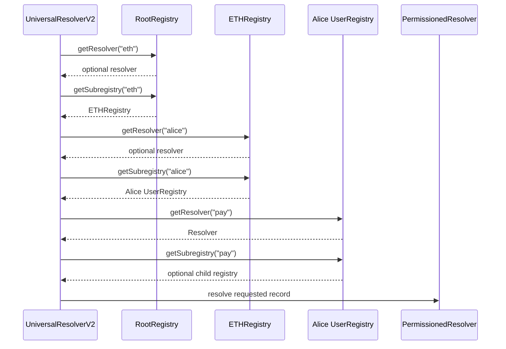
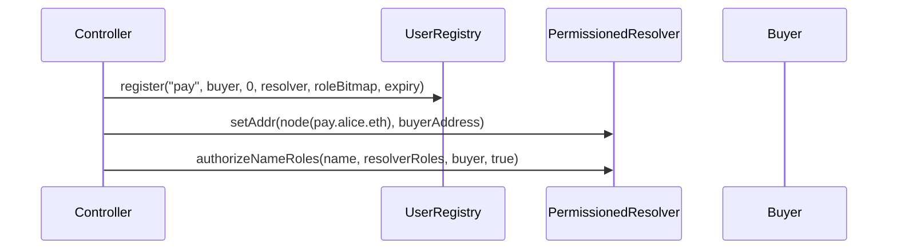

# Resolvers And Resolution

Resolution answers: given a full name and a resolver profile request, which resolver should be called and what should it return?

ENSv2 uses:

- `UniversalResolverV2` as the external entry point;
- `LibRegistry` to traverse the registry tree;
- `PermissionedResolver` to store and return records.

## Registry Traversal

Every registry exposes:

```solidity
getResolver(label)
getSubregistry(label)
```

The universal resolver starts at root and walks label by label toward the left-most label.

For `pay.alice.eth`:



The deepest non-zero resolver wins. This supports wildcard-style setups where a parent resolver can answer for children below it if no deeper resolver is found.

## UniversalResolverV2 Helpers

| Function | Use |
| --- | --- |
| `findResolver(name)` | Return resolver, node, and offset for DNS-encoded name. |
| `findExactRegistry(name)` | Return the registry exactly assigned to this name. |
| `findCanonicalRegistry(name)` | Return exact registry only if parent links are canonical. |
| `findCanonicalName(registry)` | Build DNS-encoded canonical name for a registry. |
| `findRegistries(name)` | Return all registries in ancestry. |

## PermissionedResolver Records

`PermissionedResolver` supports many resolver profiles:

| Record/profile | Setter | Getter |
| --- | --- | --- |
| ETH address | `setAddr(node, address)` | `addr(node)` |
| Multi-coin address | `setAddr(node, coinType, bytes)` | `addr(node, coinType)` |
| Text | `setText(node, key, value)` | `text(node, key)` |
| Contenthash | `setContenthash(node, hash)` | `contenthash(node)` |
| Pubkey | `setPubkey(node, x, y)` | `pubkey(node)` |
| ABI | `setABI(node, contentType, value)` | `ABI(node, contentTypes)` |
| Interface | `setInterface(node, interfaceId, implementer)` | `interfaceImplementer(node, interfaceId)` |
| Reverse name | `setName(node, primary)` | `name(node)` |
| Data | `setData(node, key, value)` | `data(node, key)` |

It also supports:

- `multicall`;
- `clearRecords`;
- resolver aliases;
- record versioning.

## Resolver Permission Resources

Resolver permissions use:

```solidity
resource(namehash, part)
```

`part` can be:

- `0`: all record parts for a name;
- `partHash(textKey)`;
- `partHash(dataKey)`;
- `partHash(coinType)`.

The resolver checks these levels:

```text
resource(0, 0)             any name, any record
resource(0, part)          any name, this record part
resource(namehash, 0)      this name, any record
resource(namehash, part)   this name, this record part
```

This lets Namespace build precise resolver permissions.

Examples:

- user can set only `text("avatar")`;
- project can set only `addr(60)`;
- Namespace can clear records for managed names;
- owner can set all records under their name.

## Resolver Alias Flow

Aliases rewrite a queried name to another name before resolving records.

```text
alias: a.eth -> b.eth
query: sub.a.eth
effective record lookup: sub.b.eth
```

This is useful for wildcard-like products, templates, and managed profiles. Avoid cycles; long alias cycles can exhaust gas.

## Resolver Setup For Minted Subnames

For a basic subname mint:

1. Namespace controller registers `pay` in Alice's registry with `resolver = PermissionedResolver`.
2. Controller optionally writes initial records.
3. Controller authorizes buyer for resolver records.



Registry roles decide who can point the name at a resolver. Resolver roles decide who can write records inside that resolver.

