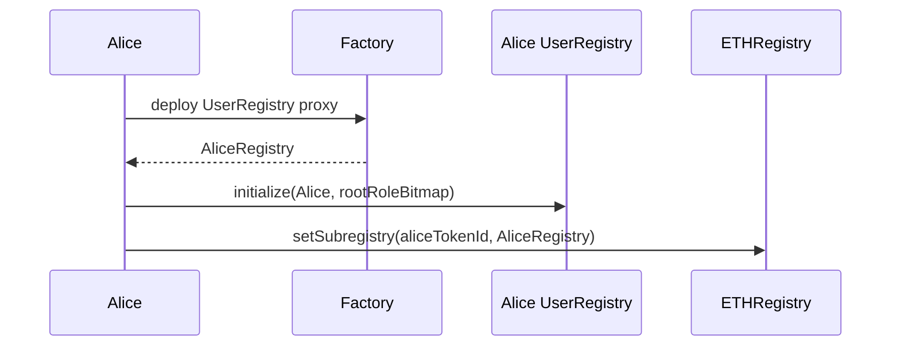
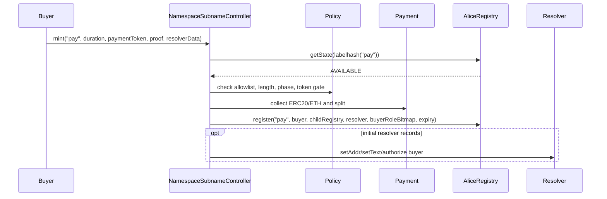
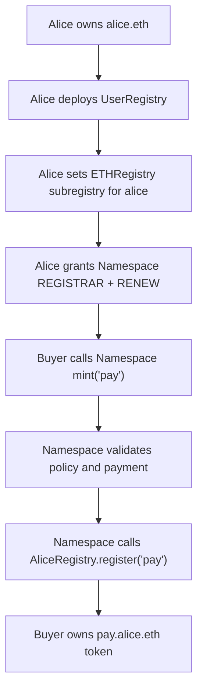

# Subname Minting Flow

ENSv2 subname minting is just registration in the correct parent registry.

For `pay.alice.eth`, the parent registry is Alice's child registry, not `ETHRegistry`.

```text
alice.eth token lives in ETHRegistry
alice.eth can point to AliceRegistry
pay.alice.eth token lives in AliceRegistry
```

## Step 1: Parent Name Gets A Child Registry

Alice owns `alice.eth`. That token is stored in `ETHRegistry`.

Alice can attach a child registry because `.eth` registrations grant:

```text
ROLE_SET_SUBREGISTRY
ROLE_SET_SUBREGISTRY_ADMIN
```

Flow:



After this:

```solidity
ETHRegistry.getSubregistry("alice") == AliceRegistry
```

## Step 2: Namespace Gets Minting Permission

Alice grants Namespace controller root roles on AliceRegistry:

```solidity
AliceRegistry.grantRootRoles(
    ROLE_REGISTRAR | ROLE_RENEW,
    namespaceController
);
```

Minimum role set:

| Role | Why Namespace needs it |
| --- | --- |
| `ROLE_REGISTRAR` | Mint available direct labels under `alice.eth`. |
| `ROLE_RENEW` | Renew sold subnames. |

Optional role set:

| Role | Use case |
| --- | --- |
| `ROLE_REGISTER_RESERVED` | Claim labels that were pre-reserved. |
| `ROLE_UNREGISTER` | Admin clawback/burn product. |
| `ROLE_SET_RESOLVER` | Managed resolver product. |
| `ROLE_SET_SUBREGISTRY` | Managed nested namespace product. |

Default recommendation: only grant `REGISTRAR` and `RENEW`.

## Step 3: Buyer Mints A Subname

Namespace controller enforces policy first, then calls registry.



The actual registry call:

```solidity
registry.register(
    "pay",
    buyer,
    childRegistry,
    resolver,
    buyerRoleBitmap,
    uint64(block.timestamp + duration)
);
```

## What Gets Minted

The minted token is not a global `.eth` token. It is an ERC1155 singleton token inside AliceRegistry.

For `pay.alice.eth`:

| Item | Value |
| --- | --- |
| Label passed to `register` | `pay` |
| Registry called | AliceRegistry |
| Owner | buyer |
| Resolver | chosen resolver, maybe Namespace-managed |
| Subregistry | usually zero unless `pay.alice.eth` should itself sell children |
| Expiry | controller policy |
| Token id | `AliceRegistry.getTokenId(labelhash("pay"))` |
| Resource id | `AliceRegistry.getResource(labelhash("pay"))` |

## Buyer Role Bitmap Choices

### Normal Transferable Subname

```text
ROLE_SET_RESOLVER
ROLE_SET_RESOLVER_ADMIN
ROLE_CAN_TRANSFER_ADMIN
```

Buyer owns the token, can transfer it, and can set resolver.

### Profile Subname With Managed Resolver

```text
ROLE_CAN_TRANSFER_ADMIN
```

Buyer can transfer token, but resolver updates are controlled through resolver roles or Namespace UI.

### Soulbound Subname

```text
no ROLE_CAN_TRANSFER_ADMIN
```

Buyer owns token but transfers revert.

### Nested Namespace

```text
ROLE_SET_SUBREGISTRY
ROLE_SET_SUBREGISTRY_ADMIN
ROLE_SET_RESOLVER
ROLE_SET_RESOLVER_ADMIN
ROLE_CAN_TRANSFER_ADMIN
```

Buyer can attach a registry and create names like `x.pay.alice.eth`.

## Reserved Subname Flow

ENSv2 supports native reservation with `owner = address(0)`.

Reserve:

```solidity
registry.register(
    "vip",
    address(0),
    IRegistry(address(0)),
    address(0),
    0,
    reservedExpiry
);
```

Claim:

```solidity
registry.register(
    "vip",
    buyer,
    childRegistry,
    resolver,
    buyerRoleBitmap,
    0
);
```

When claiming a reserved label, `expiry = 0` means keep the existing reserved expiry.

The caller needs:

- `ROLE_REGISTRAR` to reserve available labels;
- `ROLE_REGISTER_RESERVED` to promote reserved labels to registered labels.

## Renewal

Namespace renewal flow:

```solidity
state = registry.getState(labelhash(label));
newExpiry = state.expiry + duration;
registry.renew(state.tokenId, newExpiry);
```

The controller should decide:

- can anyone renew?
- only owner?
- can renew after expiry?
- is there a grace period?
- is premium charged after expiry?

The base registry only enforces that expiry cannot be reduced and caller has `ROLE_RENEW`.

## End-To-End Example



