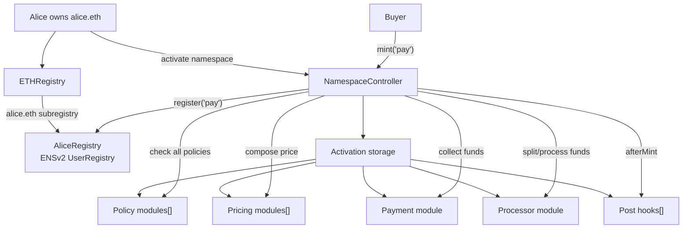
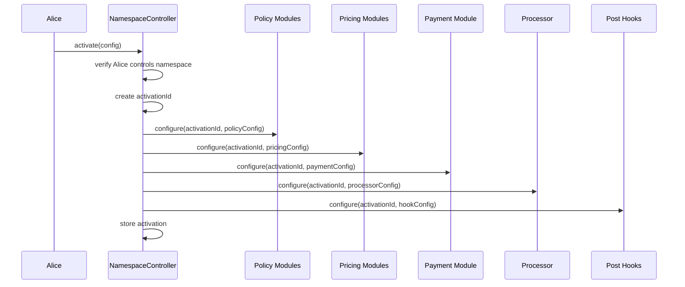
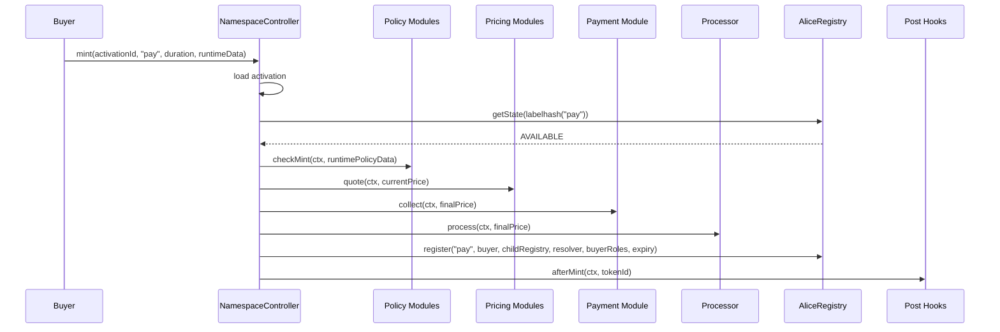

# Namespace Contract Architecture

This document describes the recommended contract architecture for Namespace on ENSv2.

The goal is to let owners like Alice, who owns `alice.eth`, activate a subname sale and sell names like:

```text
pay.alice.eth
team.alice.eth
app.alice.eth
```

with features such as:

- custom pricing;
- length-based pricing;
- USD pricing;
- dynamic pricing;
- emoji-only or number-only label rules;
- mint deadlines;
- whitelists;
- reservations;
- ERC20/ERC721 token gates;
- revenue splits;
- future integrations such as human verification or cross-chain proofs.

The architecture should keep ENSv2 compatibility by using the official ENSv2 registry as the source of truth, while Namespace becomes the programmable sale/controller layer.

## Core Decision

Namespace should not build a custom registry for every user.

Use:

```text
ENSv2 UserRegistry
  = ownership, expiry, resolver pointer, subregistry pointer, token, permissions

Namespace contracts
  = activation, policies, pricing, payment, splits, hooks, mint flow
```

For Alice:

```text
alice.eth
  -> points to AliceRegistry, an official ENSv2 UserRegistry

AliceRegistry
  -> stores pay.alice.eth, team.alice.eth, app.alice.eth

NamespaceController
  -> has limited permission to mint/renew names in AliceRegistry
  -> enforces Alice's configured sale rules
```

## High-Level Architecture



## Mental Model

There are two phases:

```text
Activation phase
  Alice configures how her namespace sale works.
  Module params are stored on-chain.

Mint phase
  Buyer mints using the already-stored activation config.
  Buyer only provides label, duration, and runtime proof data if needed.
```

So the buyer does not need to submit full policy/pricing/payment configuration on every mint.

## Phase 1: Alice Activates Her Namespace

Alice already owns `alice.eth`.

First, `alice.eth` needs a child registry:

```text
alice.eth -> AliceRegistry
```

Then Alice grants Namespace limited root roles on AliceRegistry:

```text
ROLE_REGISTRAR
ROLE_RENEW
optional ROLE_REGISTER_RESERVED
```

Then Alice calls:

```solidity
NamespaceController.activate(ActivationConfig config)
```

During activation:

1. Controller verifies Alice is allowed to activate this namespace.
2. Controller creates an `activationId`.
3. Controller stores base activation metadata.
4. Controller calls `configure()` on each selected module.
5. Each module stores its own params keyed by `activationId`.



## Phase 2: Buyer Mints A Subname

Buyer calls:

```solidity
mint(activationId, label, duration, runtimeData)
```

Example:

```text
mint(aliceActivationId, "pay", 1 year, merkleProof/paymentData/referrer)
```

Mint flow:



## Activation Data vs Runtime Data

This distinction is critical.

### Activation Data

Saved once by Alice.

Examples:

```text
sale start/end time
minimum/maximum duration
allowed label rules
Merkle root
ERC721 token gate contract
price table
USD oracle address
payment token
revenue split recipients
resolver behavior
buyer role bitmap
```

### Runtime Data

Provided by buyer per mint.

Examples:

```text
Merkle proof
signature
human verification proof
cross-chain proof
permit data
referrer
resolver record inputs
```

The buyer should only provide data that is specific to that mint. They should not provide the sale configuration itself.

## Contract Groups

Keep the module system small.

Use these groups:

```text
1. Policy modules[]
2. Pricing modules[]
3. Payment module
4. Processor module
5. Post hooks[]
```

This gives flexibility without having a dozen module interfaces.

## NamespaceController

The controller is the orchestrator.

It should:

- create activations;
- store activation metadata;
- verify namespace ownership/control during activation;
- call module `configure()` functions;
- run mint/renew flows;
- call ENSv2 `registry.register()` and `registry.renew()`;
- enforce module order;
- emit canonical Namespace events.

It should not contain every whitelist, price, token-gate, split, or resolver rule directly.

## Activation Struct

Recommended shape:

```solidity
struct Activation {
    address owner;
    IPermissionedRegistry registry;
    bytes32 parentNode;
    address resolver;
    uint256 buyerRoleBitmap;
    bool active;

    address[] policies;
    address[] pricingModules;
    address paymentModule;
    address processor;
    address[] postHooks;
}
```

Meaning:

| Field | Meaning |
| --- | --- |
| `owner` | Account that owns/admins this Namespace activation. |
| `registry` | ENSv2 registry where labels are minted, for example AliceRegistry. |
| `parentNode` | Namehash of parent, for example `alice.eth`. |
| `resolver` | Default resolver for minted subnames. |
| `buyerRoleBitmap` | ENSv2 registry roles granted to subname buyers. |
| `active` | Whether minting through this activation is enabled. |
| `policies` | All policy modules that must approve mint. |
| `pricingModules` | Pricing modules applied in sequence. |
| `paymentModule` | Module that collects payment. |
| `processor` | Module that handles splits/fees/accounting. |
| `postHooks` | Hooks called after registry mint succeeds. |

## ModuleConfig

Activation input should include module addresses plus config bytes.

```solidity
struct ModuleConfig {
    address module;
    bytes configData;
}

struct ActivationConfig {
    IPermissionedRegistry registry;
    bytes32 parentNode;
    address resolver;
    uint256 buyerRoleBitmap;

    ModuleConfig[] policies;
    ModuleConfig[] pricingModules;
    ModuleConfig paymentModule;
    ModuleConfig processor;
    ModuleConfig[] postHooks;
}
```

The controller loops through this during activation:

```solidity
for each policy:
    IConfigurableModule(policy.module).configure(activationId, policy.configData);
```

Each module stores the decoded params under `activationId`.

## Activation ID

Use a deterministic id:

```solidity
activationId = keccak256(
    abi.encode(
        block.chainid,
        registry,
        parentNode,
        owner,
        nonce
    )
);
```

Why include `nonce`?

Because Alice may want multiple campaigns over time:

```text
alice.eth allowlist phase
alice.eth public sale
alice.eth partner claim
alice.eth renewal campaign
```

Each campaign can have a separate activation.

## Shared MintContext

Every module receives the same context.

```solidity
struct MintContext {
    bytes32 activationId;
    address buyer;
    address payer;
    IPermissionedRegistry registry;
    bytes32 parentNode;
    string label;
    bytes32 labelHash;
    uint64 duration;
    uint64 expiry;
    address resolver;
    uint256 buyerRoleBitmap;
}
```

Why this helps:

- modules do not need to query controller storage repeatedly;
- modules agree on the same facts;
- future modules can be added without changing core mint semantics.

## RuntimeData

Runtime data should be split by module group.

```solidity
struct RuntimeData {
    bytes[] policyData;
    bytes[] pricingData;
    bytes paymentData;
    bytes processorData;
    bytes[] postHookData;
}
```

Array lengths must match configured modules:

```text
policyData.length == activation.policies.length
pricingData.length == activation.pricingModules.length
postHookData.length == activation.postHooks.length
```

This keeps buyer calldata predictable while still allowing modules like Merkle proof or human verification to receive per-mint proof data.

## Module Interface: Configurable Base

All modules should share a configuration interface.

```solidity
interface IConfigurableModule {
    function configure(bytes32 activationId, bytes calldata configData) external;
}
```

Security rule:

```text
Only NamespaceController should be allowed to call configure().
```

Otherwise, someone could overwrite module params for another user's activation.

A simple module base:

```solidity
abstract contract NamespaceModule is IConfigurableModule {
    address public immutable controller;

    modifier onlyController() {
        if (msg.sender != controller) revert NotController();
        _;
    }

    constructor(address controller_) {
        controller = controller_;
    }
}
```

## Module Type 1: Policy Modules

Policy modules answer:

```text
Is this mint allowed?
```

They should revert if not allowed.

```solidity
interface IPolicyModule is IConfigurableModule {
    function checkMint(
        MintContext calldata ctx,
        bytes calldata runtimeData
    ) external;
}
```

Use policy modules for:

| Feature | Policy module |
| --- | --- |
| Mint enabled/disabled | `SaleActivePolicy` |
| Start/end time | `SaleWindowPolicy` |
| Deadline | `DeadlinePolicy` |
| Min/max label length | `LabelLengthPolicy` |
| Only numbers | `OnlyNumbersPolicy` |
| Only emoji | `OnlyEmojiPolicy` |
| Whitelist | `MerkleWhitelistPolicy` |
| Reservations | `ReservationPolicy` |
| ERC721 gate | `ERC721GatePolicy` |
| ERC20 balance gate | `ERC20GatePolicy` |
| Per-wallet limit | `WalletLimitPolicy` |
| Max supply | `MaxSupplyPolicy` |
| Human verification | `HumanVerificationPolicy` |
| Cross-chain proof | `CrossChainProofPolicy` |

All policies are stacked:

```solidity
for each policy:
    policy.checkMint(ctx, runtimeData.policyData[i]);
```

If any policy reverts, mint fails.

## Module Type 2: Pricing Modules

Pricing modules answer:

```text
How much should this mint cost?
```

Pricing modules are applied sequentially.

```solidity
struct Price {
    address token;
    uint256 amount;
}

interface IPricingModule is IConfigurableModule {
    function quoteMint(
        MintContext calldata ctx,
        Price calldata currentPrice,
        bytes calldata runtimeData
    ) external view returns (Price memory);
}
```

Example composition:

```text
Start price: 0

LengthBasedPricing:
  5 chars -> 20 USDC

EmojiPremiumPricing:
  emoji label -> +10 USDC

WhitelistDiscountPricing:
  allowlisted buyer -> -5 USDC

Final price: 25 USDC
```

Use pricing modules for:

| Feature | Pricing module |
| --- | --- |
| Fixed price | `FixedPricePricing` |
| Length-based | `LengthBasedPricing` |
| USD price | `USDOraclePricing` |
| Dynamic demand | `DemandCurvePricing` |
| Emoji premium | `EmojiPremiumPricing` |
| Number premium | `NumberPremiumPricing` |
| Whitelist discount | `WhitelistDiscountPricing` |
| Free claim | `FreePricing` |

Recommendation:

```text
Use one final payment token per activation.
```

Multiple payment tokens inside one composed price make accounting and UX harder.

## Module Type 3: Payment Module

Payment module answers:

```text
How do funds enter the system?
```

```solidity
interface IPaymentModule is IConfigurableModule {
    function collect(
        MintContext calldata ctx,
        Price calldata price,
        bytes calldata runtimeData
    ) external payable;
}
```

Examples:

| Need | Payment module |
| --- | --- |
| ERC20 payment | `ERC20PaymentModule` |
| Native ETH payment | `NativePaymentModule` |
| Permit2 flow | `Permit2PaymentModule` |
| Free mint | `FreePaymentModule` |

The payment module should collect funds into either:

- the controller;
- the processor;
- an escrow/split contract;
- or directly to recipients if simple.

For clean accounting, prefer:

```text
Payment module collects.
Processor distributes.
```

## Module Type 4: Processor

Processor answers:

```text
What happens with collected funds or accounting after payment?
```

```solidity
interface IProcessorModule is IConfigurableModule {
    function processPayment(
        MintContext calldata ctx,
        Price calldata price,
        bytes calldata runtimeData
    ) external;
}
```

Use processor for:

| Need | Processor |
| --- | --- |
| Send all funds to owner | `DirectPayoutProcessor` |
| Protocol fee | `ProtocolFeeProcessor` |
| Multi-recipient split | `SplitProcessor` |
| Referrer fee | `ReferralProcessor` |
| Escrow/claim later | `EscrowProcessor` |
| Accounting-only event | `AccountingProcessor` |

Why separate payment and processor?

```text
Payment = collect funds from buyer.
Processor = split/distribute/record funds.
```

This separation lets the same split processor work with ETH, ERC20, or future payment mechanisms.

## Module Type 5: Post Hooks

Post hooks run after the ENSv2 registry mint succeeds.

```solidity
interface IPostHookModule is IConfigurableModule {
    function afterMint(
        MintContext calldata ctx,
        uint256 tokenId,
        bytes calldata runtimeData
    ) external;
}
```

Use post hooks for:

| Need | Hook |
| --- | --- |
| Set ETH address record | `SetAddrToBuyerHook` |
| Set text records | `SetTextRecordsHook` |
| Grant resolver roles | `GrantResolverRolesHook` |
| Emit integration events | `IntegrationEventHook` |
| Create metadata | `MetadataHook` |
| Deploy child registry | `CreateSubregistryHook` |

Post hooks should be used carefully. If a hook reverts after `registry.register()`, the whole transaction reverts, including the mint. That is often correct, but hooks should be small and predictable.

## Full Activation Example

Alice wants:

```text
Namespace: alice.eth
Sale: open Jan 1 to Feb 1
Labels: 3-12 characters
Whitelist: Merkle root
Gate: must hold a specific NFT
Pricing: length-based in USDC
Premium: emoji labels cost extra
Payment: USDC
Processor: 90% Alice, 10% Namespace protocol fee
Post hook: set addr(pay.alice.eth) to buyer
```

Activation:

```text
policies:
  SaleWindowPolicy(start=Jan 1, end=Feb 1)
  LabelLengthPolicy(min=3, max=12)
  MerkleWhitelistPolicy(root=0x...)
  ERC721GatePolicy(token=CoolNFT, minBalance=1)

pricingModules:
  LengthBasedPricing(table=[...], token=USDC)
  EmojiPremiumPricing(extra=10 USDC)

paymentModule:
  ERC20PaymentModule(token=USDC)

processor:
  SplitProcessor(recipients=[Alice, Namespace], bps=[9000, 1000])

postHooks:
  SetAddrToBuyerHook()
```

Buyer mint:

```text
mint(
  activationId,
  "pay",
  365 days,
  runtimeData = {
    policyData: [
      "",                  // SaleWindow needs no runtime data
      "",                  // LabelLength needs no runtime data
      merkleProof,          // MerkleWhitelist
      ""                   // ERC721Gate needs no runtime data
    ],
    pricingData: ["", ""],
    paymentData: permit or allowance data,
    processorData: referrer data,
    postHookData: [optional addr data]
  }
)
```

## Controller Mint Pseudocode

```solidity
function mint(
    bytes32 activationId,
    string calldata label,
    uint64 duration,
    RuntimeData calldata runtimeData
) external payable returns (uint256 tokenId) {
    Activation storage a = activations[activationId];
    if (!a.active) revert ActivationNotActive();

    bytes32 labelHash = keccak256(bytes(label));
    IPermissionedRegistry.State memory state = a.registry.getState(uint256(labelHash));
    if (state.status != IPermissionedRegistry.Status.AVAILABLE) {
        revert LabelNotAvailable(label);
    }

    MintContext memory ctx = MintContext({
        activationId: activationId,
        buyer: msg.sender,
        payer: msg.sender,
        registry: a.registry,
        parentNode: a.parentNode,
        label: label,
        labelHash: labelHash,
        duration: duration,
        expiry: uint64(block.timestamp) + duration,
        resolver: a.resolver,
        buyerRoleBitmap: a.buyerRoleBitmap
    });

    for (uint256 i; i < a.policies.length; ++i) {
        IPolicyModule(a.policies[i]).checkMint(ctx, runtimeData.policyData[i]);
    }

    Price memory price;
    for (uint256 i; i < a.pricingModules.length; ++i) {
        price = IPricingModule(a.pricingModules[i]).quoteMint(
            ctx,
            price,
            runtimeData.pricingData[i]
        );
    }

    IPaymentModule(a.paymentModule).collect{value: msg.value}(
        ctx,
        price,
        runtimeData.paymentData
    );

    IProcessorModule(a.processor).processPayment(
        ctx,
        price,
        runtimeData.processorData
    );

    tokenId = a.registry.register(
        label,
        msg.sender,
        IRegistry(address(0)),
        a.resolver,
        a.buyerRoleBitmap,
        ctx.expiry
    );

    for (uint256 i; i < a.postHooks.length; ++i) {
        IPostHookModule(a.postHooks[i]).afterMint(
            ctx,
            tokenId,
            runtimeData.postHookData[i]
        );
    }

    emit SubnameMinted(activationId, labelHash, label, msg.sender, tokenId, price.token, price.amount);
}
```

## Renew Flow

Renewal can use the same activation and module model.

Add optional renew functions to modules:

```solidity
interface IPolicyModule {
    function checkMint(MintContext calldata ctx, bytes calldata data) external;
    function checkRenew(RenewContext calldata ctx, bytes calldata data) external;
}

interface IPricingModule {
    function quoteMint(MintContext calldata ctx, Price calldata current, bytes calldata data)
        external
        view
        returns (Price memory);

    function quoteRenew(RenewContext calldata ctx, Price calldata current, bytes calldata data)
        external
        view
        returns (Price memory);
}
```

Renewal flow:

```text
load activation
load registry state
check renewal policies
compose renewal price
collect payment
process payment
call registry.renew(tokenId, newExpiry)
emit event
```

Do not create a separate renewal module type unless renewal logic becomes very different. Start with policy/pricing/payment/processor reuse.

## Reservations

Reservations can be implemented as a policy module.

There are two kinds:

### Soft Reservation

Only Namespace controller enforces it.

```text
ReservationPolicy says:
  label "vip" can only be minted by 0xAlice
```

Pros:

- simple;
- no registry reservation state;
- no special registry role needed beyond `ROLE_REGISTRAR`.

Cons:

- if someone can bypass the Namespace controller and call registry directly, soft reservation is bypassable.

### Hard Reservation

Namespace actually reserves the label in the ENSv2 registry:

```solidity
registry.register(
    label,
    address(0),
    IRegistry(address(0)),
    address(0),
    0,
    reservedExpiry
);
```

Then claim later:

```solidity
registry.register(
    label,
    buyer,
    IRegistry(address(0)),
    resolver,
    buyerRoleBitmap,
    0
);
```

Pros:

- registry itself marks the label as `RESERVED`.

Cons:

- controller needs `ROLE_REGISTER_RESERVED` to promote reservation to registration;
- more state transitions;
- more operational complexity.

Recommendation:

```text
Start with soft reservations for normal campaigns.
Add hard reservations for high-value or strict allocation campaigns.
```

## Trust Modes

Alice may be able to bypass Namespace rules if she keeps direct registry permissions.

This should be explicit.

### Owner-Managed Mode

Alice keeps full control.

```text
Alice can mint directly in AliceRegistry.
Namespace also has mint permission.
```

Good for:

- personal names;
- flexible communities;
- low-trust-requirement sales.

Guarantee:

```text
Namespace mints follow rules, but owner can bypass if they choose.
```

### Namespace-Enforced Mode

Namespace is the only account with `ROLE_REGISTRAR` on AliceRegistry.

```text
Alice does not keep ROLE_REGISTRAR.
Alice does not keep ROLE_REGISTRAR_ADMIN.
```

Good for:

- public sales;
- stronger buyer guarantees;
- rules enforced through controller path.

Guarantee:

```text
Subnames cannot be minted in that registry except through Namespace.
```

### Parent-Locked Mode

The strongest mode also restricts Alice's ability to replace the child registry pointer from `alice.eth`.

This concerns the parent registry role:

```text
ROLE_SET_SUBREGISTRY on alice.eth inside ETHRegistry
```

If Alice can change:

```text
alice.eth -> AliceRegistry
```

then she may point `alice.eth` to a different registry later.

This is a separate guarantee from who can mint inside AliceRegistry.

## Role Requirements

Namespace controller needs these roles on the user's `UserRegistry`.

Minimum:

```text
ROLE_REGISTRAR
ROLE_RENEW
```

Optional:

| Role | Needed for |
| --- | --- |
| `ROLE_REGISTER_RESERVED` | Hard reservation claim flow. |
| `ROLE_UNREGISTER` | Clawback/burn/admin removal products. |
| `ROLE_SET_RESOLVER` | Controller-managed resolver changes after mint. |
| `ROLE_SET_SUBREGISTRY` | Controller-managed nested registry setup. |

Recommended default:

```text
Namespace gets ROLE_REGISTRAR + ROLE_RENEW only.
```

Stronger powers should be opt-in per activation.

## Buyer Role Bitmap

The activation stores which ENSv2 registry roles buyers receive on minted names.

### Normal Transferable Subname

```text
ROLE_SET_RESOLVER
ROLE_SET_RESOLVER_ADMIN
ROLE_CAN_TRANSFER_ADMIN
```

Buyer can transfer and change resolver.

### Managed Resolver Subname

```text
ROLE_CAN_TRANSFER_ADMIN
```

Buyer owns transferable token, but resolver writes are controlled by resolver permissions/post hooks.

### Soulbound Subname

```text
no ROLE_CAN_TRANSFER_ADMIN
```

Buyer owns token, but transfer reverts.

### Nested Namespace Subname

```text
ROLE_SET_SUBREGISTRY
ROLE_SET_SUBREGISTRY_ADMIN
ROLE_SET_RESOLVER
ROLE_SET_RESOLVER_ADMIN
ROLE_CAN_TRANSFER_ADMIN
```

Buyer can attach a child registry and sell deeper names.

## Module Storage Pattern

Every module stores params by `activationId`.

Example policy:

```solidity
contract SaleWindowPolicy is NamespaceModule, IPolicyModule {
    struct Params {
        uint64 startTime;
        uint64 endTime;
    }

    mapping(bytes32 => Params) public params;

    function configure(bytes32 activationId, bytes calldata data)
        external
        onlyController
    {
        params[activationId] = abi.decode(data, (Params));
    }

    function checkMint(MintContext calldata ctx, bytes calldata)
        external
        view
    {
        Params memory p = params[ctx.activationId];
        if (block.timestamp < p.startTime) revert SaleNotStarted();
        if (block.timestamp > p.endTime) revert SaleEnded();
    }
}
```

Example pricing module:

```solidity
contract LengthBasedPricing is NamespaceModule, IPricingModule {
    struct Params {
        address token;
        uint256[] priceByLength;
    }

    mapping(bytes32 => Params) public params;

    function configure(bytes32 activationId, bytes calldata data)
        external
        onlyController
    {
        params[activationId] = abi.decode(data, (Params));
    }

    function quoteMint(
        MintContext calldata ctx,
        Price calldata,
        bytes calldata
    ) external view returns (Price memory) {
        Params memory p = params[ctx.activationId];
        uint256 len = bytes(ctx.label).length;
        return Price({
            token: p.token,
            amount: p.priceByLength[len] * ctx.duration
        });
    }
}
```

## Module Registry

Namespace may also want a `ModuleRegistry`.

Purpose:

```text
approve modules that are safe to use
mark module types
prevent malicious module addresses in UI/default flows
allow power users to opt into custom modules if desired
```

Example:

```solidity
contract ModuleRegistry {
    mapping(address => bool) public approvedModule;
    mapping(address => bytes32) public moduleKind;
}
```

Module kinds:

```text
POLICY
PRICING
PAYMENT
PROCESSOR
POST_HOOK
```

The controller can require approved modules for public activations.

## Events

Controller should emit clear events for indexing.

```solidity
event ActivationCreated(
    bytes32 indexed activationId,
    address indexed owner,
    address indexed registry,
    bytes32 parentNode
);

event ActivationStatusChanged(bytes32 indexed activationId, bool active);

event ModuleConfigured(
    bytes32 indexed activationId,
    address indexed module,
    bytes32 moduleKind
);

event SubnameMinted(
    bytes32 indexed activationId,
    bytes32 indexed labelHash,
    string label,
    address indexed owner,
    uint256 tokenId,
    address paymentToken,
    uint256 amount
);

event SubnameRenewed(
    bytes32 indexed activationId,
    bytes32 indexed labelHash,
    string label,
    uint256 tokenId,
    uint64 newExpiry,
    address paymentToken,
    uint256 amount
);
```

Indexers should also listen to ENSv2 registry events:

- `LabelRegistered`;
- `LabelReserved`;
- `LabelUnregistered`;
- `ExpiryUpdated`;
- `SubregistryUpdated`;
- `ResolverUpdated`;
- `TokenRegenerated`;
- `TokenResource`;
- ERC1155 transfers.

## Security Notes

1. Modules must be configured only by the controller.

2. Controller must verify the activator controls the namespace.

3. Runtime data array lengths must match configured module arrays.

4. Pricing modules should not accidentally switch payment token mid-pipeline unless explicitly allowed.

5. Payment and processor must be carefully ordered to avoid uncollected funds being distributed.

6. Post hooks should be trusted or approved because they run inside mint flow and can cause full transaction revert.

7. Reentrancy protection is needed around payment, processor, registry mint, and hooks.

8. If strict buyer guarantees are needed, Alice must not retain direct registrar/admin powers in AliceRegistry.

9. Token ids can change when ENSv2 roles change, so store label hash and registry as the stable identity.

10. Label normalization should be handled in policy modules or pre-validation. The ENSv2 registry checks label byte size, not product-specific label rules.

## Build Order

Recommended first implementation:

1. `NamespaceController`
2. shared structs/interfaces
3. `ModuleRegistry`
4. `SaleWindowPolicy`
5. `LabelLengthPolicy`
6. `MerkleWhitelistPolicy`
7. `FixedPricePricing`
8. `LengthBasedPricing`
9. `ERC20PaymentModule`
10. `SplitProcessor`
11. `SetAddrToBuyerHook`

Then add:

- ERC721 gate policy;
- ERC20 balance gate policy;
- reservation policy;
- dynamic pricing;
- USD oracle pricing;
- human verification policy;
- cross-chain proof policy.

## Final Shape

The system should look like this:

```text
ENSv2 UserRegistry
  stores actual subname ownership and expiry

NamespaceController
  stores activations
  orchestrates mint and renew
  calls ENSv2 registry

Policy modules[]
  stacked approval checks

Pricing modules[]
  sequential price composition

Payment module
  collects funds

Processor
  splits/distributes/accounts for funds

Post hooks[]
  resolver setup, metadata, integrations
```

This architecture keeps the core controller simple, keeps ENSv2 as the canonical name system, and lets Namespace add future features by deploying new modules instead of rewriting the registry or the controller.

