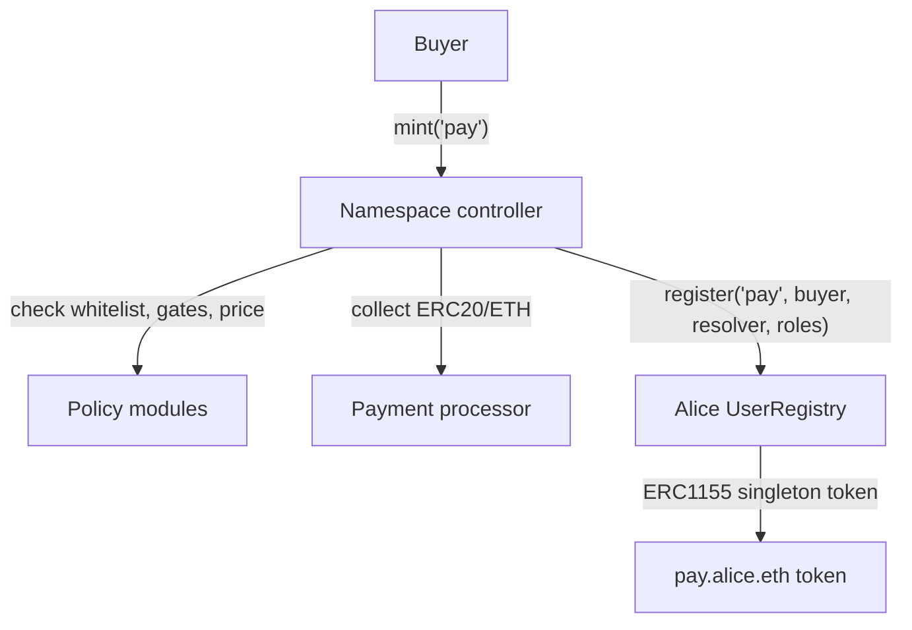

# ENSv2 Contracts Research

This documentation explains the ENSv2 contracts in `lib/contracts-v2/contracts/src` from the ground up. It focuses on the live ENSv2 architecture, `.eth` minting, registries, permissions, resolvers, and how Namespace can build subname minting on top.

Recommended reading order:

1. [Architecture From Scratch](./ensv2-architecture.md)
2. [Permissions Deep Dive](./ensv2-permissions.md)
3. [Dot ETH Minting Flow](./ensv2-dot-eth-minting.md)
4. [Registration, Pricing, And Renewals](./ensv2-registration-pricing.md)
5. [Resolvers And Resolution](./ensv2-resolution.md)
6. [Subname Minting Flow](./ensv2-subname-minting.md)
7. [Example Registry And Registrar](./ensv2-example-registry.md)
8. [Namespace Contract Architecture](./namespace-subname-minting-design.md)
9. [Namespace Architecture: Claims, Rules, Effects, And Settlement](./namespace-architecture-v2-claims-rules-settlement.md)
10. [Architecture Decision History](./architecture-decision-history.md)
11. [Namespace Architecture And Gas Review](./namespace-architecture-gas-review.md)
12. [Strict Effect Architecture Research](./strict-effect-architecture-research.md)
13. [ENSv2 Update Notes: 5677359 -> 48b3e2d](./ensv2-update-48b3e2d.md)
14. [ENSv2 Source Map](./ensv2-source-map.md)

## One-Screen Summary

ENSv2 is built around hierarchical registries.

```text
RootRegistry
  manages "eth"
      ETHRegistry
        manages "alice"
            Alice's UserRegistry
              manages "pay", "app", "team", ...
```

Every registry manages exactly one level of labels. If a label wants children, that label points to another registry through `subregistry`.

For a full name like `pay.alice.eth`:

| Name part | Managed by | Stored as |
| --- | --- | --- |
| `eth` | `RootRegistry` | token/entry for label `eth` |
| `alice` | `ETHRegistry` | token/entry for label `alice` |
| `pay` | Alice's `UserRegistry` | token/entry for label `pay` |

The same registry primitive is used for top-level names, `.eth` names, user subnames, and deeper subnames.

## Main ENSv2 Components

| Component | Main contracts | What it does |
| --- | --- | --- |
| Registry tree | `PermissionedRegistry`, `UserRegistry` | Stores labels, owner tokens, expiry, resolver, child registry. |
| Token ownership | `ERC1155Singleton` | One owner per token id, ERC1155-compatible events and transfers. |
| Permissions | `EnhancedAccessControl`, `RegistryRolesLib` | Resource-scoped role system for registries and names. |
| `.eth` registrar | `ETHRegistrar` | Commit-reveal public `.eth` registration and renewal controller. |
| Pricing | `StandardRentPriceOracle` | Label length pricing, duration discounts, expiry premium, ERC20 payment ratios. |
| Resolver | `PermissionedResolver` | Stores address, text, contenthash, ABI, pubkey, interface, reverse name, data records. |
| Resolution | `UniversalResolverV2`, `LibRegistry` | Traverses the registry tree and finds the deepest resolver. |
| Labels and token URI | `LabelStore`, `IRegistryURIRenderer`, built-in `PermissionedRegistry` URI fields | Shared label text lookup and optional registry URI rendering. |
| Deployment helpers | deploy scripts, `VerifiableFactory` | Deploys registries, resolvers, and upgradeable user registry/resolver proxies. |
| Contract naming | `ContractNamer`, `DelegatedContractNamer`, `IContractNamer` | Gives deployed contracts reverse-name metadata hooks. |

The updated ENSv2 snapshot removed the previous `src/hca/*` support contracts and the old external registry metadata provider contracts. The current registry constructor path uses `LabelStore`.

## Namespace Takeaway

Namespace should not duplicate the ENSv2 registry. Instead, Namespace should build the policy layer that operates a user's registry.

The clean model is:

1. user owns `alice.eth`;
2. user attaches a `UserRegistry` to `alice.eth`;
3. user grants Namespace controller `ROLE_REGISTRAR` and maybe `ROLE_RENEW` on that registry root;
4. Namespace controller enforces whitelist, pricing, token-gates, and payment;
5. Namespace controller calls `UserRegistry.register()` to mint `label.alice.eth`.


