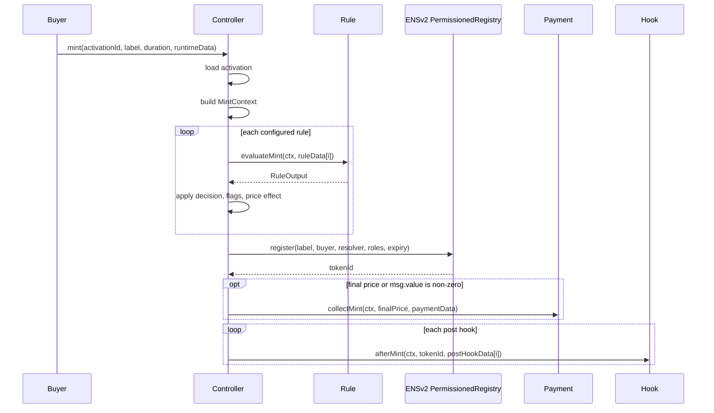
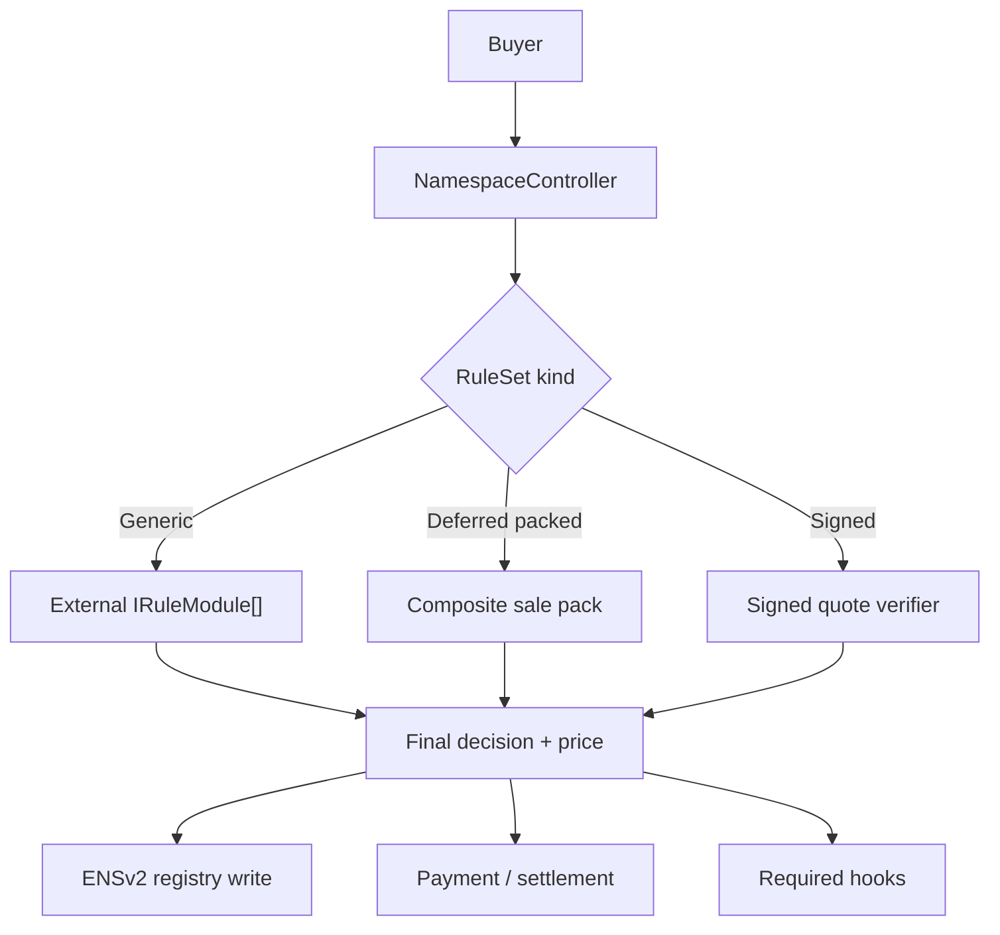

# Namespace Architecture And Gas Review

This review challenges the current Namespace architecture against the original product goal:

- Alice owns a name such as `alice.eth`.
- Alice can list subnames for sale.
- Alice can configure rules such as deadlines, whitelists, reservations, token gates, length pricing, label class pricing, discounts, and future integrations.
- A rule can affect both eligibility and price.
- The mint path should stay modular, future-proof, and cheap enough for real users.

The current implementation is a useful baseline. It proves the right mental model:

```text
Rules return effects.
The engine composes effects.
Settlement writes ENSv2 state and collects payment.
Hooks react after mint.
```

The conclusion of this review is:

```text
Keep the effect-based rule model.
Use strict generic rule stacks as the launch path.
Defer gas-optimized rule-set kinds until usage and benchmark data justify them.
```

## Current Architecture

Current mint flow:



Important detail: payment currently happens after the registry call. This is still atomic because a later payment or hook revert reverts the whole transaction, including the registry write. It is different from many registrar designs that collect payment before registering.

Current core pieces:

| Piece | Current shape | Review |
| --- | --- | --- |
| Activation | One stored sale config per namespace | Good model. Needs stronger registry binding and metadata. |
| Rule | External module implementing `IRuleModule` | Good for long-tail extensibility. Expensive if every common rule is external. |
| RuleOutput | One compact effect per rule | Good gas-aware shape. Needs stricter semantics. |
| Phases | Sorted at activation | Good. Op/phase compatibility is now enforced by the controller. |
| Payment | One payment module | Good default. Advanced settlement should be separate. |
| Hooks | Required post-mint hooks | Good for resolver writes. Non-critical hooks should not brick mints. |
| Config storage | Module-owned `mapping(activationId => Params)` | Simple, but expensive and weak for repeated module instances. |
| Runtime data | Index-aligned `bytes[]` | Gas-aware, but SDK/tooling must protect users from wrong indexes. |

## What Is Good

### Unified Rules Are Correct

The shift from separate policy/pricing modules to unified rules is the right long-term direction.

Many real features are both eligibility and pricing:

| Feature | Eligibility effect | Pricing effect |
| --- | --- | --- |
| Reservation | only buyer can mint, or label blocked | exact reserved price |
| Whitelist | only listed buyer or label can mint | discount or custom price |
| World ID | only verified human can mint | free mint or human discount |
| Token gate | holder-only mint | holder discount |
| Coupon | valid signature required | price override or discount |

Splitting these into separate "policy" and "pricing" modules creates duplicated proof verification, duplicate runtime data, and fragile ordering. The current `RuleOutput` model avoids that.

### Phases Are Necessary

Rules need deterministic order. Without phases, Alice can accidentally configure:

```text
discount before base price
override before premium
reservation after final check
```

The current phases are sensible:

```text
GUARD -> ELIGIBILITY -> BASE_PRICE -> PREMIUM -> DISCOUNT -> OVERRIDE -> FINAL_CHECK
```

### Compact Effects Are Better Than Dynamic Effect Arrays

Returning a dynamic `Effect[]` would be more expressive, but expensive and harder to audit. The current one-output shape is the right default:

```solidity
Decision decision;
PriceOp priceOp;
uint16 bps;
address token;
uint256 amount;
uint256 addFlags;
uint256 requireFlags;
```

Rules that need complex behavior should use dedicated official rules, signed quotes, or future optimized modules when benchmarks justify them.

## Main Problems

### 1. The Gas Target Is Below The Current Registry-Backed Floor

The target of `$0.20-$0.30` at `1 gwei` and ETH at `$3000` means:

| Target | Approx gas |
| ---: | ---: |
| `$0.20` | `66,667` gas |
| `$0.30` | `100,000` gas |

Current benchmark numbers:

| Scenario | Current gas | USD at 1 gwei |
| --- | ---: | ---: |
| No rules, free mint | `164,818` | `$0.49` |
| Fixed ERC20 price | `223,261` | `$0.67` |
| Sale window + length + fixed ERC20 | `260,191` | `$0.78` |
| Three rules + split payment | `290,969` | `$0.87` |
| Whitelist + split + resolver writes | `423,040` | `$1.27` |
| All rules + split, no resolver writes | `571,297` | `$1.71` |
| All rules + split + three resolver writes | `653,255` | `$1.96` |

These are call-only mint benchmarks for the Namespace transaction path. They do not include post-mint test assertions.

Even with call-only measurements, the current path is unlikely to reach `66k-100k` gas while also doing:

- official ENSv2 registry mint;
- ERC20 `transferFrom`;
- optional split transfers;
- proof verification;
- resolver writes.

The official `PermissionedRegistry.register` itself writes registry state, mints the ERC1155-style token, grants roles, and emits events. Namespace cannot micro-optimize that away from the controller.

### 2. External Rule Calls Are The Main Future Optimization Target

The generic path currently makes one external call per rule:

```text
3 rules = 3 external calls
6 rules = 6 external calls
10 rules = 10 external calls
```

That is acceptable for launch-stage modularity and custom integrations. The strict-engine benchmark shows the extra controller checks are small compared with registry, payment, proof, and hook costs.

Common sale logic can later be compiled into one optimized rule-set call:

```text
window + length + fixed price + premium + whitelist + reservation
```

This preserves the same semantic model but removes multiple external calls, repeated context passing, repeated module storage reads, and repeated output application branches. It should be added only after real activation usage shows which bundles matter.

### 3. Module Config Is Too Coarse

Modules are configured by:

```text
activationId -> Params
```

That means the same module address cannot safely appear twice in the same activation with different configs.

Example problematic desire:

```text
WhitelistRule #1: early access list gives 50% discount
WhitelistRule #2: partner list gives fixed 10 USDC price
```

Both use the same `WhitelistRule` contract and same `activationId`, so the second config overwrites the first.

Better options:

| Option | Meaning | Tradeoff |
| --- | --- | --- |
| `configId` | Controller assigns each rule instance an id | Adds plumbing, best generic fix. |
| Pass config to `evaluate` | Stateless rules read packed config from controller | More calldata/code, lower activation storage. |
| Clone modules per config | Each rule instance has isolated storage | More deployments, clean isolation. |
| Composite packs | One config contains multiple whitelist/reservation modes | Best for common flows. |

### 4. Rule Phases Are Not Strict Enough

The controller requires rules to be sorted by phase, but `_applyRuleOutput` does not know the current phase.

That means:

- a guard rule can set price;
- a final-check rule can change price after override;
- multiple `SET_BASE` operations silently last-win;
- multiple `OVERRIDE` operations silently last-win;
- a discount can run before any base price and silently discount zero.

Recommended change:

```text
Enforce a phase/op matrix.
```

Example:

| Phase | Allowed price ops |
| --- | --- |
| `GUARD` | `NONE` |
| `ELIGIBILITY` | `NONE`, maybe `DISCOUNT_BPS` or `OVERRIDE` only for typed claim rules |
| `BASE_PRICE` | `SET_BASE` |
| `PREMIUM` | `ADD`, `MARKUP_BPS`, `MIN`, `MAX` |
| `DISCOUNT` | `SUBTRACT`, `DISCOUNT_BPS`, `MAX` |
| `OVERRIDE` | `OVERRIDE` |
| `FINAL_CHECK` | `NONE`, `MIN`, `MAX` |

This should be a protocol decision, not a module convention.

### 5. Namespace Is Not An Exclusive Mint Path

Using the official ENSv2 `PermissionedRegistry` is correct, but it does not automatically make Namespace the only minting path.

If Alice retains registry admin powers, Alice can grant herself registrar roles and call `register` directly on her registry, bypassing:

- Namespace rules;
- payment;
- hooks;
- whitelist/reservation logic.

This does not break buyer safety if the UI communicates the trust model, but it breaks the assumption that Namespace rules are enforceable against Alice.

Safer production options:

| Option | Effect |
| --- | --- |
| Revoke Alice's direct registrar role | Controller becomes only registrar. |
| Put registrar admin behind timelock/multisig | Alice cannot silently bypass. |
| Use a minimal registry authority adapter | Adapter owns registry roles and only accepts controller calls. |
| Expose registry-role health in UI | Buyers see whether Namespace is exclusive. |

Recommended production posture:

```text
An activation should expose whether it is exclusive, semi-trusted, or owner-bypassable.
```

### 6. Registry Binding Is Too Weak

Activation accepts a registry and `parentNode`, but does not prove the registry is the canonical child registry for that parent.

That matters because hooks compute resolver nodes from:

```text
node = namehash(parent) + labelHash
```

If the registry and parent node do not match, a hook can write resolver records for a node unrelated to the registry mint.

Recommended change:

- verify registry parent linkage where ENSv2 exposes enough data;
- otherwise mark activation as unverified;
- include the canonical parent registry/label in activation metadata;
- require resolver hooks to be used only with verified canonical activations unless explicitly overridden.

### 7. Hooks Are All-Or-Nothing

Current hooks are required hooks. If a hook reverts, the mint reverts.

That is right for required resolver setup. It is wrong for non-critical integrations such as analytics, CRM sync, social notifications, or optional reward hooks.

Recommended split:

| Hook type | Behavior |
| --- | --- |
| Required hook | Revert mint if hook fails. |
| Optional async hook | Emit event, off-chain service reacts. |
| Best-effort hook | Catch failure only if the hook interface explicitly supports it. |

Default should stay required for resolver writes, but integrations should usually be event-driven.

## Where The Gas Goes

The current benchmarks show these rough components:

| Component | Current benchmark signal |
| --- | ---: |
| Free no-rule mint | `164,818` gas |
| One fixed-price ERC20 sale over no-rule | `+58,443` gas |
| Split payment over direct ERC20 | `+30,736` gas |
| Three-rule paid stack over one fixed-price rule | `+36,930` gas |
| All-rule stack over three-rule split stack | `+280,328` gas |
| Three resolver writes | `+81,958` gas |
| Each extra resolver write | about `+9,958` gas |
| ERC20 direct payment profile | `83,127` gas |
| ERC20 split payment, two recipients | `101,987` gas |
| ERC20 split payment, five recipients | `186,872` gas |
| Whitelist Merkle set size 10 | `67,830` gas |
| Whitelist Merkle set size 1000 | `82,713` gas |
| Reservation Merkle set size 10 | `65,910` gas |
| Reservation Merkle set size 1000 | `80,795` gas |
| USD oracle rule | `46,998` gas |

The most important conclusion:

```text
An average full-featured generic mint cannot reach 0.2-0.3 USD on L1-like gas assumptions.
```

To reach that range, one of these must be true:

1. minting happens on a very cheap L2/namechain;
2. the official registry write is batched, delayed, or simplified;
3. common rules are compiled into one pack and payment/hook work is minimized;
4. off-chain quote/signature flow replaces most on-chain rule work;
5. the benchmark target excludes registry/payment/resolver settlement and measures only the rule layer.

## Recommended Architecture

Use two launch execution lanes behind one product model, while keeping a deferred pack lane open for later optimization.



### Lane A: Generic Rule Engine

Keep the current rule engine for:

- custom integrations;
- experimental features;
- third-party modules;
- low-volume custom launches.

This path optimizes for flexibility, not lowest gas.

Required improvements:

- add `configId` or per-rule-instance identity;
- enforce phase/op compatibility;
- expose full activation metadata;
- add quote interfaces;
- add module version/deprecation metadata;
- add pack benchmarks only after common activation patterns are known.

### Deferred Lane B: Composite Sale Packs

Do not build these now. They are a future optimization lane if many users converge on the same sale bundles or if mint gas becomes dominated by repeated external rule calls.

Example packs:

| Pack | Features |
| --- | --- |
| `PublicFixedPricePack` | active/window, min/max length, fixed price, optional length premium. |
| `WhitelistReservationPack` | Merkle whitelist, reservations, blocked labels, custom exact prices. |
| `PremiumLabelPack` | number/emoji/letter classes, length buckets, premium labels. |
| `HumanDiscountPack` | World ID or other human proof, one-per-human, discount/free mint. |

Pack behavior:

```text
One external call.
Packed activation config.
Packed runtime proof data.
Same final RuleOutput semantics.
```

This is the best way to preserve modularity at the product level while reducing gas at the contract level.

### Lane C: Signed Quote Fast Path

For highly dynamic pricing or expensive integrations, use an EIP-712 quote:

```text
Alice/backend computes final eligibility and price.
Signer signs exact terms.
Controller verifies signature, nonce, deadline, and activation.
Controller settles mint.
```

The quote must bind:

- chain id;
- controller;
- registry;
- activation id;
- label hash;
- buyer;
- duration;
- expiry/deadline;
- token;
- amount;
- resolver;
- role bitmap;
- claim digest;
- nonce.

This is not as trustless as on-chain rules, but it is the practical path for:

- rapidly changing dynamic prices;
- partner campaigns;
- cross-chain proofs;
- off-chain reputation;
- human verification scores;
- very low gas buyer UX.

## Gas Roadmap

### Step 1: Keep Benchmarks Precise

The benchmark suite now includes call-only mint benchmarks, direct ENSv2 registry baselines, and per-rule profiles. Keep extending it before changing architecture:

```text
packed RuleOutput experiment
StandardSalePack
WhitelistReservationPack
SignedQuotePack
claim calldata parsing vs abi.decode
```

### Step 2: Make Cheap Defaults Actually Cheap

Do not configure neutral rules.

Examples:

- no `SaleWindowRule` if both times are zero;
- no `PauseRule` if activation status is enough;
- no `LabelLengthRule` if UI/off-chain normalization already enforces the sale bounds;
- no resolver hook unless the record is required;
- direct payment instead of split payment when possible;
- minimal buyer role bitmap.

This can move average users from "advanced stack by default" toward a lower baseline.

### Step 3: Revisit Fast Packs Later

Only implement a pack when benchmark and usage data show that a specific bundle is worth the extra contract surface. A likely future candidate is:

```text
StandardSalePack:
  active/window
  min/max byte length
  fixed base price
  length premium
  optional Merkle whitelist
  optional reservation override
```

This future pack should benchmark against the strict-engine profiles:

- current 3-rule paid stack: `260,191`;
- current whitelist ERC20 stack: `318,031`;
- current reservation split stack: `372,106`.

Success is not immediately `66k-100k`. Success would be removing the generic external-call tax for a proven high-volume path without changing the rule/effect mental model.

### Step 4: Compact Claims

Current whitelist/reservation claims use ABI-decoded structs with dynamic proof arrays.

Offer packed claim formats:

```text
labelHash | account | times | mintable | priceOp | token | mintPrice | renewPrice | proof[]
```

Rules can parse calldata directly instead of decoding a large memory struct.

Expected benefit:

- smaller calldata;
- less memory allocation;
- cheaper proof verification;
- easier SDK generation for known claim types.

### Step 5: Move Optional Work Off The Mint Path

To approach the target range:

- avoid resolver writes during mint unless mandatory;
- emit events for optional integrations;
- consider delayed split withdrawal instead of multiple ERC20 transfers;
- consider prepaid credits or deposit balances for repeat buyers;
- use signed quotes for dynamic off-chain checks.

### Step 6: Lock Down Registry Authority

Gas is not the only production issue. If Alice can bypass Namespace by directly calling the registry, then rules are business logic, not enforcement.

Add an activation health model:

| Status | Meaning |
| --- | --- |
| `Exclusive` | Controller/adapter is the only registrar path. |
| `Admin-bypassable` | Owner can self-grant registrar and bypass. |
| `Unverified registry` | Controller cannot prove registry provenance or parent linkage. |
| `Custom risk` | Unapproved modules or upgradeable components involved. |

Expose this in contract reads and UI.

## Alternative Architectures

| Architecture | Gas | Flexibility | Security | Recommendation |
| --- | --- | --- | --- | --- |
| Strict generic engine | Medium/high cost | Highest | Depends on module trust | Use as launch path. |
| Composite packs | Low/medium cost | Medium | Easier to audit | Defer until usage and benchmarks justify. |
| Signed quote intents | Low cost | Very high off-chain | Signer trust | Use for dynamic pricing/integrations. |
| Rule VM/opcodes | Medium/low cost | Medium | Interpreter risk | Consider later if packs proliferate. |
| Sale clones | Low mint cost | Low/medium | Template-specific | Good for high-volume templates. |
| Registry fast path | Lowest possible | Depends on ENSv2 changes | Needs upstream buy-in | Only way to beat registry floor. |
| Lazy/batched registry settlement | Very low immediate cost | Product-dependent | Weaker instant ownership | Consider for L2/namechain UX. |

## Concrete Design Changes To Consider

### Activation V3 Shape

```solidity
enum RuleSetKind {
    GENERIC_MODULES,
    COMPOSITE_PACK,
    SIGNED_QUOTE
}

struct Activation {
    address owner;
    IPermissionedRegistry registry;
    bytes32 parentNode;
    address resolver;
    uint256 buyerRoleBitmap;
    RuleSetKind ruleSetKind;
    address ruleSet;
    bytes32 configHash;
    address paymentModule;
    address hookSet;
    bool active;
    uint8 trustStatus;
}
```

The key shift:

```text
Activation points to a rule set.
The rule set can be generic modules, a compiled pack, or quote verification.
```

### Generic Rule Instance Identity

Add one of:

```solidity
struct RuleConfig {
    address module;
    RulePhase phase;
    bytes32 configId;
    bytes configData;
}
```

or:

```solidity
function evaluateMint(
    MintContext calldata ctx,
    bytes32 configId,
    bytes calldata runtimeData
) external returns (RuleOutput memory);
```

Without this, repeated use of the same module address is unsafe.

### Strict Effect Semantics

Before adding more modules, freeze these decisions:

- can `SET_BASE` run twice?
- does `OVERRIDE` make later price changes illegal?
- can `FINAL_CHECK` change price?
- can `ELIGIBILITY` return a discount?
- are flags globally assigned or module-namespaced?
- should `SUBTRACT` floor at zero or revert?
- what is quote behavior for stateful rules?

### Payment And Settlement

Keep default single-token payment. Add advanced settlement only when needed.

Default:

```text
one token
one final amount
one payment module
```

Advanced:

```text
settlement module
referrals
escrow
cross-chain payment
streaming
multi-asset
withdrawal-based splits
```

Do not make every mint pay for advanced settlement.

## Final Recommendation

The current effect architecture is good, but incomplete.

Do not go back to separate policy and pricing modules. That model fails for real-world features.

Use strict generic rules as the default pre-deployment architecture. The measured overhead is small enough to keep the simple activation UX where Alice passes the rules she needs.

The right long-term shape is:

```text
One semantic model:
  claims -> rules -> effects -> final decision -> settlement

Multiple execution lanes:
  strict generic modules for default extensibility
  composite packs later for proven common cheap sales
  signed quote path for dynamic/off-chain integrations
```

The realistic gas target should be reframed:

```text
Generic advanced mints:
  optimize for flexibility, expect >300k gas with registry/payment/proofs.

Common production mints:
  first optimize with fewer rules, minimal roles, no optional hooks, and direct payment.
  add packs only after benchmark data proves a specific common path deserves them.

Sub-100k mints:
  require registry fast path, lazy settlement, L2/namechain assumptions, or signed/off-chain aggregation.
```

That keeps the system future-proof without pretending generic modularity is free.
