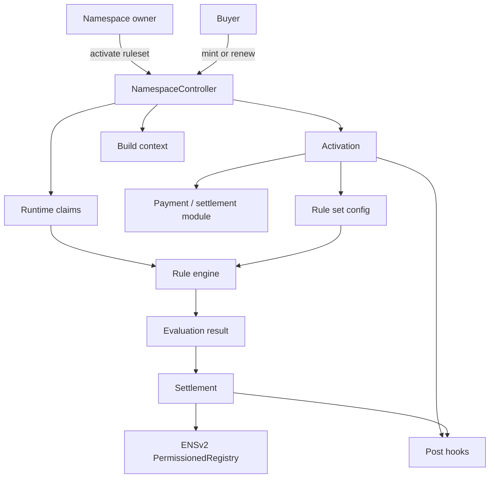
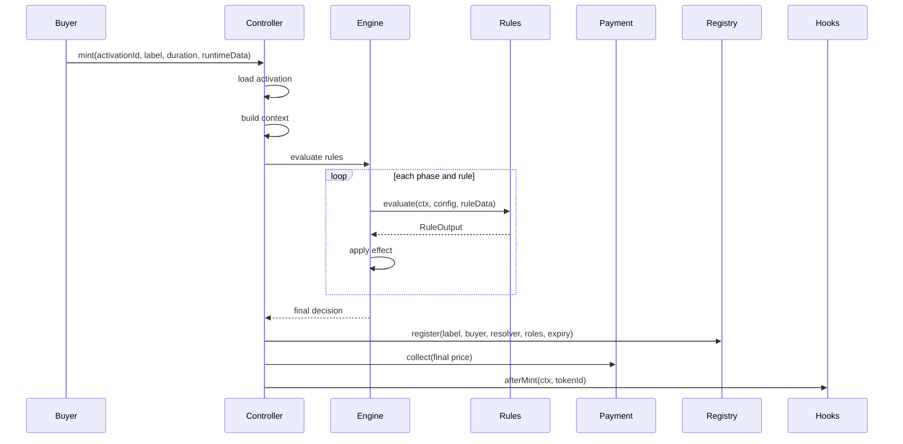

# Namespace Architecture: Claims, Rules, Effects, And Settlement

This document proposes a long-term Namespace architecture for selling ENSv2 subnames with high flexibility and low mint cost.

Current status:

```text
This is earlier broad architecture research.
The current implementation path is the strict generic rule engine with no composite packs.
Composite packs remain a deferred optimization path; see architecture-decision-history.md and strict-effect-architecture-research.md.
```

It intentionally steps back from the current contract shape. The current implementation is useful research and a working baseline, but the next architecture should be designed around the hard cases:

- base pricing;
- length-based pricing;
- emoji-only, letter-only, and number-only label classes;
- deadlines and sale windows;
- whitelist rules where a label can be mintable, blocked, buyer-bound, and specially priced;
- reservation rules where a label can be buyer-bound, public after expiry, blocked, or specially priced;
- token allowlists and token-holder discounts;
- future integrations such as World ID, Gitcoin Passport, signed partner campaigns, cross-chain proofs, human verification, reputation, or any custom external logic;
- cheap subname minting, even when configuration is expressive.

The central recommendation:

```text
Claims prove facts.
Rules turn facts and context into effects.
The engine applies effects into one final decision.
Settlement executes payment, registry mint/renew, and hooks.
```

The architecture should support two paths:

```text
Generic path
  maximum modularity, many independent rules, best for experimentation and custom integrations

Compiled path
  bundled rule packs for common production sales, best for gas-sensitive public minting
```

Do not force every namespace into one path. A serious product needs both.

## The Problem With The Current Mental Model

The current architecture separates modules into:

```text
Policy modules -> allow or reject
Pricing modules -> compute price
Payment module -> collect payment
Processor -> split or account for funds
Post hooks -> after-mint actions
```

That is clean for simple features, but many real sale rules cross module boundaries.

| Feature | Access decision | Price decision | State/accounting decision |
| --- | --- | --- | --- |
| Reservation | who can mint, when, or blocked | custom reserved price | maybe consume reservation |
| Whitelist | allowed buyer or allowed label | free mint, discount, special price | maybe consume allocation |
| World ID | human-only gate | human discount | nullifier usage |
| Token gate | minimum balance | token-holder discount | optional quota |
| Coupon | valid signed coupon | exact price or discount | coupon usage |
| Partner campaign | eligible route | campaign price | referral payout |

If a module can only be a "policy" or only be "pricing", reservation, whitelist, and identity integrations become split across multiple modules. That creates duplicated proof verification, repeated runtime data, subtle ordering problems, and a weak mental model.

The better abstraction is not "policy vs pricing".

The better abstraction is:

```text
Rule = reads context + claims + config, returns effects.
```

Some effects block minting. Some effects set price. Some effects apply a discount. Some effects tag the buyer. Some effects consume state.

## Target System Map



The ENSv2 registry remains the source of truth for:

- ownership;
- expiry;
- resolver pointer;
- child registry pointer;
- registry permissions.

Namespace remains the programmable sale layer.

## Core Objects

### Activation

An activation is the sale configuration for one parent namespace.

```solidity
struct Activation {
    address owner;
    IPermissionedRegistry registry;
    bytes32 parentNode;
    address defaultResolver;
    uint256 buyerRoleBitmap;
    address ruleSet;
    address paymentModule;
    address settlementModule;
    address hookSet;
    bool active;
}
```

The exact implementation can pack this more tightly, but conceptually this is the shape.

### Context

Context is data the controller knows for this mint or renewal.

```solidity
struct RuleContext {
    bytes32 activationId;
    address buyer;
    address payer;
    IPermissionedRegistry registry;
    bytes32 parentNode;
    string label;
    bytes32 labelHash;
    uint64 duration;
    uint64 expiry;
    address resolver;
    uint256 buyerRoleBitmap;
    Operation operation; // MINT or RENEW
}
```

Question: should modules compute label hash, expiry, and operation themselves?

Answer: no. The controller should compute canonical context once. That avoids inconsistent hashing, inconsistent expiry math, and duplicated work across modules.

Tradeoff: context is a large struct. Passing it to many external modules costs gas. For the compiled path, the rule pack should read only the fields it needs, or the controller can use smaller context structs for hot paths.

### Claim

A claim is runtime evidence that proves a fact.

Examples:

```text
buyer is in a Merkle whitelist
label is reserved for buyer until timestamp X
buyer is World ID verified
buyer owns an ERC721
buyer has a signed coupon from Alice
buyer has a cross-chain proof from another chain
```

Generic shape:

```solidity
struct Claim {
    bytes32 claimType;
    address issuer;
    bytes subject;
    bytes data;
    bytes proof;
}
```

Recommended claim types:

```solidity
bytes32 constant CLAIM_MERKLE_WHITELIST = keccak256("NAMESPACE_CLAIM_MERKLE_WHITELIST");
bytes32 constant CLAIM_RESERVATION = keccak256("NAMESPACE_CLAIM_RESERVATION");
bytes32 constant CLAIM_TOKEN_HOLDER = keccak256("NAMESPACE_CLAIM_TOKEN_HOLDER");
bytes32 constant CLAIM_WORLD_ID = keccak256("NAMESPACE_CLAIM_WORLD_ID");
bytes32 constant CLAIM_SIGNED_COUPON = keccak256("NAMESPACE_CLAIM_SIGNED_COUPON");
bytes32 constant CLAIM_CROSS_CHAIN = keccak256("NAMESPACE_CLAIM_CROSS_CHAIN");
```

Question: are claims stored on-chain?

Answer: usually no. Claims are normally runtime calldata. The activation stores roots, issuer addresses, verifier addresses, required groups, and rule config. The buyer submits the proof or signature at mint time.

Question: why not just let every rule define custom `bytes runtimeData`?

Answer: because future integrations need a common language. Claims make it possible to say "this rule consumes a World ID claim" or "this pricing rule consumes the same reservation claim as the eligibility rule." They also make SDKs and off-chain builders easier.

Tradeoff: a fully generic `Claim[]` array is not the cheapest calldata format. The architecture should define claims as a semantic standard, but allow gas-optimized encodings for production rules.

Recommendation:

```text
Use canonical claim schemas for interoperability.
Do not force every mint through a generic Claim[] decoder.
Allow rule-specific packed calldata and composite rule packs.
```

### Claim Verification

A claim is not useful until something verifies it.

There are three verification models:

| Model | How it works | Pros | Cons | Best for |
| --- | --- | --- | --- | --- |
| Rule verifies directly | Rule decodes proof and verifies root/signature/verifier call | cheapest for one rule, simple trace | duplicated verification if several rules need same claim | reservation, whitelist, coupon |
| Shared verifier module | Rule calls verifier or receives verifier output | reusable, clean integration boundary | extra external call, more moving parts | World ID, cross-chain proof systems |
| Cached attestation | User verifies once, later rules read cached state | cheap repeat mints | privacy/linkability, invalidation, extra state | account-level product features |

Question: should Namespace build a global on-chain claim registry?

Answer: not as the default. A global claim registry sounds elegant, but it adds state, privacy concerns, revocation questions, and extra reads to every mint. Most claims are sale-specific and should stay inside the activation's rule flow.

Recommendation:

```text
Default: rules verify their own packed claim data.
Shared verifier: use for expensive external proof systems.
Cached attestation: optional advanced module, not core controller state.
```

For example:

```text
ReservationRule
  directly verifies Merkle proof against activation root

WorldIdRule
  calls World ID verifier and consumes activation-scoped nullifier

CrossChainOwnershipRule
  verifies an adapter proof or reads a trusted bridge oracle
```

### Rule

A rule reads context, activation config, and runtime data. It returns one or more effects.

Conceptual interface:

```solidity
interface IRuleModule {
    function evaluate(
        RuleContext calldata ctx,
        bytes calldata configData,
        bytes calldata runtimeData
    ) external returns (RuleOutput memory output);
}
```

`evaluate` is intentionally not always `view`. Some rules need to consume state:

- per-wallet mint limit;
- one-time coupon;
- World ID nullifier;
- reservation consumption;
- referral attribution.

For read-only quoting, use a second interface:

```solidity
interface IQuoteRuleModule {
    function quoteEvaluate(
        RuleContext calldata ctx,
        bytes calldata configData,
        bytes calldata runtimeData
    ) external view returns (RuleOutput memory output);
}
```

Question: why allow stateful rules before payment and registry mint?

Answer: because state changes revert if later payment or registry mint reverts. This lets rules consume nullifiers or quotas atomically with the mint.

Tradeoff: stateful rules are harder to simulate and audit. Mitigation: modules should declare whether they are read-only, stateful-before-settlement, or stateful-after-settlement. UIs can use quote functions for preview and execution functions for final mint.

### Effect

An effect is one instruction produced by a rule.

Recommended core effect kinds:

```solidity
enum EffectKind {
    NONE,
    BLOCK,
    REQUIRE_TAG,
    ADD_TAG,
    SET_BASE_PRICE,
    ADD_PRICE,
    SUBTRACT_PRICE,
    DISCOUNT_BPS,
    MARKUP_BPS,
    MIN_PRICE,
    MAX_PRICE,
    OVERRIDE_PRICE,
    SET_PAYMENT_TOKEN,
    SET_QUANTITY_LIMIT,
    CONSUME_QUOTA
}
```

For gas, do not return dynamic arrays of effects from every rule on the hot path. A compact single-output shape is better:

```solidity
struct RuleOutput {
    uint8 decision;      // PASS, BLOCK, SKIP
    uint8 priceOp;       // NONE, SET_BASE, ADD, DISCOUNT_BPS, OVERRIDE, MIN, MAX
    uint16 bps;          // used by discount or markup
    address token;       // optional payment token
    uint256 amount;      // price amount or quantity
    bytes32 tag;         // optional tag
}
```

Question: is one effect per rule too restrictive?

Answer: for generic experimentation, yes. For cheap production minting, no. A rule that needs multiple effects can either:

- be split into multiple rules;
- return a generic multi-effect payload in a flexible path;
- be compiled into a composite rule pack.

Recommendation:

```text
Use compact one-effect outputs for the standard engine.
Allow composite packs for multi-effect complex behavior.
Avoid dynamic effect arrays in the cheapest path.
```

### Evaluation State

The rule engine accumulates effects into a final result.

```solidity
struct EvaluationState {
    bool blocked;
    address token;
    uint256 price;
    uint256 flags;
}
```

Tags should be represented as bits where possible.

```solidity
uint256 constant TAG_WORLD_ID_VERIFIED = 1 << 0;
uint256 constant TAG_WHITELISTED = 1 << 1;
uint256 constant TAG_RESERVED = 1 << 2;
uint256 constant TAG_TOKEN_HOLDER = 1 << 3;
```

Question: why not store `bytes32[] tags`?

Answer: arrays are flexible but expensive. Most on-chain rules only need a bounded number of tags. Use bit flags for standard tags. Let custom integrations use a generic extension only when needed.

## Rule Phases

Rule order must be deterministic.

Recommended phases:

```solidity
enum RulePhase {
    GUARD,
    ELIGIBILITY,
    BASE_PRICE,
    PREMIUM,
    DISCOUNT,
    OVERRIDE,
    FINAL_CHECK
}
```

Meaning:

| Phase | Purpose | Examples |
| --- | --- | --- |
| `GUARD` | broad sale-level blocks | pause, deadline, sale window |
| `ELIGIBILITY` | buyer or label qualification | whitelist, reservation, token gate, World ID |
| `BASE_PRICE` | establishes starting price | flat base price, USD base price |
| `PREMIUM` | adds positive price adjustments | length, emoji, number, premium label |
| `DISCOUNT` | reduces price | token-holder discount, World ID discount, coupon discount |
| `OVERRIDE` | final exact price overrides | reservation exact price, admin special deal |
| `FINAL_CHECK` | final invariants | min price, max price, per-wallet limit |

Question: why not just run rules in the order Alice chooses?

Answer: raw order is flexible but dangerous. If a discount runs before base price, it may do nothing. If a reservation override runs before length premium, it is not a true override. Phases let Alice compose modules without accidentally changing economics.

Tradeoff: phases reduce expressiveness. Mitigation: allow a custom advanced rule pack for users who intentionally need unusual ordering.

Recommendation:

```text
Default activations use phase-ordered rules.
Advanced custom packs can define their own internal ordering.
```

## Activation Configuration

Recommended shape:

```solidity
struct RuleConfig {
    address module;
    RulePhase phase;
    uint32 flags;
    bytes configData;
}

struct ActivationConfigV2 {
    IPermissionedRegistry registry;
    bytes32 parentNode;
    address resolver;
    uint256 buyerRoleBitmap;
    RuleConfig[] rules;
    address paymentModule;
    bytes paymentConfig;
    address settlementModule;
    bytes settlementConfig;
    HookConfig[] hooks;
}
```

Question: should rules store activation params inside each module like the current architecture?

Answer: not always. That pattern is flexible but activation gas becomes expensive because every module writes its own storage.

Better strategy:

```text
Stateless rules
  configData stored once by the controller or ruleset as an SSTORE2 blob
  module receives configData during evaluation

Stateful rules
  module stores only mutable state or indexes it truly needs

Compiled packs
  one module stores or embeds a tightly packed config for many common features
```

This avoids writing storage in every module for every activation.

Tradeoff:

| Config strategy | Activation gas | Mint gas | Flexibility | Best for |
| --- | ---: | ---: | --- | --- |
| Module-owned storage | high | medium/low | high | stateful modules, frequently used configs |
| Controller SSTORE2 config | low/medium | medium | high | stateless rules, large tables |
| Immutable clone per activation | medium | low | medium | high-volume sales |
| Composite rule pack | medium | lowest | medium | production presets |

Recommendation:

```text
Use controller/ruleset-owned packed config for generic stateless rules.
Use module-owned storage only for mutable state.
Use composite packs for common gas-sensitive sales.
```

## Runtime Data

Recommended shape:

```solidity
struct RuntimeDataV2 {
    bytes[] ruleData;
    bytes paymentData;
    bytes settlementData;
    bytes[] hookData;
}
```

Each `ruleData[i]` is aligned with `rules[i]`.

Question: why not pass one global `Claim[] claims` to all rules?

Answer: simpler mental model, worse gas. Passing one dynamic array into every external rule call is costly. Aligned runtime data is cheaper and lets each rule use a packed proof format.

But keep a canonical claim library:

```text
Claim schemas are standardized.
Runtime encoding can be optimized.
```

This means SDKs can build reservation claims, World ID claims, and coupon claims consistently, while contracts still use calldata-efficient encodings.

## Pricing Semantics

The final price should be single-token for the default engine.

```solidity
struct Price {
    address token;
    uint256 amount;
}
```

Question: why not support multi-token prices from day one?

Answer: multi-token pricing complicates every rule, every payment module, every split, every UI, and every audit. Most subname sales need one payment token. Multi-token settlement should be a separate advanced settlement module later.

Recommendation:

```text
Default engine supports one final payment token.
Advanced settlement modules can support multi-asset flows later.
```

Price operations:

| Operation | Meaning | Example |
| --- | --- | --- |
| `SET_BASE_PRICE` | set starting amount if not set | base price 20 USDC |
| `ADD_PRICE` | add premium | 3-letter premium 500 USDC |
| `SUBTRACT_PRICE` | subtract fixed discount | coupon minus 5 USDC |
| `DISCOUNT_BPS` | percentage discount | World ID 20% off |
| `MARKUP_BPS` | percentage markup | high-demand multiplier |
| `MIN_PRICE` | floor | never below 1 USDC |
| `MAX_PRICE` | cap | founder discount cap |
| `OVERRIDE_PRICE` | final exact price | reserved name exactly 1000 USDC |

Question: should `OVERRIDE_PRICE` ignore all earlier pricing?

Answer: yes, in the default engine. The word override must be strong and predictable. If a reservation says exact 1000 USDC, length pricing and discounts should not accidentally change it.

Tradeoff: maybe Alice wants reservation price plus discount. That should be explicit through another operation or custom pack, not accidental.

### Effect Application Algorithm

The engine should apply effects with a small, auditable algorithm.

Conceptual logic:

```text
state.blocked = false
state.token = address(0)
state.price = 0
state.flags = 0

for phase in phaseOrder:
  for rule in rules[phase]:
    output = rule.evaluate(ctx, config, runtime)

    if output.requireFlags != 0:
      require((state.flags & output.requireFlags) == output.requireFlags)

    if output.decision == BLOCK:
      revert Blocked(rule)

    state.flags |= output.addFlags

    if output.priceOp != NONE:
      apply token consistency
      apply price operation

require(!state.blocked)
return state
```

Token consistency:

```text
If state.token is unset, a pricing effect can set it.
If state.token is already set, later pricing effects must use the same token.
Advanced settlement can opt out, but default engine should reject mixed tokens.
```

Price operation semantics:

| Operation | Engine behavior |
| --- | --- |
| `SET_BASE` | set price only during `BASE_PRICE`; optionally reject if price already set |
| `ADD` | `price += amount` |
| `SUBTRACT` | subtract with floor at zero or revert on underflow, depending config |
| `DISCOUNT_BPS` | `price = price * (10_000 - bps) / 10_000` |
| `MARKUP_BPS` | `price = price * (10_000 + bps) / 10_000` |
| `MIN` | `price = max(price, amount)` |
| `MAX` | `price = min(price, amount)` |
| `OVERRIDE` | `price = amount` and mark override-applied |

Question: should discounts apply before or after override?

Answer: default no. `OVERRIDE` is intentionally late and exact. If a campaign needs "reserved price then human discount", make that an explicit composite rule or use a custom phase order.

Question: should subtract discount floor at zero or revert?

Answer: default floor at zero for discounts, revert for malformed arithmetic in strict rules. A discount should not brick minting because it is larger than price unless the activation explicitly wants strict accounting.

## Settlement

Settlement starts after the engine produces:

```solidity
struct FinalDecision {
    bool allowed;
    address token;
    uint256 price;
    uint256 flags;
}
```

Settlement steps:

```text
1. execute authoritative ENSv2 registry write or renewal
2. collect payment and split or route funds
3. run post hooks
```

Question: should payment happen before or after registry mint?

Answer: registry mint should happen before payment when possible if the registry can reject unavailable labels. That prevents payment transfer attempts for unavailable labels. If any later payment or hook reverts, the whole transaction reverts including the registry write.

Tradeoff: external token calls after registry mint add reentrancy surface. Mitigation: controller uses nonReentrant, modules are controller-only, and the registry write reverts with the transaction if settlement fails.

Question: should revenue split be a processor after payment or inside payment?

Answer: for gas, direct split inside the payment module is better. For complex accounting, a settlement module can route funds to a processor.

Recommendation:

```text
Cheap default: ERC20SplitPayment collects directly from payer to recipients.
Advanced path: settlement module can route through escrow, processor, vesting, referral, or cross-chain adapter.
```

Question: should hooks run before or after payment?

Answer: after payment. Hooks often write resolver records or notify integrations. They should only run after the buyer has paid and the registry write has succeeded. If a hook reverts, payment and registry writes revert too.

Question: should payment use `transferFrom` from payer or pre-funded escrow?

Answer: default `transferFrom` is cheaper and simpler. Escrow is an advanced settlement strategy for auctions, delayed settlement, or cross-chain payments.

## Core Contracts

### NamespaceControllerV2

Responsibilities:

- own activation lifecycle;
- check namespace owner/admin authority;
- check controller registry roles;
- build canonical context;
- call the rule engine;
- call settlement;
- call ENSv2 registry;
- call hooks;
- enforce nonReentrant;
- enforce module allowlist if enabled.

It should not contain reservation logic, World ID logic, pricing tables, or token gate logic.

### RuleEngine

Can be a library or internal controller component.

Responsibilities:

- run configured rules by phase;
- apply price operations deterministically;
- enforce token consistency;
- enforce block/allow semantics;
- produce final decision.

Question: should `RuleEngine` be a separate contract?

Answer: probably no for the hot path. External calls add gas. Implement the engine as an internal library or controller logic. Rule modules are already external calls.

Tradeoff: a separate engine contract is easier to upgrade/reuse. But this is core hot-path logic and should be tightly audited.

### RuleSet Storage

A ruleset stores packed module addresses, phases, flags, and config pointers.

Recommended implementation options:

```text
Small activation:
  store first few rule addresses/counts directly in activation storage

Large activation:
  store packed rule list and config blobs in SSTORE2

High-volume activation:
  deploy or clone a compiled rule pack
```

Question: why not one simple storage model?

Answer: because gas has different bottlenecks. Small sales need cheap reads. Large configurable sales need cheap activation config. High-volume sales need cheap mint execution.

Recommendation:

```text
Support multiple storage strategies behind one activation interface.
Do not make the most generic storage strategy the only production path.
```

### Rule Modules

Rule modules should be small and single-purpose by default.

Examples:

```text
PauseRule
SaleWindowRule
DeadlineRule
BasePriceRule
USDBasePriceRule
LengthPremiumRule
LabelClassPremiumRule
MerkleWhitelistRule
ReservationRule
TokenBalanceRule
WorldIdRule
SignedCouponRule
MintLimitRule
```

But gas-sensitive deployments should use packs:

```text
StandardPublicSalePack
WhitelistReservationPack
HumanDiscountPack
PremiumLabelPack
```

Question: does this create two systems?

Answer: it creates two implementations behind one mental model. Generic rules and composite packs both return effects. That keeps the architecture consistent while allowing gas optimization.

## Feature Mapping

### Base Pricing

Rule:

```text
BasePriceRule
phase: BASE_PRICE
effect: SET_BASE_PRICE(token, amount)
```

Alternative: keep base price inside payment module.

Decision: do not put pricing in payment. Payment should collect, not decide.

### Length-Based Pricing

Rule:

```text
LengthPremiumRule
phase: PREMIUM
effect: ADD_PRICE(rateForLength * duration or fixedLengthAmount)
```

Use packed tables:

```text
length -> fixed mint amount
length -> renewal rate per second
fallback bucket for longer labels
```

Gas recommendation:

- use packed arrays or SSTORE2 for large tables;
- use inline small tables in composite packs for hot deployments.

### Emoji, Letter, And Number Label Classes

Rule:

```text
LabelClassPremiumRule
phase: PREMIUM or ELIGIBILITY
effect: ADD_PRICE or BLOCK
```

Modes:

```text
NUMBER_ONLY
LETTER_ONLY
EMOJI_ONLY
MIXED
CUSTOM_CLASS
```

Question: should label class be a policy or pricing rule?

Answer: both are valid. A rule can block non-number labels or add number-only premium. That is exactly why rules should produce effects instead of being split into policy/pricing modules.

### Deadlines And Sale Windows

Rule:

```text
SaleWindowRule
phase: GUARD
effect: BLOCK if outside window
```

This is a pure guard. It should be cheap and first.

### Whitelist

Whitelist should support more than "is account allowed."

Recommended whitelist claim:

```solidity
struct WhitelistClaim {
    bytes32 labelHash;      // optional zero for any label
    address account;        // optional zero for public
    uint64 startTime;
    uint64 endTime;
    bool mintable;
    address token;
    uint256 mintPrice;
    uint256 renewPrice;
    uint16 discountBps;
    uint8 priceMode;        // NONE, SET, ADD, DISCOUNT_BPS
    uint32 allowance;       // optional per-claim quantity
}
```

Rule behavior:

```text
If proof invalid -> BLOCK
If mintable false -> BLOCK
If account set and buyer differs -> BLOCK
If labelHash set and label differs -> BLOCK
If priceMode SET -> OVERRIDE_PRICE
If priceMode ADD -> ADD_PRICE
If discountBps set -> DISCOUNT_BPS
If allowance set -> CONSUME_QUOTA
```

Question: is whitelist now doing too much?

Answer: the claim contains sale terms. The rule can be configured to use only some fields. This is useful because real whitelists often encode allocation and discount. But for gas, offer smaller schemas:

```text
WhitelistBasicClaim
WhitelistPricedClaim
WhitelistAllocationClaim
```

Do not force the largest schema on every sale.

### Reservation

Reservation should be a first-class sale term, not just an allowlist.

Recommended reservation claim:

```solidity
struct ReservationClaim {
    bytes32 labelHash;
    address account;        // zero means public reservation or public blocked label
    uint64 startTime;
    uint64 endTime;
    bool mintable;
    address token;
    uint256 mintPrice;
    uint256 renewPrice;
    uint8 priceMode;        // NONE, SET, ADD
}
```

Examples:

```text
Reserved for Bob at 1000 USDC:
  account = bob
  mintable = true
  priceMode = SET
  mintPrice = 1000e6

Blocked forever:
  account = zero
  mintable = false
  endTime = 0

Reserved until timestamp, then public:
  account = bob
  mintable = true
  endTime = timestamp
```

Question: should reservation expire into public mint or remain blocked after expiry?

Answer: make it configurable in the rule:

```text
expiryMode = DISABLE_CLAIM_AFTER_EXPIRY
expiryMode = PUBLIC_AFTER_EXPIRY
expiryMode = BLOCK_AFTER_EXPIRY
```

Default recommendation:

```text
Before expiry: only reserved account can mint.
After expiry: claim no longer grants reserved access.
Separate public sale rules decide public minting.
```

This avoids hidden behavior where a reservation proof changes public sale rules.

### Token Whitelist And Token Discounts

Rule:

```text
TokenBalanceRule
phase: ELIGIBILITY and/or DISCOUNT
```

Modes:

```text
REQUIRE_ERC20_BALANCE
REQUIRE_ERC721_BALANCE
REQUIRE_ERC1155_BALANCE
DISCOUNT_IF_HELD
PRICE_TIER_IF_HELD
```

Question: should token checks be claims?

Answer: for same-chain balances, no proof is needed. The rule can read token balance directly. For cross-chain balances, use a claim.

### World ID And Human Verification

World ID rule:

```text
phase: ELIGIBILITY or DISCOUNT
claim: WorldIdProof
effects:
  ADD_TAG WORLD_ID_VERIFIED
  optional DISCOUNT_BPS
  optional CONSUME_NULLIFIER
```

Question: should the controller know World ID details?

Answer: no. World ID should live entirely in a rule module. The controller only sees effects.

Question: should World ID proof be verified every mint?

Answer: depends on desired privacy and quota.

Options:

| Model | Pros | Cons |
| --- | --- | --- |
| Verify every mint | no stored user verification state | more gas |
| Cache verified account | cheaper later mints | linkable account state, invalidation complexity |
| Consume nullifier per activation | sybil resistance per sale | proof and nullifier complexity |

Recommendation:

```text
Use nullifier-per-activation for one-per-human mints.
Use cached verification only for product-level accounts if privacy tradeoff is acceptable.
```

### Custom Future Integrations

Any future integration should fit this shape:

```text
Verifier/claim proves fact.
Rule converts fact to effect.
Settlement stays unchanged.
```

Examples:

| Integration | Claim | Rule effects |
| --- | --- | --- |
| Gitcoin Passport | score proof | allow if score >= threshold, discount |
| Farcaster | signed fid ownership | allow club sale, tag community |
| Cross-chain NFT | bridge proof | token-holder discount |
| Partner coupon | EIP-712 signature | price override or discount |
| Anti-bot | human proof | allow, quota |
| Referral | signed referral | tag referrer, settlement split |

## Gas Strategy

The architecture should not pretend generic modularity is free.

Gas strategy should be explicit:

```text
Tier 1: Generic modular rules
  best for new integrations and complex custom sales

Tier 2: Packed standard rules
  same semantics, optimized config encoding

Tier 3: Composite rule packs
  one external call handles common bundles

Tier 4: Dedicated sale contracts/clones
  highest volume, lowest gas, less dynamic
```

### Activation Gas

Problems learned from current architecture:

- configuring many modules writes many storage slots;
- each module stores params keyed by activation id;
- flexible activation becomes expensive;
- SSTORE2 helps tables and module lists;
- composite modules reduce external calls.

V2 recommendations:

1. Store stateless rule config in packed blobs, not per-module storage.
2. Use SSTORE2 for large config tables and claim roots.
3. Use module storage only for mutable state.
4. Use composite packs for common high-volume flows.
5. Let activation choose a `RuleSetKind`:

```solidity
enum RuleSetKind {
    INLINE_SMALL,
    SSTORE2_PACKED,
    COMPOSITE_PACK,
    CLONE_SALE
}
```

### Mint Gas

Main costs:

- external calls per rule;
- proof verification;
- ERC20 transfer;
- ENSv2 registry write;
- resolver writes;
- dynamic calldata decoding.

V2 recommendations:

1. Put cheap guard rules first.
2. Use one external call for common bundles.
3. Avoid generic `Claim[]` decoding in the hot path.
4. Use calldata proof verification where possible.
5. Use direct split payment instead of payment plus processor when possible.
6. Batch resolver hooks.
7. Use bit flags for tags.
8. Avoid dynamic effect arrays.
9. Keep default final price single-token.

### Why Not One Mega Contract?

Alternative:

```text
One giant sale contract with all features.
```

Pros:

- lowest external call overhead;
- easiest to optimize for one flow;
- simpler execution trace.

Cons:

- hard to audit as features grow;
- impossible to support arbitrary future integrations cleanly;
- upgrade pressure becomes dangerous;
- every namespace pays for code paths it does not use;
- third-party modules cannot plug in naturally.

Decision:

```text
Do not make one mega contract as the core architecture.
Use composite packs for common flows instead.
```

### Why Not Fully Generic Plugins Only?

Alternative:

```text
Everything is a plugin, every plugin returns dynamic effects.
```

Pros:

- maximum flexibility;
- easy third-party integrations;
- clean conceptual model.

Cons:

- expensive mint path;
- difficult to bound behavior;
- dynamic effect arrays and generic claims add overhead;
- harder UI simulation.

Decision:

```text
Use generic plugins as the extension model.
Use compiled packs as the production gas model.
```

## Recommended Rule Packs

### StandardPublicSalePack

Covers:

- active/pause;
- sale window;
- base price;
- length premium;
- label class premium;
- ERC20 direct split payment compatibility;
- optional batch resolver hook.

### WhitelistReservationPack

Covers:

- Merkle whitelist;
- priced whitelist;
- reservations;
- blocked labels;
- custom exact label price;
- allocation.

This is likely the most important production pack.

### HumanDiscountPack

Covers:

- World ID verification;
- one-per-human nullifier;
- discount or exact price tier.

### PremiumLabelPack

Covers:

- 1/2/3 character premiums;
- number-only, letter-only, emoji-only classes;
- reserved premium labels;
- exact override price.

## Security Model

### Controller Trust Boundary

The controller is trusted to orchestrate:

- activation owner checks;
- ENSv2 registry permissions;
- module allowlist;
- rule engine semantics;
- settlement ordering.

Rule modules are semi-trusted if approved by the controller owner or marketplace governance.

For permissionless custom modules, activations should clearly display risk.

### Module Approval

Recommended:

```text
Curated mode:
  only approved modules and packs

Permissionless mode:
  namespace owner can use any module, but UI marks it unverified
```

Question: should the protocol allow arbitrary custom modules?

Answer: yes eventually, but not as the default user experience. A marketplace selling cheap subnames needs predictable safety. Custom modules are powerful and dangerous.

### Reentrancy

Rules may call external verifiers and tokens. Payment calls ERC20s. Hooks call resolvers.

Recommendations:

- controller `nonReentrant`;
- modules controller-only where they mutate Namespace state;
- settlement after registry availability check;
- no unbounded user-selected loops without activation limits;
- module allowlist for official UI;
- rule count and hook count caps.

### Failure Semantics

If any rule, payment, registry write, or hook reverts, the entire mint reverts.

That keeps state atomic:

```text
No paid-but-not-minted state.
No consumed-proof-but-failed-mint state.
No partially-written resolver state.
```

### Upgradeability

Controller can be UUPS upgradeable, but the rule semantics should be treated as protocol-critical.

Recommendations:

- timelock upgrades after deployment;
- publish engine semantics as stable docs;
- avoid changing effect semantics silently;
- add new rule modules instead of changing old ones where possible;
- version rule packs.

## Proposed Interfaces

These are conceptual. They should be refined before implementation.

```solidity
enum Operation {
    MINT,
    RENEW
}

enum RulePhase {
    GUARD,
    ELIGIBILITY,
    BASE_PRICE,
    PREMIUM,
    DISCOUNT,
    OVERRIDE,
    FINAL_CHECK
}

enum Decision {
    PASS,
    BLOCK,
    SKIP
}

enum PriceOp {
    NONE,
    SET_BASE,
    ADD,
    SUBTRACT,
    DISCOUNT_BPS,
    MARKUP_BPS,
    MIN,
    MAX,
    OVERRIDE
}

struct RuleOutput {
    Decision decision;
    PriceOp priceOp;
    uint16 bps;
    address token;
    uint256 amount;
    uint256 addFlags;
    uint256 requireFlags;
}
```

Rule:

```solidity
interface IRuleModule {
    function evaluate(
        RuleContext calldata ctx,
        bytes calldata configData,
        bytes calldata runtimeData
    ) external returns (RuleOutput memory output);
}
```

Quote-compatible rule:

```solidity
interface IQuoteRuleModule {
    function quoteEvaluate(
        RuleContext calldata ctx,
        bytes calldata configData,
        bytes calldata runtimeData
    ) external view returns (RuleOutput memory output);
}
```

Payment:

```solidity
interface IPaymentModuleV2 {
    function collect(
        SettlementContext calldata ctx,
        Price calldata price,
        bytes calldata paymentData
    ) external payable;
}
```

Hook:

```solidity
interface IPostHookV2 {
    function afterMint(
        SettlementContext calldata ctx,
        uint256 tokenId,
        bytes calldata hookData
    ) external;
}
```

## Execution Flow



The registry write may happen before payment collection if the registry is the cheapest and most authoritative availability check. If a later step reverts, registry state reverts too.

## Decision Audit

### Decision: Claims Exist As A Semantic Layer

Alternative: every rule owns totally custom runtime data.

Pros of claims:

- common language for proofs and integrations;
- easier SDK support;
- reusable schemas;
- future integrations fit naturally;
- off-chain tooling can reason about requirements.

Cons:

- can become over-abstract;
- generic claim arrays are gas-heavy;
- poor design can duplicate proof verification.

Final decision:

```text
Use claims as canonical schemas, not necessarily as one mandatory generic calldata format.
```

### Decision: Rules Return Effects

Alternative: separate eligibility modules and pricing modules.

Pros:

- handles overlap cleanly;
- reservation/whitelist/World ID can affect access and price;
- easier future custom logic;
- avoids artificial module splitting.

Cons:

- engine semantics are more complex;
- effect ordering must be carefully defined;
- rule outputs need strict limits for gas and auditability.

Final decision:

```text
Use rules plus effects, with strict phases and compact outputs.
```

### Decision: Single Final Payment Token

Alternative: support multiple currencies per final price.

Pros:

- much simpler payment and split logic;
- cheaper hot path;
- easier UI and quoting;
- fewer audit paths.

Cons:

- some advanced sales may want baskets or fallback currencies.

Final decision:

```text
Default engine is single-token. Multi-token belongs in advanced settlement modules.
```

### Decision: Composite Packs Are First-Class

Alternative: rely only on generic modular rules.

Pros:

- preserves cheap public minting;
- reduces external calls;
- lets common flows be heavily optimized;
- keeps generic architecture for long-tail cases.

Cons:

- more code to maintain;
- need to prove pack semantics match generic semantics;
- users must understand pack limitations.

Final decision:

```text
Build generic rules for flexibility and composite packs for production gas.
```

### Decision: Config Storage Is Strategy-Based

Alternative: every module stores `mapping(activationId => Params)`.

Pros:

- can optimize activation gas and mint gas separately;
- avoids unnecessary module storage writes;
- supports SSTORE2 tables and clone packs.

Cons:

- implementation complexity;
- more careful tooling required to inspect activations.

Final decision:

```text
Stateless config should live in packed rule sets. Mutable state lives in modules.
```

## Suggested Implementation Roadmap

### Stage 1: Define Semantics

Deliverables:

- `RulePhase`;
- `PriceOp`;
- `RuleOutput`;
- exact effect application order;
- canonical claim schemas for whitelist, reservation, coupon, and World ID.

Do this before writing many modules.

### Stage 2: Build Minimal Engine

Deliverables:

- `NamespaceControllerV2`;
- internal `RuleEngine`;
- single-token price state;
- rule count caps;
- hook count caps;
- direct split payment module;
- batch resolver hook.

### Stage 3: Build Core Rules

Deliverables:

- sale window guard;
- pause guard;
- base price;
- length premium;
- label class premium;
- whitelist terms rule;
- reservation terms rule;
- token balance rule;
- coupon rule.

### Stage 4: Build Composite Packs

Deliverables:

- public sale pack;
- whitelist/reservation pack;
- premium label pack;
- human discount pack.

### Stage 5: Integrations

Deliverables:

- World ID rule;
- cross-chain claim adapter;
- partner signed campaign rule;
- SDK claim builder.

## Non-Negotiable Invariants

1. ENSv2 registry remains source of truth for ownership and expiry.
2. Controller never lets Alice bypass configured Namespace rules through the Namespace mint path.
3. Activation owner can update allowed activation params only while still authorized on the parent registry.
4. Rule count, hook count, and runtime data sizes must be bounded.
5. Effect application order must be deterministic.
6. Payment token must be consistent unless advanced settlement explicitly opts out.
7. A blocked rule must always stop minting.
8. A failed payment, registry write, rule, or hook must revert the whole transaction.
9. Cheap production paths must not require generic dynamic claim arrays.
10. Custom integrations must not require controller changes.

## Final Recommendation

Build Namespace V2 around:

```text
NamespaceControllerV2
  activation lifecycle, context, ENSv2 registry calls

RuleEngine
  deterministic phase/effect application

Rule modules
  generic extension points

Claim schemas
  common proof language for SDKs and integrations

Composite rule packs
  gas-optimized production presets

Payment and settlement modules
  final value movement, direct split where possible

Post hooks
  resolver writes and integrations after mint
```

This gives the system a stable long-term mental model:

```text
Any future feature proves a fact, returns effects, or settles value.
```

That is broad enough for reservations, whitelists, discounts, World ID, token gates, coupons, cross-chain proofs, and unknown future integrations, while still leaving room for cheap composite implementations when public mint gas matters most.
