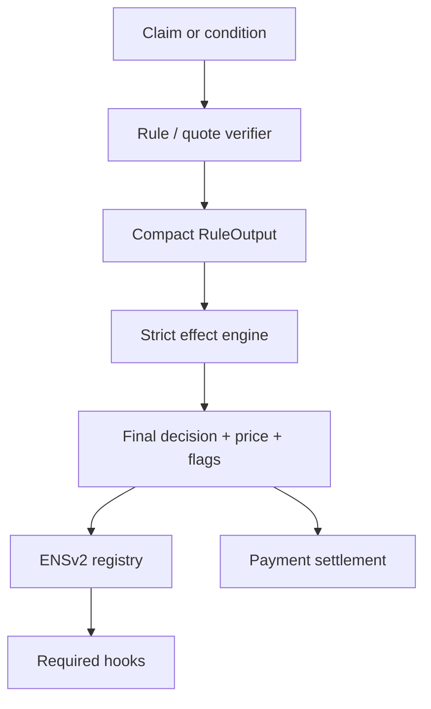
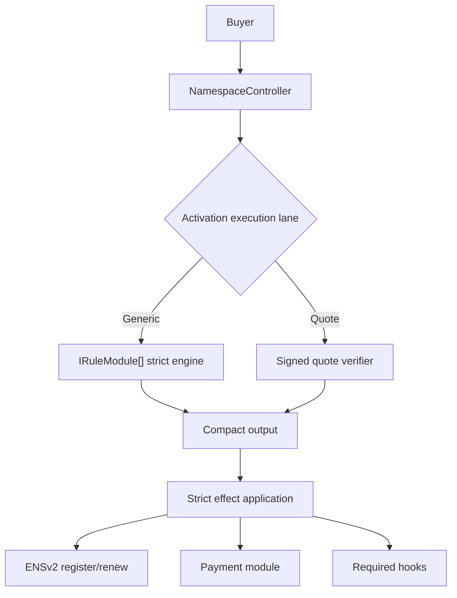

# Strict Effect Architecture Research

This is a pre-deployment architecture research note. It is not a "v2" migration plan because the contracts are still being iterated before launch.

The question is:

```text
Can Namespace make the rule/effect architecture stricter and more future-proof without making gas worse than the current implementation?
```

Short answer:

```text
Yes, but only if "effects" stay compact on the hot path.

Do not return dynamic Effect[] arrays from every rule.
Do not make arbitrary external modules the default path for common sales.
Do enforce strict effect semantics in the controller.
Do keep optimized packs possible later, but do not implement them in the current spike.
```

## Current Baseline

The current implementation already has the correct core model:

```text
activation config -> rule calls -> RuleOutput effects -> final price -> registry -> payment -> hooks
```

Relevant current pieces:

| Piece | Current file | Current shape |
| --- | --- | --- |
| Phases | `src/libraries/NamespaceTypes.sol` | `GUARD`, `ELIGIBILITY`, `BASE_PRICE`, `PREMIUM`, `DISCOUNT`, `OVERRIDE`, `FINAL_CHECK` |
| Effects | `src/libraries/NamespaceTypes.sol` | `Decision`, `PriceOp`, `addFlags`, `requireFlags` |
| Engine | `src/controller/NamespaceControllerRules.sol` | loops rules, applies one compact output per rule |
| Activation | `src/controller/NamespaceControllerLifecycle.sol` | stores rules, payment module, hooks |
| Gas evidence | `BENCHMARKS.md` | call-only mint benchmarks and module profiles |

Current `RuleOutput`:

```solidity
struct RuleOutput {
    Decision decision;
    PriceOp priceOp;
    uint16 bps;
    address token;
    uint256 amount;
    uint256 addFlags;
    uint256 requireFlags;
}
```

This is already an effect result. The issue is not that Namespace lacks effects. The issue is that the semantics are still too loose.

## Gas Baseline And Strict Spike Result

The strict-engine spike was implemented in the current contract names, not in separate `v2` contract names. It keeps the same `IRuleModule` and `RuleOutput` shape, adds controller-side phase/op checks, and tracks price state with status bits.

Call-only benchmark comparison:

| Scenario | Loose engine | Strict engine | Delta |
| --- | ---: | ---: | ---: |
| Direct ENSv2 registry register, no buyer roles | `76,072` | `76,072` | `0` |
| Direct ENSv2 registry register, buyer roles | `123,378` | `123,378` | `0` |
| Namespace free mint, no rules | `164,818` | `164,818` | `0` |
| Namespace fixed-price ERC20 mint | `222,268` | `223,261` | `+993` |
| Namespace three-rule ERC20 mint | `259,427` | `260,191` | `+764` |
| Namespace whitelist ERC20 mint | `317,250` | `318,031` | `+781` |
| Namespace reservation plus split mint | `369,718` | `372,106` | `+2,388` |
| Namespace all-rules split mint, no resolver writes | `566,676` | `571,297` | `+4,621` |
| Namespace all-rules split mint, three resolver writes | `648,634` | `653,255` | `+4,621` |
| Namespace renewal, three-rule ERC20 | `150,724` | `151,488` | `+764` |

Result:

```text
The strict checks add small overhead compared with the external rule calls, registry write, ERC20 settlement, Merkle proofs, and resolver hooks already in the path.
```

This is good enough to keep the stricter architecture as the current contract architecture. Composite packs remain deferred because the strict generic path is acceptable for launch-stage flexibility.

Per-rule profile signals:

| Rule/profile | Gas |
| --- | ---: |
| Sale window | `24,219` to `36,007` |
| Label length | `36,201` |
| Fixed price | `34,018` to `40,676` |
| Length premium | about `31,900` |
| Token balance discount | `45,731` |
| Reservation Merkle size 10 | `65,910` |
| Reservation Merkle size 1000 | `80,795` |
| Whitelist Merkle size 10 | `67,830` |
| Whitelist Merkle size 1000 | `82,713` |
| USD oracle | `46,998` |

Per-rule, payment, hook, activation, and direct registry profiles did not materially change because the strict-engine patch lives in the controller's output-application step.

This means the architecture cannot pretend that generic modularity is free. A strict effect model must keep the current hot path roughly the same, and the measured deltas show that it does.

## Design Principle

There are two different layers:

```text
Semantic layer:
  rich concepts like human verification, reservations, discounts, exact prices, limits, quotes, and attestations.

Hot-path ABI layer:
  compact fixed-size outputs that the controller can apply cheaply.
```

Do not make the semantic layer directly equal to a dynamic Solidity ABI shape.

The architecture should be:



## Proposed Architecture

### Keep One Compact Output Per Rule

Recommended default:

```text
one rule call -> one compact output
```

That output can contain multiple effect families:

| Effect family | Current support | Keep? |
| --- | --- | --- |
| Decision | `PASS`, `BLOCK`, `SKIP` | Yes |
| Price mutation | one `PriceOp` | Yes |
| Flags | `addFlags`, `requireFlags` | Yes, but stricter |
| Token consistency | `token` on absolute price ops | Yes |
| BPS adjustment | `bps` | Yes |

Avoid this for the generic engine:

```solidity
struct Effect {
    EffectKind kind;
    bytes data;
}

function evaluateMint(...) returns (Effect[] memory effects);
```

Why not dynamic effects?

| Problem | Why it matters |
| --- | --- |
| Dynamic return data | More memory allocation and copying per rule. |
| Per-effect loop | More branches inside the controller. |
| Unbounded output | Harder to cap gas and audit. |
| Harder SDK support | Every module can invent arbitrary payloads. |
| More conflict cases | Controller must handle multiple operations per module. |

Dynamic effects are attractive architecturally, but they move complexity into the hottest mint path.

### Make The Current Output Stricter

The current output is good, but the controller should enforce stronger rules.

Current risk:

```text
The activation stores phases, but _applyRuleOutput applies outputs without knowing the rule phase.
```

This means a rule placed in `GUARD` can still return a price operation, or a `FINAL_CHECK` rule can change the final price.

Recommended strict rule:

```text
The phase controls which effect operations are legal.
```

Suggested phase/op matrix:

| Phase | Allowed decision | Allowed price ops | Notes |
| --- | --- | --- | --- |
| `GUARD` | `PASS`, `BLOCK`, `SKIP` | `NONE` | Fast global checks only. |
| `ELIGIBILITY` | `PASS`, `BLOCK`, `SKIP` | `NONE` | Whitelist/token/human gates. Price changes should be separate unless using a dedicated pricing rule. |
| `BASE_PRICE` | `PASS`, `BLOCK`, `SKIP` | `SET_BASE` | At most one base price. |
| `PREMIUM` | `PASS`, `BLOCK`, `SKIP` | `ADD`, `MARKUP_BPS`, `MIN` | Positive price changes. |
| `DISCOUNT` | `PASS`, `BLOCK`, `SKIP` | `SUBTRACT`, `DISCOUNT_BPS`, `MAX` | Discounts and caps after price exists. |
| `OVERRIDE` | `PASS`, `BLOCK`, `SKIP` | `OVERRIDE` | Exact final price, usually reservation or signed deal. |
| `FINAL_CHECK` | `PASS`, `BLOCK`, `SKIP` | `NONE`, `MIN`, `MAX` | Last invariant checks only. |

Question: should `ELIGIBILITY` rules be allowed to price?

Answer: default no. It is cleaner and safer to separate phases. If a single proof must both check eligibility and price, use one of these:

1. place the rule in the later pricing phase where the price effect belongs;
2. use flags where an eligibility rule marks proof success and a later price rule requires that flag;
3. later, use a dedicated optimized module only if benchmarks prove repeated proof work is too expensive.

This avoids duplicated proof verification while keeping default phase semantics strict.

### Track Price State, Not Just Amount

Current engine stores:

```solidity
uint256 amount;
uint256 flags;
address token;
bool tokenSet;
```

Recommended strict state:

```solidity
struct EvaluationState {
    uint256 amount;
    uint256 flags;
    address token;
    uint8 status;
}
```

Where `status` is a bitfield:

| Bit | Meaning |
| --- | --- |
| `TOKEN_SET` | A payment token has been chosen. |
| `BASE_SET` | A base price has already been set. |
| `PRICE_MUTATED` | Any price operation has occurred. |
| `OVERRIDDEN` | Final exact price override has occurred. |
| `DISCOUNTED` | At least one discount has been applied. |

Strict conflict rules:

| Situation | Recommendation |
| --- | --- |
| `SET_BASE` twice | Revert unless activation explicitly allows last-write-wins. |
| `OVERRIDE` twice | Revert unless same token and amount. |
| `ADD` after `OVERRIDE` | Revert. Override should mean final exact price. |
| `DISCOUNT_BPS` before base price | Revert. Discounting zero hides misconfiguration. |
| `SUBTRACT` larger than price | Floor at zero by default, but consider strict mode for high-value sales. |
| Token changes mid-evaluation | Revert, as current engine already does. |
| `MIN`/`MAX` after override | Allow only in `FINAL_CHECK` if explicitly intended. |

Question: does strict state add gas?

Answer: slightly, if implemented naively. It can be cheap if packed into one `uint8` or `uint256` word and checked with bit operations. The cost should be benchmarked against the current `_applyRuleOutput`; it is likely smaller than one extra external rule call.

### Consider Packing RuleOutput

Current ABI returns seven 32-byte words. A packed output can reduce return-data size:

```solidity
struct PackedRuleOutput {
    uint256 control;
    address token;
    uint256 amount;
    uint256 addFlags;
    uint256 requireFlags;
}
```

Possible `control` layout:

| Bits | Meaning |
| ---: | --- |
| `0..3` | decision |
| `4..11` | price op |
| `12..27` | bps |
| `28..35` | reserved effect class |
| `36..63` | reserved small params |
| `64..255` | future reserved |

Question: should this be implemented immediately?

Answer: no. The strict-engine benchmark is acceptable using the current readable seven-word `RuleOutput`. Packing can reduce ABI return data, but it makes module code less readable. A helper library can hide packing:

```solidity
return RuleOutputs.price(NamespaceTypes.PriceOp.SET_BASE, token, amount);
```

Recommendation:

1. first add strict phase/op checks using current `RuleOutput`;
2. benchmark;
3. only test `PackedRuleOutput` later if generic rule-call gas becomes the limiting cost.

For now, keep readability. If packing later saves meaningful gas across every rule call, switch before deployment.

### Defer Composite Packs For Now

The generic engine should remain the open integration path. Composite packs may become useful later, but they should not be the first implementation step.

Why defer packs:

| Reason | Explanation |
| --- | --- |
| Simple activations stay simple | If Alice needs two rules, passing two rules is clearer than selecting a pack. |
| Avoid premature product assumptions | Packs freeze common feature bundles before real usage data exists. |
| Measure strictness first | The immediate question is whether stricter semantics add gas. |
| Preserve contract surface | Fewer pack contracts are easier to audit before launch. |

Pack-compatible rule:

```text
Do not design the strict engine in a way that prevents optimized packs later.
```

Future packs are reasonable only when benchmark data proves they are needed:

| Future pack | When it becomes justified |
| --- | --- |
| `StandardSalePack` | Most activations use window + length + fixed price + premium. |
| `WhitelistReservationPack` | Many activations combine whitelist, reservations, blocks, and exact prices. |
| `PremiumLabelPack` | Label class and length pricing become a high-volume path. |
| `HumanDiscountPack` | Human verification becomes common enough to optimize. |

Question: does deferring packs hurt future gas?

Answer: no if the strict engine remains pack-compatible. Packs can still be added later as ordinary approved modules that return the same compact output.

### Use Signed Quotes For Expensive Or Off-Chain Integrations

Some integrations should not run full verification in the mint transaction.

Examples:

| Integration type | Best lane |
| --- | --- |
| Simple ERC20/ERC721 token gate | Generic rule |
| Merkle whitelist/reservation | Generic rule now; optimized module later only if benchmarks justify it |
| Chainlink-style oracle price | Generic rule |
| World ID enforced on-chain | Dedicated rule |
| Human Passport API score | Signed quote or attestation |
| EAS attestation | Attestation rule or signed quote |
| Cross-chain proof | Signed quote or bridge-confirmed attestation |
| Dynamic pricing model | Signed quote |
| Partner campaigns | Signed quote or Merkle root |

World ID official docs say on-chain verification is appropriate when smart contracts must enforce proof checks; otherwise their API verification path is appropriate. They also show nullifier storage for one-action-per-human semantics and recommend upgradeable verification logic because protocol versions evolve.

Human Passport's Stamps API requires an API key and scorer id. That means it is naturally an off-chain input, not something a minting contract can directly query. The contract should receive a signed quote, Merkle inclusion, or on-chain attestation derived from the Passport score.

EAS supports attestations based on schemas. For Namespace, EAS is best treated as a claim source:

```text
schema + attester + recipient + expiry + data -> rule effect
```

Do not bake any one provider deeply into the controller. The controller should only understand compact effects.

## Proposed Execution Lanes



### Lane A: Generic Strict Engine

Use for:

- experimental modules;
- third-party integrations;
- custom one-off campaigns;
- low-volume namespaces.

Gas posture:

```text
Flexible but not cheapest.
Each rule is an external call.
```

Required improvements:

- pass the rule phase into `_applyRuleOutput`;
- enforce phase/op matrix;
- track price state;
- define official flag bit ranges;
- add strict output tests;
- benchmark before/after.

### Lane B: Signed Quote

Use for:

- dynamic pricing;
- expensive identity/reputation providers;
- cross-chain checks;
- app-specific scoring;
- campaigns that change frequently.

A quote must bind:

| Field | Why |
| --- | --- |
| `chainId` | prevents cross-chain replay |
| `controller` | prevents cross-contract replay |
| `activationId` | binds sale config |
| `registry` | binds ENSv2 target |
| `parentNode` | binds namespace |
| `labelHash` | binds subname |
| `buyer` | prevents another account using the quote |
| `duration` | prevents extending a short quote |
| `resolver` | prevents resolver substitution |
| `roleBitmap` | prevents role escalation |
| `token` and `amount` | exact payment terms |
| `deadline` | quote expiry |
| `nonce` or `salt` | replay protection |
| `claimDigest` | binds off-chain proof context |

Question: is signed quote too centralized?

Answer: yes for pure trustless sales. That is why it should be a lane, not the only architecture. It is the correct lane for providers that are already API-driven or computationally expensive.

### Deferred Lane: Composite Packs

Do not implement this lane in the immediate strict-engine spike.

Keep it as a future option:

```text
one external call
packed activation config
same compact output
same strict engine application
```

Possible future benchmark targets:

| Current scenario | Current gas | Pack target |
| --- | ---: | ---: |
| Three-rule ERC20 mint | `260,191` | lower than current by at least one external rule call |
| Whitelist ERC20 mint | `318,031` | lower than current whitelist path |
| Reservation split mint | `372,106` | lower than current reservation path |

## Config Identity

Current issue:

```text
module mapping key = activationId
```

If the same module appears twice in one activation with different params, the later config overwrites the earlier one.

Options:

| Option | Mint gas | Activation/deployment cost | Future-proofing | Recommendation |
| --- | ---: | ---: | --- | --- |
| Keep current one-module-once rule | lowest | lowest | weak | acceptable only if enforced |
| Add `configId` to every rule call | slightly higher | medium | strong | benchmark before adopting |
| Use minimal clones per config | proxy overhead per mint | extra deployments | medium | okay for rare custom rules |
| Use composite packs later | lowest for common paths | medium implementation | strong for products | defer until usage and gas data justify it |

Recommendation:

```text
For first launch, enforce "same module address may appear once per activation" in the generic engine.
For common multi-list cases, first consider dedicated official rules or signed quotes; add packs only after benchmarks justify them.
Benchmark configId before putting it in every generic rule call.
```

Reason:

Adding `configId` to every rule call makes the common path pay for a feature that most activations will not need. If repeated module instances become necessary, a packed rule-list format can add per-rule `configId`, but that should be evidence-driven.

## Flags

Current flags are powerful:

```text
rule A adds flag
rule B requires flag
```

Problem:

```text
Flags are global uint256 bits. If third-party modules choose bits freely, collisions can create accidental authorization.
```

Options:

| Option | Gas | Safety | Recommendation |
| --- | ---: | --- | --- |
| Global arbitrary flags | cheapest | weak | avoid for untrusted modules |
| Governance-assigned bit ranges | cheap | good | best for official modules |
| Module-namespaced flags | higher | strong | use only if needed |
| No cross-rule flags | cheapest | strict | too limiting |

Recommendation:

```text
Official modules get documented flag bits.
Third-party modules should not rely on shared flags unless approved.
Future optimized modules can use private internal flags without exposing them to the controller.
```

## Runtime Data And Claims

Current `RuntimeData` is index-aligned:

```solidity
bytes[] ruleData;
bytes paymentData;
bytes[] postHookData;
```

This is acceptable because it keeps runtime config out of the mint call. The risk is SDK correctness: a proof in the wrong index can fail or produce unexpected behavior.

For gas, improve claim formats:

```text
Do not abi.decode large structs with dynamic proof arrays when a packed calldata parser can do the job.
```

Recommended claim strategy:

| Claim type | Preferred format |
| --- | --- |
| Simple whitelist | packed account/label/time/price/proof |
| Reservation | packed label/account/mintable/price/proof |
| Signed quote | typed EIP-712 signature |
| Provider score | quote digest or attestation UID |
| World ID | provider-specific proof struct in dedicated rule |

Question: should all claims use one universal `Claim` struct?

Answer: no. A universal claim becomes bloated. Use common leaf hashing helpers and SDK conventions, but keep hot-path claim payloads specialized.

## Payment And Settlement

Keep default settlement simple:

```text
one final token
one final amount
one payment module
```

Do not put pricing in payment modules. Payment should collect the final price; rules, quotes, or future optimized modules should compute it.

Advanced settlement can exist, but not in the default path:

| Feature | Suggested lane |
| --- | --- |
| Direct recipient | default ERC20 payment |
| Split revenue | split payment module |
| Many recipients | withdrawal-based splitter if recipient count is high |
| Referrals | signed quote or settlement module |
| Escrow | settlement module |
| Cross-chain payment | settlement adapter, not default payment |

Question: should splits happen by multiple `transferFrom` calls?

Answer: for 2 or 3 recipients, direct split is probably acceptable. For many recipients, pull-based accounting can be cheaper for the minter, but shifts gas to recipients later.

## Hooks

Hooks should be split by criticality:

| Hook type | Behavior |
| --- | --- |
| Required hook | Reverts mint if it fails. Use for resolver records that must exist. |
| Event-only integration | Emits event and lets off-chain indexers react. |
| Optional hook | Only if a clear best-effort interface is built and benchmarked. |

Do not make social analytics, CRM sync, rewards, or notifications required hooks on the mint path.

## Cross-Questioned Decisions

### Should the controller support arbitrary dynamic effects?

No for the hot path. It is more expressive but likely more expensive and harder to audit. Use compact fixed outputs, and only add optimized modules later if benchmarks justify them.

### Should rules be able to emit multiple price operations?

No in the generic engine. One rule gets one price mutation. If a feature truly needs several mutations, it should be a dedicated optimized module later or a signed quote.

### Should a reservation discount apply after a reservation override?

Default no. `OVERRIDE` means exact final price. If product wants "reserved price plus human discount", it should be explicit dedicated-module behavior or a quote, not accidental global ordering.

### Should `SET_BASE` be last-write-wins?

Default no. Multiple base prices indicate misconfiguration. Revert unless a future dedicated module handles precedence internally.

### Should `SUBTRACT` floor at zero or revert?

For consumer UX, floor at zero. For strict accounting, add an activation-level strict mode later. Do not make every mint pay for strict modes until product needs it.

### Should phase/op checks happen at activation or mint?

Both have value:

- activation-time checks catch obvious configuration errors;
- mint-time checks protect against malicious or buggy modules returning illegal outputs.

Mint-time phase/op checks are the real safety mechanism.

### Should modules self-declare capabilities?

Not necessary for the mint path. Capability introspection can happen off-chain or at activation. The controller should not pay extra hot-path calls for module metadata.

### Should every integration become a rule?

No. Providers fall into three groups:

- cheap on-chain checks become rules;
- common combinations stay as simple rules until benchmarks justify optimized modules;
- expensive/API/cross-chain checks become signed quotes or attestations.

### Should Namespace make provider-specific logic core?

No. The controller core should only know:

```text
compact effect output
phase validation
price composition
registry/payment/hook orchestration
```

Provider-specific logic belongs in modules or quote signers.

## Recommended Next Implementation Sequence

1. **Strict engine patch**
   - Pass rule phase into `_applyRuleOutput`.
   - Add phase/op matrix.
   - Track `BASE_SET`, `OVERRIDDEN`, and `DISCOUNTED` state bits.
   - Add tests for illegal operations by phase.
   - Status: implemented in the current contracts.

2. **Benchmark strict engine**
   - Compare current `mint.three_rules_erc20`, `mint.whitelist_erc20`, and `mint.all_rules_split`.
   - Strict checks should add only small overhead.
   - If overhead is meaningful, optimize with bitmask lookup before changing architecture.
   - Status: complete; the common three-rule path adds `764` gas and all-rules split adds `4,621` gas.

3. **Packed output experiment**
   - Prototype `PackedRuleOutput`.
   - Benchmark against current seven-word `RuleOutput`.
   - Keep only if it saves gas without making module code unreadable.
   - Status: deferred because the strict-engine profile is acceptable.

4. **StandardSalePack**
   - Deferred.
   - Revisit only after strict-engine benchmark results and product usage data.

5. **WhitelistReservationPack**
   - Deferred.
   - Revisit only if repeated proofs or external-call overhead become the limiting cost.

6. **SignedQuoteVerifier**
   - EIP-712 quote verifier with deadline and nonce.
   - Use for API-driven and cross-chain integrations.

7. **Integration adapters**
   - World ID rule for trustless human proof.
   - Attestation rule for EAS-style claims.
   - Human Passport quote adapter.
   - Token/NFT gate rules remain simple direct reads.

## Success Criteria

The stricter architecture is successful only if these are true:

| Requirement | Evidence needed |
| --- | --- |
| Stricter semantics | tests prove illegal phase/op combinations revert |
| No gas regression for common mints | benchmark report shows comparable or lower gas |
| Future integrations supported | at least one provider-style adapter design works without controller changes |
| Repeated proof duplication avoided | flags or a future dedicated optimized module verify once for combined eligibility/pricing |
| Module trust model clearer | docs define official flags, unapproved modules, and quote trust |
| Product UX remains modular | activation config can still express common sale features |

## Final Recommendation

Keep the current effect model, but harden it:

```text
Strict compact effects for the generic engine.
Simple rule stacks as the default modular path.
Signed quotes for expensive, API-driven, or cross-chain integrations.
Provider modules only at the edges.
Composite packs only later when benchmark data justifies them.
```

Do not build a dynamic effect-array engine unless benchmarks prove it is acceptable. The product needs future-proof modularity, but buyers should not pay dynamic-framework gas on every mint.

## Sources

- [World ID on-chain verification](https://docs.world.org/world-id/idkit/onchain-verification)
- [Ethereum Attestation Service](https://attest.org/)
- [EAS schemas documentation](https://docs.attest.org/docs/core--concepts/schemas)
- [Human Passport Stamps API access](https://docs.passport.human.tech/building-with-passport/stamps/passport-api/getting-access)
- [Namespace gas benchmarks](../BENCHMARKS.md)
